<font style="color:rgb(76, 73, 72);">简单记录Java中23种设计模式的应用，方便后期查看。</font>

## <font style="color:rgb(76, 73, 72);">创建型模式</font>

### <font style="color:rgb(76, 73, 72);">简单工厂模式</font>

<font style="color:rgb(76, 73, 72);">简单工厂模式严格意义上来说，并不属于设计模式中的一种，不过这里还是简单记录下。</font>

**<font style="color:rgb(76, 73, 72);">定义</font>**<font style="color:rgb(76, 73, 72);">
：由一个工厂对象决定创建出哪一种类型实例。客户端只需传入工厂类的参数，无心关心创建过程。</font>

**<font style="color:rgb(76, 73, 72);">优点</font>**<font style="color:rgb(76, 73, 72);">
：具体产品从客户端代码中抽离出来，解耦。</font>

**<font style="color:rgb(76, 73, 72);">缺点</font>**<font style="color:rgb(76, 73, 72);">
：工厂类职责过重，增加新的类型时，得修改工程类得代码，违背开闭原则。</font>

<font style="color:rgb(76, 73, 72);">举例：新建Fruit水果抽象类，包含eat抽象方法：</font>

```java
public abstract class Fruit {

    public abstract void eat();
}
```

<font style="color:rgb(76, 73, 72);">其实现类Apple：</font>

```java
public class Apple extends Fruit {
    @Override
    public void eat() {
        System.out.println("吃🍎");
    }
}
```

<font style="color:rgb(76, 73, 72);">新建创建Fruit的工厂类：</font>

```java
public class FruitFactory {

    public Fruit produce(String name) {
        if ("apple".equals(name)) {
            return new Apple();
        } else {
            return null;
        }
    }
}
```

<font style="color:rgb(76, 73, 72);">新建个客户端测试一下：</font>

```java
public class Application {

    public static void main(String[] args) {
        FruitFactory factory = new FruitFactory();
        Fruit fruit = factory.produce("apple");
        fruit.eat();
    }
}
```

<font style="color:rgb(76, 73, 72);">运行main方法，输出：</font>

```java
吃🍎
```

<font style="color:rgb(76, 73, 72);">
可以看到，客户端Application并未依赖具体的水果类型，只关心FruitFactory的入参，这就是客户端和具体产品解耦的体现，UML图如下：</font>

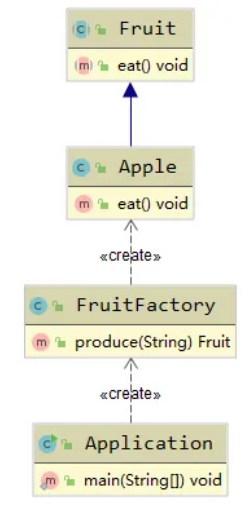

### <font style="color:rgb(76, 73, 72);">工厂方法模式</font>

<font style="color:rgb(76, 73, 72);">为了解决简单工厂模式的缺点，诞生了工厂方法模式（Factory method pattern）。</font>

**<font style="color:rgb(76, 73, 72);">定义</font>**<font style="color:rgb(76, 73, 72);">
：定义创建对象的接口，让实现这个接口的类来决定实例化哪个类，工厂方法让类的实例化推迟到了子类进行。</font>

**<font style="color:rgb(76, 73, 72);">优点</font>**<font style="color:rgb(76, 73, 72);">：</font>

1. <font style="color:rgb(76, 73, 72);">具体产品从客户端代码中抽离出来，解耦。</font>
2. <font style="color:rgb(76, 73, 72);">
   加入新的类型时，只需添加新的工厂方法（无需修改旧的工厂方法代码），符合开闭原则。</font>

**<font style="color:rgb(76, 73, 72);">缺点</font>**<font style="color:rgb(76, 73, 72);">
：类的个数容易过多，增加复杂度。</font>

<font style="color:rgb(76, 73, 72);">举例：新建Fruit抽象类，包含eat抽象方法：</font>

```java
public abstract class Fruit {

    public abstract void eat();
}
```

<font style="color:rgb(76, 73, 72);">新建FruitFactory抽象工厂，定义produceFruit抽象方法：</font>

```java
public abstract class FruitFactory {

    public abstract Fruit produceFruit();
}
```

<font style="color:rgb(76, 73, 72);">新建Fruit的实现类，Apple：</font>

```java
public class Apple extends Fruit {
    @Override
    public void eat() {
        System.out.println("吃🍎");
    }
}
```

<font style="color:rgb(76, 73, 72);">新建FruitFactory的实现类AppleFruitFactory，用于生产具体类型的水果 —— 苹果：</font>

```java
public class AppleFruitFactory extends FruitFactory {
    @Override
    public Fruit produceFruit() {
        return new Apple();
    }
}
```

<font style="color:rgb(76, 73, 72);">新建客户端Application测试一波：</font>

```java
public class Application {

    public static void main(String[] args) {
        FruitFactory factory = new AppleFruitFactory();
        Fruit fruit = factory.produceFruit();
        fruit.eat();
    }
}
```

<font style="color:rgb(76, 73, 72);">运行main方法，输出如下：</font>

```java
吃🍎
```

<font style="color:rgb(76, 73, 72);">
现在要新增Banana类型的水果，只需要新增Banana类型的工厂类即可，无需修改现有的AppleFruitFactory代码，符合开闭原则。但是这种模式的缺点也显而易见，就是类的个数容易过多，增加复杂度。</font>

<font style="color:rgb(76, 73, 72);">上面例子UML图如下所示：</font>

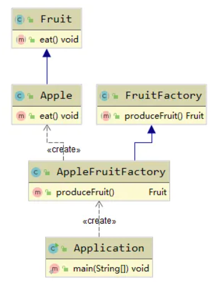

### <font style="color:rgb(76, 73, 72);">抽象工厂模式</font>

<font style="color:rgb(76, 73, 72);">抽象工厂模式（Abstract factory pattern）提供了</font>*
*<font style="color:rgb(76, 73, 72);">一系列</font>**<font style="color:rgb(76, 73, 72);">
相关或者相互依赖的对象的接口，关键字是“一系列”。</font>

**<font style="color:rgb(76, 73, 72);">优点</font>**<font style="color:rgb(76, 73, 72);">：</font>

1. <font style="color:rgb(76, 73, 72);">具体产品从客户端代码中抽离出来，解耦。</font>
2. <font style="color:rgb(76, 73, 72);">将一个系列的产品族统一到一起创建。</font>

**<font style="color:rgb(76, 73, 72);">缺点</font>**<font style="color:rgb(76, 73, 72);">
：拓展新的功能困难，需要修改抽象工厂的接口；</font>

<font style="color:rgb(76, 73, 72);">综上所述，抽象工厂模式适合那些功能相对固定的产品族的创建。</font>

<font style="color:rgb(76, 73, 72);">举例：新建水果抽象类Fruit，包含buy抽象方法：</font>

```java
public abstract class Fruit {

    public abstract void buy();
}
```

<font style="color:rgb(76, 73, 72);">新建价格抽象类Price，包含pay抽象方法：</font>

```java
public abstract class Price {

    public abstract void pay();
}
```

<font style="color:rgb(76, 73, 72);">
新建水果创建工厂接口FruitFactory，包含获取水果和价格抽象方法（产品族的体现是，一组产品包含水果和对应的价格）：</font>

```java
public interface FruitFactory {

    Fruit getFruit();

    Price getPrice();
}
```

<font style="color:rgb(76, 73, 72);">接下来开始创建</font><font style="color:rgb(76, 73, 72);">
🍎</font><font style="color:rgb(76, 73, 72);">这个“产品族”。新建Fruit实现类AppleFruit：</font>

```java
public class AppleFruit extends Fruit {
    @Override
    public void buy() {
        System.out.println("购买🍎");
    }
}
```

<font style="color:rgb(76, 73, 72);">新建对应的苹果价格实现ApplePrice：</font>

```java
public class ApplePrice extends Price {
    @Override
    public void pay() {
        System.out.println("🍎单价2元");
    }
}
```

<font style="color:rgb(76, 73, 72);">创建客户端Application，测试一波：</font>

```java
public class Application {
    public static void main(String[] args) {
        FruitFactory factory = new AppleFruitFactory();
        factory.getFruit().buy();
        factory.getPrice().pay();
    }
}
```

<font style="color:rgb(76, 73, 72);">输出如下：</font>

```java
购买🍎
        🍎单价2元
```

<font style="color:rgb(76, 73, 72);">
客户端只需要通过创建AppleFruitFactory就可以获得苹果这个产品族的所有内容，包括苹果对象，苹果价格。要新建</font><font style="color:rgb(76, 73, 72);">
🍌</font><font style="color:rgb(76, 73, 72);">
的产品族，只需要实现FruitFactory、Price和Fruit接口即可。这种模式的缺点和工厂方法差不多，就是类的个数容易过多，增加复杂度。</font>

<font style="color:rgb(76, 73, 72);">上面例子UML图如下所示：</font>

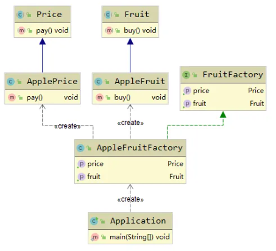

### <font style="color:rgb(76, 73, 72);">建造者模式</font>

<font style="color:rgb(76, 73, 72);">建造者模式也称为生成器模式（Builder
Pattern），将复杂对象的建造过程抽象出来（抽象类别），使这个抽象过程的不同实现方法可以构造出不同表现（属性）的对象。简单来说就是，相同的过程可以创建不同的产品。</font>

<font style="color:rgb(76, 73, 72);">
将复杂对象的建造过程抽象出来（抽象类别），使这个抽象过程的不同实现方法可以构造出不同表现（属性）的对象。</font>

<font style="color:rgb(76, 73, 72);">简单来说就是，相同的过程可以创建不同的产品。</font>

<font style="color:rgb(76, 73, 72);">适用于：</font>

1. <font style="color:rgb(76, 73, 72);">一个对象有非常复杂的内部结构（很多属性）</font>
2. <font style="color:rgb(76, 73, 72);">想将复杂对象的创建和使用分离。</font>

**<font style="color:rgb(76, 73, 72);">优点</font>**<font style="color:rgb(76, 73, 72);">：</font>

1. <font style="color:rgb(76, 73, 72);">封装性好，创建和使用分离</font>
2. <font style="color:rgb(76, 73, 72);">拓展性好，建造类之间独立，一定程度上解耦。</font>

**<font style="color:rgb(76, 73, 72);">缺点</font>**<font style="color:rgb(76, 73, 72);">：</font>

1. <font style="color:rgb(76, 73, 72);">产生多余的Builder对象；</font>
2. <font style="color:rgb(76, 73, 72);">产品内部发生变化，建造者需要更改，成本较大。</font>

<font style="color:rgb(76, 73, 72);">举个例子：</font>

<font style="color:rgb(76, 73, 72);">新增商铺类Shop，包含名称，地点和类型属性：</font>

```java
public class Shop {

    private String name;
    private String location;
    private String type;

    @Override
    public String toString() {
        return "Shop{" +
                "name='" + name + '\'' +
                ", location='" + location + '\'' +
                ", type='" + type + '\'' +
                '}';
    }

    public String getName() {
        return name;
    }

    public void setName(String name) {
        this.name = name;
    }

    public String getLocation() {
        return location;
    }

    public void setLocation(String location) {
        this.location = location;
    }

    public String getType() {
        return type;
    }

    public void setType(String type) {
        this.type = type;
    }
}
```

<font style="color:rgb(76, 73, 72);">接着创建Shop抽象生成器ShopBuilder：</font>

```java
public abstract class ShopBuilder {

    private String name;
    private String location;
    private String type;

    public abstract void name(String name);

    public abstract void location(String location);

    public abstract void type(String type);

    public abstract Shop build();
}
```

<font style="color:rgb(76, 73, 72);">包含和Shop相同的属性及对应的抽象构建方法。</font>

<font style="color:rgb(76, 73, 72);">继续创建ShopBuilder的实现，水果店构造器FruitShopBuilder：</font>

```java
public class FruitShopBuilder extends ShopBuilder {

    private Shop shop = new Shop();

    @Override
    public void name(String name) {
        this.shop.setName(name);
    }

    @Override
    public void location(String location) {
        this.shop.setLocation(location);
    }

    @Override
    public void type(String type) {
        this.shop.setType(type);
    }

    @Override
    public Shop build() {
        return shop;
    }
}
```

<font style="color:rgb(76, 73, 72);">创建个经销商类Dealer，用于通过ShopBuilder构建具体的商店：</font>

```java
public class Dealer {

    private ShopBuilder builder;

    public void setBuilder(ShopBuilder builder) {
        this.builder = builder;
    }

    public Shop build(String name, String location, String type) {
        this.builder.name(name);
        this.builder.location(location);
        this.builder.type(type);
        return builder.build();
    }
}
```

<font style="color:rgb(76, 73, 72);">创建个客户端Application测试一波：</font>

```java
public class Application {

    public static void main(String[] args) {
        ShopBuilder builder = new FruitShopBuilder();
        Dealer dealer = new Dealer();
        dealer.setBuilder(builder);

        Shop shop = dealer.build("XX水果店", "福州市XX区XX街XX号", "水果经营");
        System.out.println(shop);
    }
}
```

<font style="color:rgb(76, 73, 72);">输出如下：</font>

```bash
Shop{name='XX水果店', location='福州市XX区XX街XX号', type='水果经营'}
```

<font style="color:rgb(76, 73, 72);">这个例子是典型的建造者模式，UML图如下所示：</font>

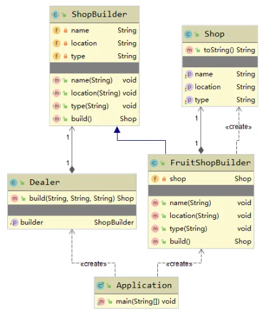

<font style="color:rgb(76, 73, 72);">其实建造者模式更为常用的例子是下面这个：</font>

<font style="color:rgb(76, 73, 72);">创建一个店铺类Shop，Shop里包含构造该Shop的内部类：</font>

```java
public class Shop {

    private String name;
    private String location;
    private String type;

    public Shop(ShopBuilder builder) {
        this.name = builder.name;
        this.location = builder.location;
        this.type = builder.type;
    }

    @Override
    public String toString() {
        return "Shop{" +
                "name='" + name + '\'' +
                ", location='" + location + '\'' +
                ", type='" + type + '\'' +
                '}';
    }

    public static class ShopBuilder {
        private String name;
        private String location;
        private String type;

        public ShopBuilder name(String name) {
            this.name = name;
            return this;
        }

        public ShopBuilder location(String location) {
            this.location = location;
            return this;
        }

        public ShopBuilder type(String type) {
            this.type = type;
            return this;
        }

        public Shop build() {
            return new Shop(this);
        }
    }
}
```

<font style="color:rgb(76, 73, 72);">在客户端构建Shop只需：</font>

```java
public class Application {

    public static void main(String[] args) {
        Shop shop = new Shop.ShopBuilder()
                .name("XX水果店")
                .location("福州市XX区XX街XX号")
                .type("水果经营")
                .build();
        System.out.println(shop);
    }
}
```

<font style="color:rgb(76, 73, 72);">这种用法和Lombok的@Builder注解效果是一样的。</font>

<font style="color:rgb(76, 73, 72);">这个例子的UML图：</font>

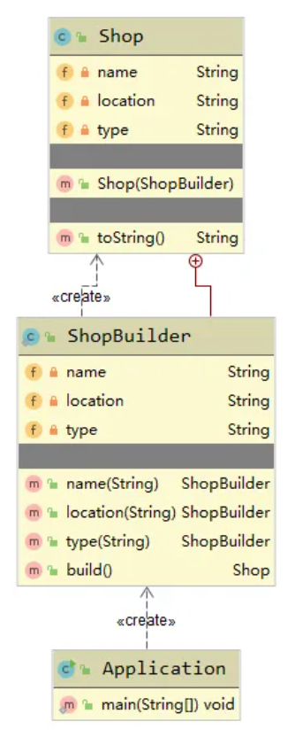

### <font style="color:rgb(76, 73, 72);">单例模式</font>

<font style="color:rgb(76, 73, 72);">单例模式目的是为了一个类只有一个实例。</font>

<font style="color:rgb(76, 73, 72);">优点：</font>

1. <font style="color:rgb(76, 73, 72);">内存中只有一个实例，减少了内存开销；</font>
2. <font style="color:rgb(76, 73, 72);">可以避免对资源的多重占用；</font>
3. <font style="color:rgb(76, 73, 72);">设置全局访问点，严格控制访问。</font>

<font style="color:rgb(76, 73, 72);">缺点：</font>

1. <font style="color:rgb(76, 73, 72);">没有接口，拓展困难。</font>

#### <font style="color:rgb(76, 73, 72);">懒汉模式</font>

<font style="color:rgb(76, 73, 72);">懒汉模式下的单例写法是最简单的，但它是线程不安全的：</font>

```java
public class LazySingleton {

    private static LazySingleton lazySingleton = null;

    private LazySingleton() {

    }

    public static LazySingleton getInstance() {
        if (lazySingleton == null) {
            lazySingleton = new LazySingleton();
        }
        return lazySingleton;
    }
}
```

<font style="color:rgb(76, 73, 72);">可加同步锁解决线程安全问题：</font>

```java
public class LazySingleton {

    private static LazySingleton lazySingleton = null;

    private LazySingleton() {

    }

    public static LazySingleton getInstance() {
        synchronized (LazySingleton.class) {
            if (lazySingleton == null) {
                lazySingleton = new LazySingleton();
            }
        }
        return lazySingleton;
    }
}
```

<font style="color:rgb(76, 73, 72);">
但是同步锁锁的是整个类，比较消耗资源，并且即使运行内存中已经存在LazySingleton，调用其getInstance还是会上锁，所以这种写法也不是很好。</font>

#### <font style="color:rgb(76, 73, 72);">双重同步锁单例模式</font>

```java
public class LazyDoubleCheckSingleton {

    private static LazyDoubleCheckSingleton instance = null;

    private LazyDoubleCheckSingleton() {

    }

    public static LazyDoubleCheckSingleton getInstance() {
        if (instance == null) {
            synchronized (LazyDoubleCheckSingleton.class) {
                if (instance == null) {
                    instance = new LazyDoubleCheckSingleton();
                }
            }
        }
        return instance;
    }
}
```

<font style="color:rgb(76, 73, 72);">
上面例子虽然加了同步锁，但它还是线程不安全的。虽然上面的例子不会出现多次初始化LazyDoubleCheckSingleton实例的情况，但是由于指令重排的原因，某些线程可能会获取到空对象，后续对该对象的操作将触发空指针异常。</font>

<font style="color:rgb(76, 73, 72);">
要修复这个问题，只需要阻止指令重排即可，所以可以给instance属性加上volatile关键字：</font>

```java
public class LazyDoubleCheckSingleton {

    private volatile static LazyDoubleCheckSingleton instance = null;

    private LazyDoubleCheckSingleton() {

    }

    public static LazyDoubleCheckSingleton getInstance() {
        if (instance == null) {
            synchronized (LazyDoubleCheckSingleton.class) {
                if (instance == null) {
                    instance = new LazyDoubleCheckSingleton();
                }
            }
        }
        return instance;
    }
}
```

<font style="color:rgb(76, 73, 72);">
相关博文：</font>[<font style="color:rgb(76, 73, 72);">深入理解volatile关键字</font>](https://mrbird.cc/volatile.html)<font style="color:rgb(76, 73, 72);">。</font>

<font style="color:rgb(76, 73, 72);">
上面这种写法是不但确保了线程安全，并且当LazyDoubleCheckSingleton实例创建好后，后续再调用其getInstance方法不会上锁。</font>

#### <font style="color:rgb(76, 73, 72);">静态内部类单例模式</font>

<font style="color:rgb(76, 73, 72);">看例子：</font>

```java
public class StaticInnerClassSingleton {

    private StaticInnerClassSingleton() {

    }

    private static class InnerClass {
        private static StaticInnerClassSingleton instance = new StaticInnerClassSingleton();
    }

    public static StaticInnerClassSingleton getInstance() {
        return InnerClass.instance;
    }
}
```

<font style="color:rgb(76, 73, 72);">为什么这个例子是可行的呢？主要有两个原因：</font>

1. <font style="color:rgb(76, 73, 72);">
   JVM在类的初始化阶段会加Class对象初始化同步锁，同步多个线程对该类的初始化操作；</font>
2. <font style="color:rgb(76, 73, 72);">静态内部类InnerClass的静态成员变量instance在方法区中只会有一个实例。</font>

<font style="color:rgb(76, 73, 72);">在Java规范中，当以下这些情况首次发生时，A类将会立刻被初始化：</font>

1. <font style="color:rgb(76, 73, 72);">A类型实例被创建；</font>
2. <font style="color:rgb(76, 73, 72);">A类中声明的静态方法被调用；</font>
3. <font style="color:rgb(76, 73, 72);">A类中的静态成员变量被赋值；</font>
4. <font style="color:rgb(76, 73, 72);">A类中的静态成员被使用（非常量）；</font>

#### <font style="color:rgb(76, 73, 72);">饿汉单例模式</font>

<font style="color:rgb(76, 73, 72);">“饿汉”意指在类加载的时候就初始化：</font>

```java
public class HungrySingleton {

    private final static HungrySingleton instance = new HungrySingleton();

    private HungrySingleton() {

    }

    public static HungrySingleton getInstance() {
        return instance;
    }
}
```

<font style="color:rgb(76, 73, 72);">
这种模式在类加载的时候就完成了初始化，所以并不存在线程安全性问题；但由于不是懒加载，饿汉模式不管需不需要用到实例都要去创建实例，如果创建了不使用，则会造成内存浪费。</font>

#### <font style="color:rgb(76, 73, 72);">序列化破坏单例模式</font>

<font style="color:rgb(76, 73, 72);">
前面的单例例子在实现序列化接口后都能被序列化的方式破坏，比如HungrySingleton，让其实现序列化接口：</font>

```java
public class HungrySingleton implements Serializable {

    private static final long serialVersionUID = -8073288969651806838L;

    private final static HungrySingleton instance = new HungrySingleton();

    private HungrySingleton() {

    }

    public static HungrySingleton getInstance() {
        return instance;
    }
}
```

<font style="color:rgb(76, 73, 72);">然后创建Application测试一下如何破坏：</font>

```java
public class Application {

    public static void main(String[] args) throws IOException, ClassNotFoundException {
        // 演示序列化破坏单例
        HungrySingleton instance = HungrySingleton.getInstance();
        ObjectOutputStream outputStream = new ObjectOutputStream(new FileOutputStream("file"));
        outputStream.writeObject(instance);

        ObjectInputStream inputStream = new ObjectInputStream(new FileInputStream("file"));
        HungrySingleton newInstance = (HungrySingleton) inputStream.readObject();

        System.out.println(instance);
        System.out.println(newInstance);
        System.out.println(instance == newInstance);
    }
}
```

<font style="color:rgb(76, 73, 72);">输出如下所示：</font>

```bash
cc.mrbird.design.pattern.creational.singleton.HungrySingleton@7f31245a
cc.mrbird.design.pattern.creational.singleton.HungrySingleton@6d03e736
false
```

<font style="color:rgb(76, 73, 72);">可以看到，虽然是单例模式，但却成功创建出了两个不一样的实例，单例遭到了破坏。</font>

<font style="color:rgb(76, 73, 72);">
要让反序列化后的对象和序列化前的对象是同一个对象的话，可以在HungrySingleton里加上readResolve方法：</font>

```java
public class HungrySingleton implements Serializable {

    private static final long serialVersionUID = -8073288969651806838L;

    private final static HungrySingleton instance = new HungrySingleton();

    private HungrySingleton() {

    }

    public static HungrySingleton getInstance() {
        return instance;
    }

    // 新增
    private Object readResolve() {
        return instance;
    }
}
```

<font style="color:rgb(76, 73, 72);">再次运行Application的main方法后：</font>

```bash
cc.mrbird.design.pattern.creational.singleton.HungrySingleton@7f31245a
cc.mrbird.design.pattern.creational.singleton.HungrySingleton@7f31245a
true
```

<font style="color:rgb(76, 73, 72);">
可以看到，这种方式最终反序列化出来的对象和序列化对象是同一个对象。但这种方式反序列化过程内部还是会重新创建HungrySingleton实例，只不过因为HungrySingleton类定义了readResolve方法（方法内部返回instance引用），反序列化过程会判断目标类是否定义了readResolve该方法，是的话则通过反射调用该方法。</font>

#### <font style="color:rgb(76, 73, 72);">反射破坏单例模式</font>

<font style="color:rgb(76, 73, 72);">除了序列化能破坏单例外，反射也可以，举个反射破坏HungrySingleton的例子：</font>

```java
public class Application {

    public static void main(String[] args) throws Exception {
        HungrySingleton instance = HungrySingleton.getInstance();
        // 反射创建实例
        Class<HungrySingleton> c = HungrySingleton.class;
        // 获取构造器
        Constructor<HungrySingleton> constructor = c.getDeclaredConstructor();
        // 打开构造器权限
        constructor.setAccessible(true);
        HungrySingleton newInstance = constructor.newInstance();

        System.out.println(instance);
        System.out.println(newInstance);
        System.out.println(instance == newInstance);
    }
}
```

<font style="color:rgb(76, 73, 72);">输出如下所示：</font>

```bash
cc.mrbird.design.pattern.creational.singleton.HungrySingleton@1b6d3586
cc.mrbird.design.pattern.creational.singleton.HungrySingleton@4554617c
false
```

<font style="color:rgb(76, 73, 72);">可以看到，我们通过反射破坏了私有构造器权限，成功创建了新的实例。</font>

<font style="color:rgb(76, 73, 72);">
对于这种情况，饿汉模式下的例子可以在构造器中添加判断逻辑来防御（懒汉模式的就没有办法了），比如修改HungrySingleton的代码如下所示：</font>

```java
public class HungrySingleton {

    private final static HungrySingleton instance = new HungrySingleton();

    private HungrySingleton() {
        if (instance != null) {
            throw new RuntimeException("forbidden");
        }
    }

    public static HungrySingleton getInstance() {
        return instance;
    }
}
```

<font style="color:rgb(76, 73, 72);">再次运行Application的main方法：</font>

```bash
Exception in thread "main" java.lang.reflect.InvocationTargetException
    at sun.reflect.NativeConstructorAccessorImpl.newInstance0(Native Method)
    at sun.reflect.NativeConstructorAccessorImpl.newInstance(NativeConstructorAccessorImpl.java:62)
    at sun.reflect.DelegatingConstructorAccessorImpl.newInstance(DelegatingConstructorAccessorImpl.java:45)
    at java.lang.reflect.Constructor.newInstance(Constructor.java:423)
    at cc.mrbird.design.pattern.creational.singleton.Application.main(Application.java:33)
Caused by: java.lang.RuntimeException: forbidden
    at cc.mrbird.design.pattern.creational.singleton.HungrySingleton.<init>(HungrySingleton.java:16)
    ... 5 more
```

#### <font style="color:rgb(76, 73, 72);">枚举单例模式</font>

<font style="color:rgb(76, 73, 72);">
枚举单例模式是推荐的单例模式，它不仅可以防御序列化攻击，也可以防御反射攻击。举个枚举单例模式的代码：</font>

```java
public enum EnumSingleton {

    INSTANCE;

    private Object data;

    public Object getData() {
        return data;
    }

    public void setData(Object data) {
        this.data = data;
    }

    public static EnumSingleton getInstance() {
        return INSTANCE;
    }
}
```

<font style="color:rgb(76, 73, 72);">验证下是否是单例的：</font>

```java
public class Application {

    public static void main(String[] args) throws Exception {

        EnumSingleton instance = EnumSingleton.getInstance();
        instance.setData(new Object());
        EnumSingleton newInstance = EnumSingleton.getInstance();

        System.out.println(instance);
        System.out.println(newInstance);
        System.out.println(instance.getData());
        System.out.println(newInstance.getData());
    }
}
```

<font style="color:rgb(76, 73, 72);">输出如下所示：</font>

```bash
INSTANCE
INSTANCE
java.lang.Object@1b6d3586
java.lang.Object@1b6d3586
```

<font style="color:rgb(76, 73, 72);">测试下序列化攻击：</font>

```java
public class Application {

    public static void main(String[] args) throws Exception {
        EnumSingleton instance = EnumSingleton.getInstance();
        instance.setData(new Object());
        ObjectOutputStream outputStream = new ObjectOutputStream(new FileOutputStream("file"));
        outputStream.writeObject(instance);

        ObjectInputStream inputStream = new ObjectInputStream(new FileInputStream("file"));
        EnumSingleton newInstance = (EnumSingleton) inputStream.readObject();

        System.out.println(instance);
        System.out.println(newInstance);
        System.out.println(instance == newInstance);

        System.out.println(instance.getData());
        System.out.println(newInstance.getData());
        System.out.println(instance.getData() == newInstance.getData());
    }
}
```

<font style="color:rgb(76, 73, 72);">输出如下所示：</font>

```bash
INSTANCE
INSTANCE
true
java.lang.Object@568db2f2
java.lang.Object@568db2f2
true
```

<font style="color:rgb(76, 73, 72);">可以看到序列化和反序列化后的对象是同一个。</font>

<font style="color:rgb(76, 73, 72);">
原理：跟踪ObjectInputStream#readObject源码，其中当反编译对象为枚举类型时，将调用readEnum方法：</font>

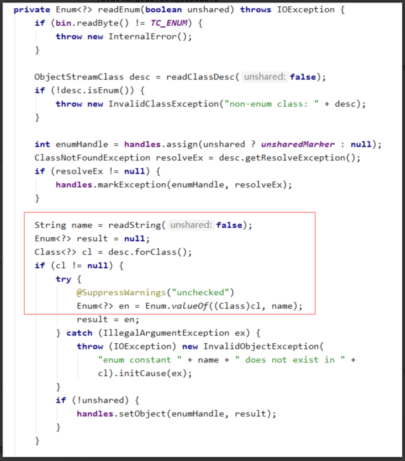

<font style="color:rgb(76, 73, 72);">name为枚举类里的枚举常量，对于线程来说它是唯一的，存在方法区，所以通过</font>
`_<font style="color:rgb(65, 74, 81);background-color:rgb(251, 251, 251);">Enum.valueOf((Class)cl, name)</font>_`<font style="color:rgb(76, 73, 72);">
方法得到的枚举对象都是同一个。</font>

<font style="color:rgb(76, 73, 72);">再测试一下反射攻击：</font>

```java
public class Application {

    public static void main(String[] args) throws Exception {
        EnumSingleton instance = EnumSingleton.getInstance();

        Class<EnumSingleton> c = EnumSingleton.class;
        // 枚举类只包含一个(String,int)类型构造器
        Constructor<EnumSingleton> constructor = c.getDeclaredConstructor(String.class, int.class);
        constructor.setAccessible(true);
        EnumSingleton newInstance = constructor.newInstance("hello", 1);

        System.out.println(instance == newInstance);
    }
}
```

<font style="color:rgb(76, 73, 72);">运行输出如下：</font>

```bash
Exception in thread "main" java.lang.IllegalArgumentException: Cannot reflectively create enum objects
    at java.lang.reflect.Constructor.newInstance(Constructor.java:417)
    at cc.mrbird.design.pattern.creational.singleton.Application.main(Application.java:71)
```

<font style="color:rgb(76, 73, 72);">可以看到抛异常了，查看Constructor类的417行代码可以发现原因：</font>

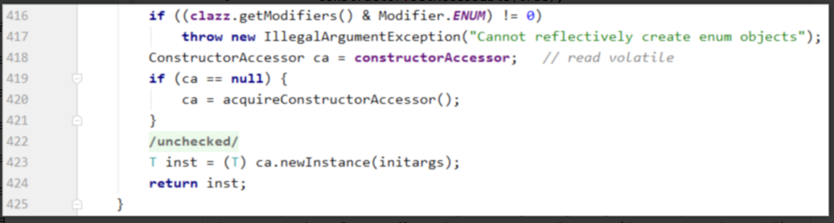

<font style="color:rgb(76, 73, 72);">Java禁止通过反射创建枚举对象。</font>

<font style="color:rgb(76, 73, 72);">正是因为枚举类型拥有这些天然的优势，所以用它创建单例是不错的选择，这也是Effective
Java推荐的方式。</font>

### <font style="color:rgb(76, 73, 72);">原型模式</font>

<font style="color:rgb(76, 73, 72);">原型实例指定创建对象的种类，通过拷贝这些原型创建新的对象。</font>

<font style="color:rgb(76, 73, 72);">适用于：</font>

1. <font style="color:rgb(76, 73, 72);">类初始化消耗较多资源；</font>
2. <font style="color:rgb(76, 73, 72);">循环体中生产大量对象的时候。</font>

<font style="color:rgb(76, 73, 72);">优点：</font>

1. <font style="color:rgb(76, 73, 72);">原型模式性能比直接new一个对象性能好；</font>
2. <font style="color:rgb(76, 73, 72);">简化创建对象过程。</font>

<font style="color:rgb(76, 73, 72);">缺点：</font>

1. <font style="color:rgb(76, 73, 72);">对象必须重写Object克隆方法；</font>
2. <font style="color:rgb(76, 73, 72);">复杂对象的克隆方法写起来较麻烦（深克隆、浅克隆）</font>

<font style="color:rgb(76, 73, 72);">
举例：新建一个学生类Student，实现克隆接口，并重写Object的克隆方法（因为都是简单属性，所以浅克隆即可）：</font>

```java
public class Student implements Cloneable {

    private String name;
    private int age;

    public String getName() {
        return name;
    }

    public void setName(String name) {
        this.name = name;
    }

    public int getAge() {
        return age;
    }

    public void setAge(int age) {
        this.age = age;
    }

    @Override
    public String toString() {
        return "Student{" +
                "name='" + name + '\'' +
                ", age=" + age +
                '}';
    }

    @Override
    protected Object clone() throws CloneNotSupportedException {
        return super.clone();
    }
}
```

<font style="color:rgb(76, 73, 72);">在Application中测试一波：</font>

```java
public class Application {

    public static void main(String[] args) throws CloneNotSupportedException {
        Student student = new Student();
        ArrayList<Student> list = new ArrayList<>();
        for (int i = 0; i < 3; i++) {
            Student s = (Student) student.clone();
            s.setName("学生" + i);
            s.setAge(20 + i);
            list.add(s);
        }
        System.out.println(list);
    }
}
```

<font style="color:rgb(76, 73, 72);">输出如下所示：</font>

```java
[Student {
    name = '学生0', age = 20
},

Student {
    name = '学生1', age = 21
},

Student {
    name = '学生2', age = 22
}]
```

<font style="color:rgb(76, 73, 72);">这种方式会比直接在循环中创建Student性能好。</font>

<font style="color:rgb(76, 73, 72);">当对象包含引用类型属性时，需要使用深克隆，比如Student包含Date属性时：</font>

```java
public class Student implements Cloneable {

    private String name;
    private int age;
    private Date birthday;

    public String getName() {
        return name;
    }

    public void setName(String name) {
        this.name = name;
    }

    public int getAge() {
        return age;
    }

    public void setAge(int age) {
        this.age = age;
    }

    public Date getBirthday() {
        return birthday;
    }

    public void setBirthday(Date birthday) {
        this.birthday = birthday;
    }

    @Override
    public String toString() {
        return "Student{" +
                "name='" + name + '\'' +
                ", age=" + age +
                ", birthday=" + birthday +
                '}';
    }

    @Override
    protected Object clone() throws CloneNotSupportedException {
        Student student = (Student) super.clone();
        // 引用类型深克隆
        Date birthday = (Date) student.getBirthday().clone();
        student.setBirthday(birthday);
        return student;
    }
}
```

<font style="color:rgb(76, 73, 72);">值得注意的是，克隆会破坏实现了Cloneable接口的单例对象。</font>

## <font style="color:rgb(76, 73, 72);">结构型模式</font>

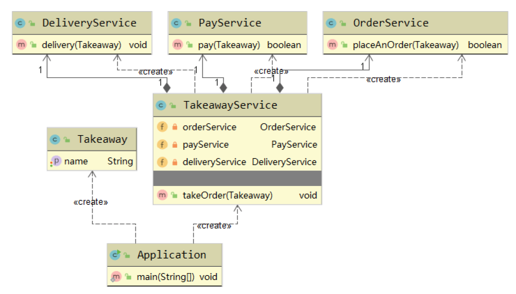

### <font style="color:rgb(76, 73, 72);">装饰者模式</font>

<font style="color:rgb(76, 73, 72);">
在不改变原有对象的基础之上，将功能附加到对象上，提供了比继承更有弹性的替代方案。</font>

<font style="color:rgb(76, 73, 72);">适用于：</font>

1. <font style="color:rgb(76, 73, 72);">拓展一个类的功能；</font>
2. <font style="color:rgb(76, 73, 72);">动态给对象添加功能，并且动态撤销。</font>

<font style="color:rgb(76, 73, 72);">优点：</font>

1. <font style="color:rgb(76, 73, 72);">继承的有力补充，不改变原有对象的情况下给对象拓展功能；</font>
2. <font style="color:rgb(76, 73, 72);">通过使用不同的装饰类、不同的组合方式，实现不同的效果。</font>
3. <font style="color:rgb(76, 73, 72);">符合开闭原则。</font>

<font style="color:rgb(76, 73, 72);">缺点：</font>

1. <font style="color:rgb(76, 73, 72);">增加程序复杂性；</font>

<font style="color:rgb(76, 73, 72);">举个水果沙拉的例子。</font>

<font style="color:rgb(76, 73, 72);">
比如在点水果沙拉外卖时，可以往水果沙拉里加各种水果，价格也会相应的调整，要让程序支持不同水果自由组合，并计算相应的价格，则可以使用装饰者模式来完成。</font>

<font style="color:rgb(76, 73, 72);">定义一个抽象的水果沙拉类AbstractFruitSalad：</font>

```java
public abstract class AbstractFruitSalad {
    public abstract String remark();

    public abstract int price();
}
```

<font style="color:rgb(76, 73, 72);">包含备注和价格抽象方法。</font>

<font style="color:rgb(76, 73, 72);">接着创建一个抽象的装饰器AbstractDecorator（关键点，继承抽象水果沙拉类）：</font>

```java
public class AbstractDecorator extends AbstractFruitSalad {

    private AbstractFruitSalad fruitSalad;

    public AbstractDecorator(AbstractFruitSalad fruitSalad) {
        this.fruitSalad = fruitSalad;
    }

    @Override
    public String remark() {
        return fruitSalad.remark();
    }

    @Override
    public int price() {
        return fruitSalad.price();
    }
}
```

<font style="color:rgb(76, 73, 72);">创建具体的水果沙拉类FruitSalad：</font>

```java
public class FruitSalad extends AbstractFruitSalad {
    @Override
    public String remark() {
        return "水果🥗（标准）\n";
    }

    @Override
    public int price() {
        return 9;
    }
}
```

<font style="color:rgb(76, 73, 72);">该沙拉是标准的水果沙拉，价格是9元。</font>

<font style="color:rgb(76, 73, 72);">
如果我们的水果沙拉还允许客户添加猕猴桃和西瓜，那么我们可以添加两个新的装饰器。添加猕猴桃装饰器KiwiDecorator：</font>

```java
public class KiwiDecorator extends AbstractDecorator {

    public KiwiDecorator(AbstractFruitSalad fruitSalad) {
        super(fruitSalad);
    }

    @Override
    public String remark() {
        return super.remark() + "加份🥝切\n";
    }

    @Override
    public int price() {
        return super.price() + 2;
    }
}
```

<font style="color:rgb(76, 73, 72);">可以看到，加一份猕猴桃需要在原有基础上加2元。</font>

<font style="color:rgb(76, 73, 72);">接着继续创建西瓜装饰器WaterMelonDecorator：</font>

```java
public class WaterMelonDecorator extends AbstractDecorator {

    public WaterMelonDecorator(AbstractFruitSalad fruitSalad) {
        super(fruitSalad);
    }

    @Override
    public String remark() {
        return super.remark() + "加份🍉切\n";
    }

    @Override
    public int price() {
        return super.price() + 3;
    }
}
```

<font style="color:rgb(76, 73, 72);">最后创建客户端Application测试一下：</font>

```java
public class Application {

    public static void main(String[] args) {
        // 点了份水果沙拉，并加了两份🥝和一份🍉，看看最终价格是多少？
        AbstractFruitSalad fruitSalad = new FruitSalad();
        fruitSalad = new KiwiDecorator(fruitSalad);
        fruitSalad = new KiwiDecorator(fruitSalad);
        fruitSalad = new WaterMelonDecorator(fruitSalad);

        System.out.println(fruitSalad.remark() + "价格是：" + fruitSalad.price());
    }
}
```

<font style="color:rgb(76, 73, 72);">上面的写法也可以改为：</font>

```java
public class Application {

    public static void main(String[] args) {
        // 点了份水果沙拉，并加了两份🥝和一份🍉，看看最终价格是多少？
        AbstractFruitSalad fruitSalad = new FruitSalad();
        fruitSalad = new WaterMelonDecorator(new KiwiDecorator(new KiwiDecorator(fruitSalad)));

        System.out.println(fruitSalad.remark() + "价格是：" + fruitSalad.price());
    }
}
```

<font style="color:rgb(76, 73, 72);">程序输出如下：</font>

```bash
水果🥗（标准）
加份🥝切
加份🥝切
加份🍉切
价格是：16
```

<font style="color:rgb(76, 73, 72);">
通过不同的装饰器自由组合，我们可以灵活的组装出各式各样的水果沙拉，这正是装饰者模式的优点，但明显可以看出代码变复杂了。</font>

<font style="color:rgb(76, 73, 72);">这个例子的UML图如下所示:</font>

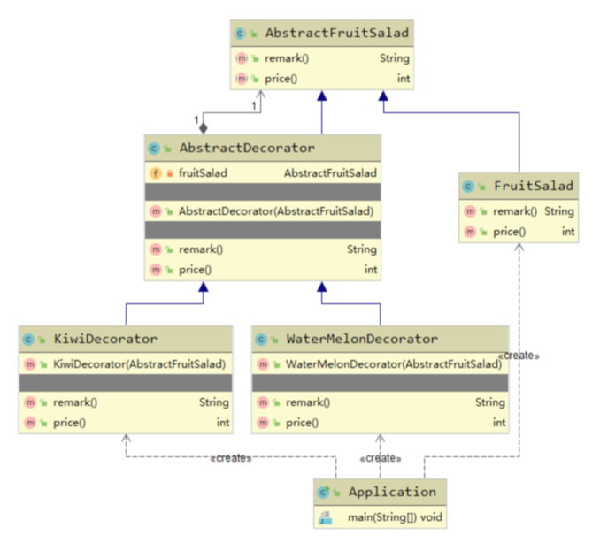

### <font style="color:rgb(76, 73, 72);">适配器模式</font>

<font style="color:rgb(76, 73, 72);">将一个类的接口转换为期望的另一个接口，使原本不兼容的类可以一起工作。</font>

<font style="color:rgb(76, 73, 72);">适用于：</font>

1. <font style="color:rgb(76, 73, 72);">已存在的类，它的方法和需求不匹配时（方法结果相同或者相似）</font>

<font style="color:rgb(76, 73, 72);">优点:</font>

1. <font style="color:rgb(76, 73, 72);">提高类的透明性和复用，现有的类复用但不需改变；</font>
2. <font style="color:rgb(76, 73, 72);">目标类和适配器类解耦，提高程序拓展性；</font>
3. <font style="color:rgb(76, 73, 72);">符合开闭原则。</font>

<font style="color:rgb(76, 73, 72);">缺点：</font>

1. <font style="color:rgb(76, 73, 72);">适配器编写过程需要全面考虑，可能会增加系统的复杂性；</font>
2. <font style="color:rgb(76, 73, 72);">降低代码可读性。</font>

<font style="color:rgb(76, 73, 72);">分为：类适配器模式和对象适配器模式。</font>

<font style="color:rgb(76, 73, 72);">先举个类适配器模式的例子：</font>

<font style="color:rgb(76, 73, 72);">假如项目里原有一条水果的产品线，比如包含一个树莓类Raspberry：</font>

```java
public class Raspberry {

    public void addRaspberry() {
        System.out.println("添加点树莓");
    }
}
```

<font style="color:rgb(76, 73, 72);">随着项目的拓展，现在新增了水果派产品线，新建Pie接口：</font>

```java
public interface Pie {

    void make();
}
```

<font style="color:rgb(76, 73, 72);">
要将Raspberry加入到Pie产品线，又不想修改Raspberry类的代码，则可以创建一个适配器RaspberryPieAdaptor：</font>

```java
public class RaspberryPieAdaptor extends Raspberry implements Pie {
    @Override
    public void make() {
        System.out.println("制作一个派🥧");
        super.addRaspberry();
    }
}
```

<font style="color:rgb(76, 73, 72);">适配器继承被适配的类，实现新的产品线接口。</font>

<font style="color:rgb(76, 73, 72);">在Application里测试一波：</font>

```java
public class Application {
    public static void main(String[] args) {
        Pie pie = new RaspberryPieAdaptor();
        pie.make();
    }
}
```

<font style="color:rgb(76, 73, 72);">输出：</font>

```bash
制作一个派🥧
添加点树莓
```

<font style="color:rgb(76, 73, 72);">成功通过适配器制造了树莓派。类适配器模式的UML图很简单：</font>

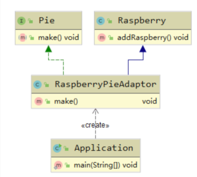

<font style="color:rgb(76, 73, 72);">对象适配器模式只需要将RaspberryPieAdaptor修改为：</font>

```java
public class RaspberryPieAdaptor implements Pie {

    private Raspberry raspberry = new Raspberry();

    @Override
    public void make() {
        System.out.println("制作一个派🥧");
        raspberry.addRaspberry();
    }
}
```

<font style="color:rgb(76, 73, 72);">这种模式不直接继承被适配者，而是在适配器里创建被适配者。这种模式的UML图：</font>

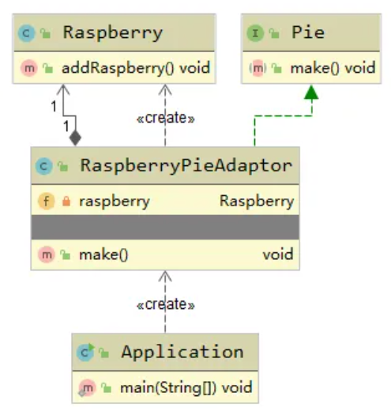

### <font style="color:rgb(76, 73, 72);">享元模式</font>

<font style="color:rgb(76, 73, 72);">
提供了减少对象数量从而改善应用所需的对象结构的方式，运用共享技术有效地支持大量细粒度的对象。</font>

<font style="color:rgb(76, 73, 72);">适用于：</font>

1. <font style="color:rgb(76, 73, 72);">底层系统开发，解决性能问题；</font>
2. <font style="color:rgb(76, 73, 72);">系统拥有大量相似对象，需要缓冲池的场景。</font>

<font style="color:rgb(76, 73, 72);">优点：</font>

1. <font style="color:rgb(76, 73, 72);">减少对象的创建，降低内存占用；</font>

<font style="color:rgb(76, 73, 72);">缺点：</font>

1. <font style="color:rgb(76, 73, 72);">关注内/外部状态，关注线程安全问题；</font>
2. <font style="color:rgb(76, 73, 72);">程序的逻辑复杂化。</font>

<font style="color:rgb(76, 73, 72);">内部状态：简单理解为享元对象的属性状态，不会因为外部的改变而改变；
外部状态：简单理解为方法参数。</font>

<font style="color:rgb(76, 73, 72);">举个例子，新建派</font><font style="color:rgb(76, 73, 72);">
🥧</font><font style="color:rgb(76, 73, 72);">接口Pie：</font>

```java
public interface Pie {

    void make() throws InterruptedException;
}
```

<font style="color:rgb(76, 73, 72);">其实现类水果派FruitPie：</font>

```java
public class FruitPie implements Pie {

    private String name;
    private LocalDateTime productTime;

    public FruitPie(String name) {
        this.name = name;
    }

    public void setProductTime(LocalDateTime productTime) {
        this.productTime = productTime;
    }

    @Override
    public void make() {
        try {
            Thread.sleep(100);
            System.out.println(name + "生产时间：" + this.productTime);
        } catch (InterruptedException e) {
            e.printStackTrace();
        }
    }
}
```

<font style="color:rgb(76, 73, 72);">包含名称和生产日期属性，并且有个make方法。</font>

<font style="color:rgb(76, 73, 72);">接着创建生产FruitPie的工厂FruitPieFactory：</font>

```java
public class FruitPieFactory {

    private static final HashMap<String, FruitPie> PIE_HASH_MAP = new HashMap<>();

    public static FruitPie produce(String name) {
        FruitPie fruitPie = PIE_HASH_MAP.get(name);
        if (fruitPie == null) {
            System.out.println("没有" + name + "制作方法，学习制作...");
            fruitPie = new FruitPie(name);
            PIE_HASH_MAP.put(name, fruitPie);
        }
        return fruitPie;
    }
}
```

<font style="color:rgb(76, 73, 72);">代码关键是通过HashMap存储对象。</font>

<font style="color:rgb(76, 73, 72);">编写个测试类：</font>

```java
public class Application {

    private static final String[] PIE = {"🍇派", "🍈派", "🍓派", "🍒派"};

    public static void main(String[] args) {
        IntStream.range(0, 10).forEach((i) -> {
            String name = PIE[(int) (Math.random() * PIE.length)];
            FruitPie fruitPie = FruitPieFactory.produce(name);
            fruitPie.setProductTime(LocalDateTime.now());
            fruitPie.make();
        });
    }
}
```

<font style="color:rgb(76, 73, 72);">输出如下所示：</font>

```bash
没有🍓派制作方法，学习制作...
🍓派生产时间：2019-12-19T16:13:26.397
没有🍇派制作方法，学习制作...
🍇派生产时间：2019-12-19T16:13:26.498
🍇派生产时间：2019-12-19T16:13:26.599
没有🍒派制作方法，学习制作...
🍒派生产时间：2019-12-19T16:13:26.700
🍒派生产时间：2019-12-19T16:13:26.800
🍒派生产时间：2019-12-19T16:13:26.901
没有🍈派制作方法，学习制作...
🍈派生产时间：2019-12-19T16:13:27.002
🍓派生产时间：2019-12-19T16:13:27.103
🍇派生产时间：2019-12-19T16:13:27.203
🍇派生产时间：2019-12-19T16:13:27.304
```

<font style="color:rgb(76, 73, 72);">
从结果看，在10次循环中，只生产了4个对象，这很好的描述了系统有大量相似对象，需要缓冲池的场景。</font>

<font style="color:rgb(76, 73, 72);">JDK中的字符串常量池，数据库连接池等都是用的享元模式。</font>

### <font style="color:rgb(76, 73, 72);">组合模式</font>

<font style="color:rgb(76, 73, 72);">
将对象组合成树形结构以表示“部分-整体”的层次结构，使客户端对单个对象和组合对象保持一致的方式处理。</font>

<font style="color:rgb(76, 73, 72);">适用于：</font>

1. <font style="color:rgb(76, 73, 72);">客户端可以忽略组合对象与单个对象的差异；</font>
2. <font style="color:rgb(76, 73, 72);">处理树形结构数据。</font>

<font style="color:rgb(76, 73, 72);">优点:</font>

1. <font style="color:rgb(76, 73, 72);">层次清晰；</font>
2. <font style="color:rgb(76, 73, 72);">客户端不必关系层次差异，方便控制；</font>
3. <font style="color:rgb(76, 73, 72);">符合开闭原则。</font>

<font style="color:rgb(76, 73, 72);">缺点：</font>

1. <font style="color:rgb(76, 73, 72);">树形处理较为复杂。</font>

<font style="color:rgb(76, 73, 72);">举个菜单按钮组成的树形例子。</font>

<font style="color:rgb(76, 73, 72);">新建菜单按钮的组合抽象类AbstractMenuButton：</font>

```java
public abstract class AbstractMenuButton {

    public void add(AbstractMenuButton abstractMenuButton) {
        throw new UnsupportedOperationException("不支持创建操作");
    }

    public String getName() {
        throw new UnsupportedOperationException("不支持名称获取");
    }

    public String getType() {
        throw new UnsupportedOperationException("不支持类型获取");
    }

    public String getIcon() {
        throw new UnsupportedOperationException("不支持图标");
    }

    public void print() {
        throw new UnsupportedOperationException("不支持打印操作");
    }
}
```

<font style="color:rgb(76, 73, 72);">组合了菜单按钮操作的基本方法。</font>

<font style="color:rgb(76, 73, 72);">新增按钮类Button：</font>

```java
public class Button extends AbstractMenuButton {

    private String name;

    public Button(String name) {
        this.name = name;
    }

    @Override
    public String getName() {
        return this.name;
    }

    @Override
    public String getType() {
        return "按钮";
    }

    @Override
    public void print() {
        System.out.println(getName() + "【" + getType() + "】");
    }
}
```

<font style="color:rgb(76, 73, 72);">
按钮拥有名称属性，并且支持名称获取，类型获取和打印方法，所以重写了这三个父类方法。</font>

<font style="color:rgb(76, 73, 72);">接着新建菜单类Menu：</font>

```java
public class Menu extends AbstractMenuButton {

    private List<AbstractMenuButton> items = new ArrayList<>();
    private String name;
    private String icon;
    private Integer level;

    public Menu(String name, String icon, Integer level) {
        this.name = name;
        this.icon = icon;
        this.level = level;
    }

    @Override
    public void add(AbstractMenuButton abstractMenuButton) {
        items.add(abstractMenuButton);
    }

    @Override
    public String getName() {
        return this.name;
    }

    @Override
    public String getType() {
        return "菜单";
    }

    @Override
    public String getIcon() {
        return this.icon;
    }

    @Override
    public void print() {
        System.out.println(getIcon() + getName() + "【" + getType() + "】");
        for (AbstractMenuButton item : items) {
            if (this.level != null) {
                for (int i = 0; i < this.level; i++) {
                    System.out.print("    ");
                }
            }
            item.print();
        }
    }
}
```

<font style="color:rgb(76, 73, 72);">
菜单包含名称、图标和层级属性，并且菜单可以包含下级（比如下级菜单，下级按钮），所以它包含一个List</font><font style="color:rgb(76, 73, 72);">
类型的属性items。</font>

<font style="color:rgb(76, 73, 72);">此外，菜单包含添加下级、名称获取、类型获取、图标获取和打印方法。</font>

<font style="color:rgb(76, 73, 72);">新建一个客户端，测试菜单按钮的层级结构：</font>

```java
public class Application {

    public static void main(String[] args) {
        Menu userMenu = new Menu("用户管理", "🧑", 2);
        Button createUser = new Button("新增用户");
        Button updateUser = new Button("修改用户");
        Button deleteUser = new Button("删除用户");
        userMenu.add(createUser);
        userMenu.add(updateUser);
        userMenu.add(deleteUser);

        Menu logMenu = new Menu("操作日志", "📃", 2);
        Button export = new Button("导出Excel");
        logMenu.add(export);

        Menu systemMenu = new Menu("系统管理", "🔨", 1);
        systemMenu.add(userMenu);
        systemMenu.add(logMenu);

        systemMenu.print();
    }
}
```

<font style="color:rgb(76, 73, 72);">打印输出如下所示：</font>

```java
🔨系统管理【菜单】
        🧑用户管理【菜单】
新增用户【按钮】
修改用户【按钮】
删除用户【按钮】
        📃操作日志【菜单】
导出Excel【按钮】
```

<font style="color:rgb(76, 73, 72);">UML图如下所示：</font>

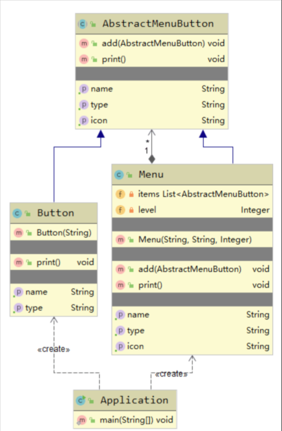

### <font style="color:rgb(76, 73, 72);">桥接模式</font>

<font style="color:rgb(76, 73, 72);">
将抽象部分和具体实现部分分离，使它们都可以独立变化。通过组合的方式建立两个类之间的关系，而不是通过继承。</font>

<font style="color:rgb(76, 73, 72);">适用于：</font>

1. <font style="color:rgb(76, 73, 72);">抽象和实体实现之间增加更多的灵活性；</font>
2. <font style="color:rgb(76, 73, 72);">一个类存在多个独立变化的维度，并且需要独立拓展；</font>
3. <font style="color:rgb(76, 73, 72);">不希望使用继承。</font>

<font style="color:rgb(76, 73, 72);">优点：</font>

1. <font style="color:rgb(76, 73, 72);">分离抽象部分和具体实现部分；</font>
2. <font style="color:rgb(76, 73, 72);">提高了系统可拓展性；</font>
3. <font style="color:rgb(76, 73, 72);">符合开闭原则和合成复用原则。</font>

<font style="color:rgb(76, 73, 72);">缺点：</font>

1. <font style="color:rgb(76, 73, 72);">增加了系统的理解和设计难度；</font>

<font style="color:rgb(76, 73, 72);">举个例子：</font>

<font style="color:rgb(76, 73, 72);">现有派的接口类Pie：</font>

```java
public interface Pie {

    Pie makePie();

    void getType();
}
```

<font style="color:rgb(76, 73, 72);">包含制作派和获取派类型抽象方法。</font>

<font style="color:rgb(76, 73, 72);">接着创建两个Pie的实现类，苹果派AppliePie：</font>

```java
public class ApplePie implements Pie {
    @Override
    public Pie makePie() {
        System.out.println("制作苹果派🍎🥧");
        return new ApplePie();
    }

    @Override
    public void getType() {
        System.out.println("水果派");
    }
}
```

<font style="color:rgb(76, 73, 72);">胡萝卜派CarrotPie：</font>

```java
public class CarrotPie implements Pie {
    @Override
    public Pie makePie() {
        System.out.println("制作胡萝卜派🥕🥧");
        return new CarrotPie();
    }

    @Override
    public void getType() {
        System.out.println("蔬菜沙拉派");
    }
}
```

<font style="color:rgb(76, 73, 72);">
接着创建一个店铺抽象类Store，通过属性的方式和Pie相关联，目的是可以在不同的店铺实现类中灵活地制作各种派：</font>

```java
public abstract class Store {

    protected Pie pie;

    public Store(Pie pie) {
        this.pie = pie;
    }

    abstract Pie makePie();
}
```

<font style="color:rgb(76, 73, 72);">Store子类之一，山姆大叔的小店SamStore：</font>

```java
public class SamStore extends Store {

    public SamStore(Pie pie) {
        super(pie);
    }

    @Override
    Pie makePie() {
        System.out.print("山姆大叔的小店💒");
        return pie.makePie();
    }
}
```

<font style="color:rgb(76, 73, 72);">Store子类之二，杰克的小店JackStore：</font>

```java
public class JackStore extends Store {

    public JackStore(Pie pie) {
        super(pie);
    }

    @Override
    Pie makePie() {
        System.out.print("杰克的小店💒");
        return pie.makePie();
    }
}
```

<font style="color:rgb(76, 73, 72);">新建一个客户端，测试Pie的实现类和Store的继承类之间的自由组合：</font>

```java
public class Application {
    public static void main(String[] args) {
        Store samStore = new SamStore(new ApplePie());
        Pie samStorePie = samStore.makePie();
        samStorePie.getType();

        Store jackStore = new JackStore(new CarrotPie());
        Pie jackStorePie = jackStore.makePie();
        jackStorePie.getType();
    }
}
```

<font style="color:rgb(76, 73, 72);">输出如下：</font>

```bash
山姆大叔的小店💒制作苹果派🍎🥧
水果派
杰克的小店💒制作胡萝卜派🥕🥧
蔬菜沙拉派
```

<font style="color:rgb(76, 73, 72);">这个例子很好地体现了桥接模式的特点，UML图如下：</font>

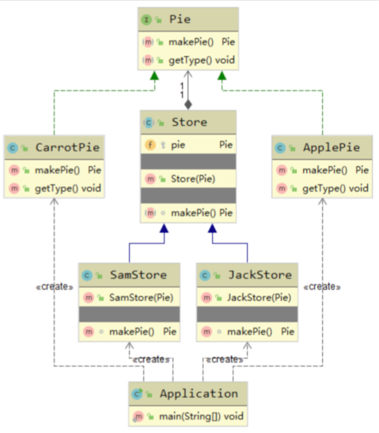

### <font style="color:rgb(76, 73, 72);">代理模式</font>

<font style="color:rgb(76, 73, 72);">
为其他对象提供一种代理，以控制对这个对象的访问，代理对象在客户端和目标对象之间起到了中介的作用。</font>

<font style="color:rgb(76, 73, 72);">适用于：</font>

1. <font style="color:rgb(76, 73, 72);">保护目标对象；</font>
2. <font style="color:rgb(76, 73, 72);">增强目标对象。</font>

<font style="color:rgb(76, 73, 72);">优点：</font>

1. <font style="color:rgb(76, 73, 72);">将代理对象和真实被调用的目标对象分离；</font>
2. <font style="color:rgb(76, 73, 72);">降低耦合，拓展性好；</font>
3. <font style="color:rgb(76, 73, 72);">保护目标对象，增强目标对象。</font>

<font style="color:rgb(76, 73, 72);">缺点：</font>

1. <font style="color:rgb(76, 73, 72);">造成类的数目增加，增加复杂度；</font>
2. <font style="color:rgb(76, 73, 72);">客户端和目标对象增加代理对象，会造成处理速度变慢。</font>

#### <font style="color:rgb(76, 73, 72);">静态代理</font>

<font style="color:rgb(76, 73, 72);">
通过在代码中显式地定义了一个代理类，在代理类中通过同名的方法对目标对象的方法进行包装，客户端通过调用代理类的方法来调用目标对象的方法。</font>

<font style="color:rgb(76, 73, 72);">举个静态代理的例子：</font>

<font style="color:rgb(76, 73, 72);">新建一个派的制作接口PieService：</font>

```java
public interface PieServcie {
    void makePie();
}
```

<font style="color:rgb(76, 73, 72);">创建其实现类PieServiceImpl：</font>

```java
public class PieServiceImpl implements PieServcie {
    public void makePie() {
        System.out.println("制作🥗派");
    }
}
```

<font style="color:rgb(76, 73, 72);">要对PieServiceImpl的</font>
`_<font style="color:rgb(65, 74, 81);background-color:rgb(251, 251, 251);">makePie</font>_`<font style="color:rgb(76, 73, 72);">
方法增强，我们需要创建一个代理对象PieServiceProxy：</font>

```java
public class PieServiceProxy {

    private PieServcie pieServcie;

    public void makePie() {
        beforeMethod();
        pieServcie = new PieServiceImpl();
        pieServcie.makePie();
        afterMethod();
    }

    private void beforeMethod() {
        System.out.println("准备材料");
    }

    private void afterMethod() {
        System.out.println("保鲜");
    }

}
```

<font style="color:rgb(76, 73, 72);">在PieServiceProxy中我们创建了一个和PieServcie一致的同名方法</font>
`_<font style="color:rgb(65, 74, 81);background-color:rgb(251, 251, 251);">makePie</font>_`<font style="color:rgb(76, 73, 72);">
，方法内部调用了PieServiceImpl的</font>
`_<font style="color:rgb(65, 74, 81);background-color:rgb(251, 251, 251);">makePie</font>_`<font style="color:rgb(76, 73, 72);">
方法，并且在方法调用前调用了代理类的</font>
`_<font style="color:rgb(65, 74, 81);background-color:rgb(251, 251, 251);">beforeMethod</font>_`<font style="color:rgb(76, 73, 72);">
方法，方法调用后调用了代理类的</font>
`_<font style="color:rgb(65, 74, 81);background-color:rgb(251, 251, 251);">afterMethod</font>_`<font style="color:rgb(76, 73, 72);">
方法。</font>

<font style="color:rgb(76, 73, 72);">创建客户端Application，测试：</font>

```java
public class Application {

    public static void main(String[] args) {
        PieServiceProxy proxy = new PieServiceProxy();
        proxy.makePie();
    }
}
```

<font style="color:rgb(76, 73, 72);">输出：</font>

```bash
准备材料
制作🥗派
保鲜
```

<font style="color:rgb(76, 73, 72);">这个例子的UML图如下：</font>

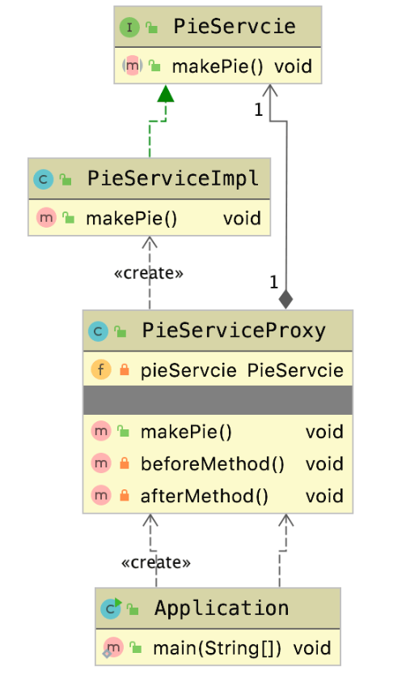

#### <font style="color:rgb(76, 73, 72);">动态代理</font>

<font style="color:rgb(76, 73, 72);">
JDK的动态代理只能代理接口，通过接口的方法名在动态生成的代理类中调用业务实现类的同名方法。</font>

<font style="color:rgb(76, 73, 72);">
静态代理的缺点就是每需要代理一个类，就需要手写对应的代理类。这个问题可以用动态代理来解决。举个动态代理的例子：</font>

<font style="color:rgb(76, 73, 72);">新建冰淇淋制作接口IceCreamService：</font>

```java
public interface IceCreamService {
    void makeIceCream(String fruit);
}
```

<font style="color:rgb(76, 73, 72);">实现类IceCreamServiceImpl：</font>

```java
public class IceCreamServiceImpl implements IceCreamService {

    public void makeIceCream(String fruit) {
        System.out.println("制作" + fruit + "🍦");
    }
}
```

<font style="color:rgb(76, 73, 72);">
现在需要对IceCreamServiceImpl进行代理增强，如果使用静态代理，我们需要编写一个IceCreamServiceImplProxy类，使用动态代理的话，我们可以动态生成对应的代理类。</font>

<font style="color:rgb(76, 73, 72);">创建DynamicProxy：</font>

```java
public class DynamicProxy implements InvocationHandler {

    // 代理的目标对象
    private Object object;

    public DynamicProxy(Object object) {
        this.object = object;
    }

    public Object proxy() {
        Class<?> clazz = object.getClass();
        // 生成代理对象
        return Proxy.newProxyInstance(clazz.getClassLoader(),
                clazz.getInterfaces(), this);
    }

    /**
     * @param proxy  动态生成的代理对象
     * @param method 代理方法
     * @param args   代理方法的方法参数
     * @return 结果
     * @throws Throwable
     */
    public Object invoke(Object proxy, Method method, Object[] args) throws Throwable {
        return null;
    }

}
```

<font style="color:rgb(76, 73, 72);">动态代理类通过实现InvocationHandler的</font>
`_<font style="color:rgb(65, 74, 81);background-color:rgb(251, 251, 251);">invoke</font>_`<font style="color:rgb(76, 73, 72);">
方法实现，</font>
`_<font style="color:rgb(65, 74, 81);background-color:rgb(251, 251, 251);">proxy</font>_`<font style="color:rgb(76, 73, 72);">
用于生成代理对象。剩下的步骤和静态代理类似，完善DynamicProxy：</font>

```java
public class DynamicProxy implements InvocationHandler {

    // 代理的目标对象
    private Object object;

    public DynamicProxy(Object object) {
        this.object = object;
    }

    public Object proxy() {
        Class<?> clazz = object.getClass();
        // 生成代理对象
        return Proxy.newProxyInstance(clazz.getClassLoader(),
                clazz.getInterfaces(), this);
    }

    /**
     * @param proxy  动态生成的代理对象
     * @param method 代理方法
     * @param args   代理方法的方法参数
     * @return 结果
     * @throws Throwable
     */
    public Object invoke(Object proxy, Method method, Object[] args) throws Throwable {
        beforeMethod(object);
        // 反射执行代理对象的目标方法
        Object result = method.invoke(object, args);
        afterMethod(object);
        return result;
    }

    private void beforeMethod(Object object) {
        if (object instanceof PieServcie) {
            System.out.println("准备派的材料");
        } else if (object instanceof IceCreamService) {
            System.out.println("准备冰淇淋材料");
        } else {
            throw new RuntimeException("暂不支持代理" + object.getClass() + "类型");
        }
    }

    private void afterMethod(Object object) {
        if (object instanceof PieServcie) {
            System.out.println("保鲜派");
        } else if (object instanceof IceCreamService) {
            System.out.println("保鲜冰淇淋");
        } else {
            throw new RuntimeException("暂不支持代理" + object.getClass() + "类型");
        }
    }

}
```

<font style="color:rgb(76, 73, 72);">创建客户端Application测试：</font>

```java
public class Application {

    public static void main(String[] args) {

        PieServcie pieServiceDynamicProxy = (PieServcie) new DynamicProxy(new PieServiceImpl()).proxy();
        pieServiceDynamicProxy.makePie();
        System.out.println("-----------------");
        IceCreamService iceCreamServiceDynamicProxy = (IceCreamService) new DynamicProxy(new IceCreamServiceImpl()).proxy();
        iceCreamServiceDynamicProxy.makeIceCream("🍓");
    }
}
```

<font style="color:rgb(76, 73, 72);">结果：</font>

```bash
准备派的材料
制作🥗派
保鲜派
-----------------
准备冰淇淋材料
制作🍓🍦
保鲜冰淇淋
```

<font style="color:rgb(76, 73, 72);">可以看到，通过动态代理我们实现了目标方法增强，并且不需要手写目标类的代理对象。</font>

#### <font style="color:rgb(76, 73, 72);">CGLib代理</font>

<font style="color:rgb(76, 73, 72);">通过继承来实现，生成的代理类就是目标对象类的子类，通过重写业务方法来实现代理。</font>

#### <font style="color:rgb(76, 73, 72);">Spring对代理模式的拓展</font>

1. <font style="color:rgb(76, 73, 72);">当Bean有实现接口时，使用JDK动态代理；</font>
2. <font style="color:rgb(76, 73, 72);">当Bean没有实现接口时，使用CGLib代理。</font>

<font style="color:rgb(76, 73, 72);">可以通过以下配置强制使用CGLib代理：</font>

```yaml
spring:
  aop:
    proxy-target-class: true
```

## <font style="color:rgb(76, 73, 72);">行为型模式</font>

### <font style="color:rgb(76, 73, 72);">模板方法模式</font>

<font style="color:rgb(76, 73, 72);">
模板方法模式定义了一个流程的骨架，由多个方法组成。并允许子类为一个或多个步骤提供实现。简而言之就是公共的不变的部分由父类统一实现，变化的部分由子类来个性化实现。</font>

<font style="color:rgb(76, 73, 72);">优点：</font>

1. <font style="color:rgb(76, 73, 72);">提高复用性；</font>
2. <font style="color:rgb(76, 73, 72);">提高拓展性；</font>
3. <font style="color:rgb(76, 73, 72);">符合开闭原则。</font>

<font style="color:rgb(76, 73, 72);">缺点：</font>

1. <font style="color:rgb(76, 73, 72);">类的数目增加；</font>
2. <font style="color:rgb(76, 73, 72);">增加了系统实现的复杂度；</font>
3. <font style="color:rgb(76, 73, 72);">父类添加新的抽象方法，所有子类都要改一遍。</font>

<font style="color:rgb(76, 73, 72);">举个模板方法模式的例子。定义一个外卖的接口，包含下单、制作和打包配送三个步骤：</font>

```java
public abstract class Takeaway {

    final void order() {
        System.out.println("下单");
    }

    final void packageSend() {
        System.out.println("打包派送");
    }

    protected abstract void make();

    protected boolean needTableware() {
        return true;
    }

    final void flow() {
        this.order();
        this.make();
        if (needTableware()) {
            System.out.println("赠送一次性餐具");
        }
        this.packageSend();
    }
}
```

<font style="color:rgb(76, 73, 72);">其中下单和打包配送行为是固定的，不同的是制作过程，所以</font>
`_<font style="color:rgb(65, 74, 81);background-color:rgb(251, 251, 251);">order</font>_`<font style="color:rgb(76, 73, 72);">
和</font>
`_<font style="color:rgb(65, 74, 81);background-color:rgb(251, 251, 251);">packageSend</font>_`<font style="color:rgb(76, 73, 72);">
方法提供了默认实现，并且由final修饰，子类不可重写。此外，我们还可以通过</font>
`_<font style="color:rgb(65, 74, 81);background-color:rgb(251, 251, 251);">needTableware</font>_`<font style="color:rgb(76, 73, 72);">
这个钩子方法来控制某些子类的定制化需求。</font>

<font style="color:rgb(76, 73, 72);">新增BarbecueTakeaway继承Takeaway：</font>

```java
public class BarbecueTakeaway extends Takeaway {

    private final boolean needTableware;

    public BarbecueTakeaway(boolean needTableware) {
        this.needTableware = needTableware;
    }

    @Override
    protected void make() {
        System.out.println("制作烤肉");
    }

    @Override
    protected boolean needTableware() {
        return this.needTableware;
    }
}
```

<font style="color:rgb(76, 73, 72);">新增FruitTakeaway继承Takeaway：</font>

```java
public class FruitTakeaway extends Takeaway {

    @Override
    protected void make() {
        System.out.println("水果配货");
    }

    @Override
    protected boolean needTableware() {
        return false;
    }
}
```

<font style="color:rgb(76, 73, 72);">新增个客户端Application测试：</font>

```java
public class Application {

    public static void main(String[] args) {
        Takeaway barbecue = new BarbecueTakeaway(true);
        barbecue.flow();

        FruitTakeaway fruit = new FruitTakeaway();
        fruit.flow();
    }
}
```

```bash
下单
制作烤肉
赠送一次性餐具
打包派送
下单
水果配货
打包派送
```

<font style="color:rgb(76, 73, 72);">UML：</font>

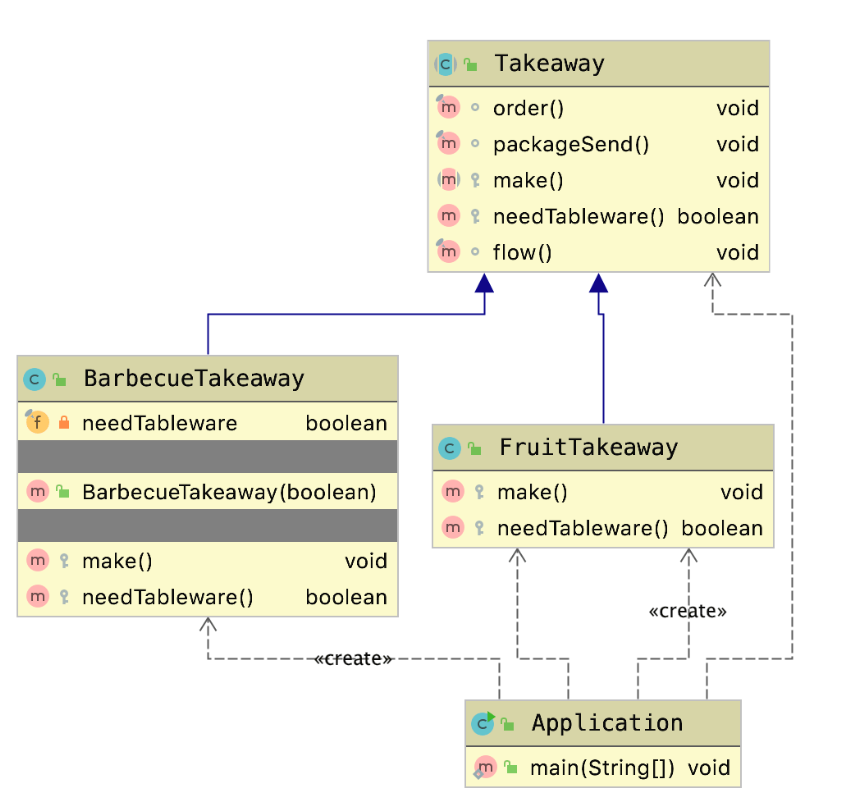

### <font style="color:rgb(76, 73, 72);">迭代器模式</font>

<font style="color:rgb(76, 73, 72);">ignore</font>

### <font style="color:rgb(76, 73, 72);">策略模式</font>

<font style="color:rgb(76, 73, 72);">策略模式定义了算法家族，分别封装起来，让它们之间可以互相替换。此模式让算法的变化不会影响到使用算法的用户。策略模式常用于消除大量的if
else代码。</font>

<font style="color:rgb(76, 73, 72);">适用场景：</font>

1. <font style="color:rgb(76, 73, 72);">系统有很多类，它们的区别仅仅在于行为不同；</font>
2. <font style="color:rgb(76, 73, 72);">一个系统需要动态地在几种算法中选择一种；</font>

<font style="color:rgb(76, 73, 72);">举个策略模式的例子（促销活动），定义一个促销策略接口：</font>

```java
public interface PromotionStrategy {

    void promotion();
}
```

<font style="color:rgb(76, 73, 72);">实现类之一（策略之一），满减促销策略：</font>

```java
public class FullReductionPromotionStrategy implements PromotionStrategy {
    public void promotion() {
        System.out.println("满1000立减1");
    }
}
```

<font style="color:rgb(76, 73, 72);">实现类之一（策略之一），打折促销策略：</font>

```java
public class DiscountPromotionStrategy implements PromotionStrategy {
    public void promotion() {
        System.out.println("9.9折钜惠");
    }
}
```

<font style="color:rgb(76, 73, 72);">创建一个客户端测试：</font>

```java
public class Application {

    public static void main(String[] args) {
        // 模拟客户端传递的促销策略key
        String promotionKey = "fr";
        PromotionStrategy strategy;
        if ("fr".equals(promotionKey)) {
            strategy = new FullReductionPromotionStrategy();
        } else if ("ds".equals(promotionKey)) {
            strategy = new DiscountPromotionStrategy();
        } else {
            throw new RuntimeException("暂不支持该促销活动");
        }
        strategy.promotion();
    }
}
```

<font style="color:rgb(76, 73, 72);">输出结果：</font>

```bash
满1000立减1
```

<font style="color:rgb(76, 73, 72);">策略模式常结合工厂模式来消除大量的if
else代码，我们新建一个促销策略的创建工厂：</font>

```java
public class PromotionStrategyFactory {

    private static final Map<String, PromotionStrategy> PROMOTION_STRATEGY_MAP = new HashMap<>();

    private static final PromotionStrategy NON_PROMOTION = () -> System.out.println("无促销活动");

    static {
        PROMOTION_STRATEGY_MAP.put(PromotionKey.FR, new FullReductionPromotionStrategy());
        PROMOTION_STRATEGY_MAP.put(PromotionKey.DS, new DiscountPromotionStrategy());
    }

    private PromotionStrategyFactory() {
    }

    public static PromotionStrategy getPromotionStrategy(String promotionKey) {
        PromotionStrategy strategy = PROMOTION_STRATEGY_MAP.get(promotionKey);
        return strategy == null ? NON_PROMOTION : strategy;
    }

    private interface PromotionKey {
        String FR = "fr";
        String DS = "ds";
    }
}
```

<font style="color:rgb(76, 73, 72);">
上面代码中，我们通过Map来装载促销策略，这样可以减少对象的重复创建。如果不希望在static块中一次性初始化所有促销策略，我们可以结合享元模式来推迟对象创建过程。</font>

<font style="color:rgb(76, 73, 72);">通过这个工厂方法，上面客户端代码可以简写为：</font>

```java
public class Application {

    public static void main(String[] args) {
        // 模拟客户端传递的促销策略key
        String promotionKey = "fr";
        PromotionStrategy promotionStrategy = PromotionStrategyFactory.getPromotionStrategy(promotionKey);
        promotionStrategy.promotion();
    }
}
```

### <font style="color:rgb(76, 73, 72);">解释器模式</font>

<font style="color:rgb(76, 73, 72);">用的较少，暂不记录。</font>

### <font style="color:rgb(76, 73, 72);">观察者模式</font>

<font style="color:rgb(76, 73, 72);">
观察者模式定义了对象之间的一对多依赖，让多个观察者同时监听某个主题对象，当主体对象发生变化时，它的所有观察者都会收到响应的通知。</font>

<font style="color:rgb(76, 73, 72);">优点：</font>

1. <font style="color:rgb(76, 73, 72);">观察者和被观察者之间建立一个抽象的耦合；</font>
2. <font style="color:rgb(76, 73, 72);">观察者模式支持广播通信。</font>

<font style="color:rgb(76, 73, 72);">缺点：</font>

1. <font style="color:rgb(76, 73, 72);">观察者之间有过多的细节依赖，提高时间消耗及程序复杂度；</font>
2. <font style="color:rgb(76, 73, 72);">应避免循环调用。</font>

<font style="color:rgb(76, 73, 72);">JDK对观察者模式提供了支持。下面举个观察者模式的例子。</font>

<font style="color:rgb(76, 73, 72);">创建一个博客类：</font>

```java
/**
 * 继承 Observable类，Blog为被观察对象
 */
public class Blog extends Observable {

    private String title;

    public Blog(String title) {
        this.title = title;
    }

    public String getTitle() {
        return title;
    }

    public void comment(Comment comment) {

        System.out.println(comment.getNickname() + "评论了<" + this.title + "> ，" +
                "评论内容：" + comment.getValue());
        // 设置标识位 changed = true，表示被观察者发生了改变
        setChanged();
        // 通知观察者，可以给观察者传递数据
        notifyObservers(comment);
    }

}
```

<font style="color:rgb(76, 73, 72);">Comment类代码：</font>

```java
public class Comment {
    /**
     * 评论者昵称
     */
    private String nickname;
    /**
     * 评论内容
     */
    private String value;

    public Comment(String nickname, String value) {
        this.nickname = nickname;
        this.value = value;
    }

    public String getValue() {
        return value;
    }

    public String getNickname() {
        return nickname;
    }
}
```

<font style="color:rgb(76, 73, 72);">
Blog类是被观察者对象，被观察者对象需要继承JDK的Observable类，继承后，被观察者对象包含如下属性和方法：</font>


<font style="color:rgb(76, 73, 72);">这些方法都是线程安全方法（加了synchronized同步锁）。</font>

<font style="color:rgb(76, 73, 72);">Blog的comment方法中，当博客收到评论时，首先调用父类的setChanged()方法，设置标识位
changed = true，表示被观察者发生了改变；然后调用父类的notifyObservers(Object)方法通知所有观察者。</font>

<font style="color:rgb(76, 73, 72);">被观察者对象创建好后，我们接着创建观察者。新建一个Author类：</font>

```java
public class Author implements Observer {

    private String name;

    public Author(String name) {
        this.name = name;
    }

    /**
     * 观察者被通知后，就会调用这个方法
     *
     * @param o   被观察者对象
     * @param arg 被观察者传递过来的数据
     */
    @Override
    public void update(Observable o, Object arg) {
        Blog blog = (Blog) o;
        Comment comment = (Comment) arg;
        System.out.println("系统感知到" + this.name + "撰写的博文<" +
                blog.getTitle() + ">收到了" + comment.getNickname() +
                "的评论，评论内容为：" + comment.getValue());
    }
}
```

<font style="color:rgb(76, 73, 72);">
观察者对象需要实现JDK的Observer类，重写update方法。当被观察者对象调用了notifyObservers方法后，相应的观察者的update方法会被调用。</font>

<font style="color:rgb(76, 73, 72);">新建一个客户端测试一下：</font>

```java
public class Application {

    public static void main(String[] args) {
        Blog blog = new Blog("Java从入门到放弃");
        Author author = new Author("MrBird");

        // 添加观察者
        blog.addObserver(author);

        Comment comment = new Comment("Scott",
                "感谢楼主的文章，让我及时放弃Java，回家继承了千万家产。");
        blog.comment(comment);
    }
}
```

<font style="color:rgb(76, 73, 72);">程序输出如下：</font>

```bash
Scott评论了<Java从入门到放弃> ，评论内容：感谢楼主的文章，让我及时放弃Java，回家继承了千万家产。
系统感知到MrBird撰写的博文<Java从入门到放弃>收到了Scott的评论，评论内容为：感谢楼主的文章，让我及时放弃Java，回家继承了千万家产。
```

<font style="color:rgb(76, 73, 72);">
值得注意的是，观察者的update方法里的逻辑最好进行异步化，这样在并发环境下可以提升程序性能。</font>

### <font style="color:rgb(76, 73, 72);">备忘录模式</font>

<font style="color:rgb(76, 73, 72);">
参考：</font>[<font style="color:rgb(76, 73, 72);">https://www.cnblogs.com/jimoer/p/9537997.html</font>](https://www.cnblogs.com/jimoer/p/9537997.html)<font style="color:rgb(76, 73, 72);">。</font>

### <font style="color:rgb(76, 73, 72);">命令模式</font>

<font style="color:rgb(76, 73, 72);">暂不记录。</font>

### <font style="color:rgb(76, 73, 72);">中介者模式</font>

<font style="color:rgb(76, 73, 72);">暂不记录。</font>

### <font style="color:rgb(76, 73, 72);">职责链模式</font>

<font style="color:rgb(76, 73, 72);">职责链模式为请求创建一个接收此次请求对象的链。</font>

<font style="color:rgb(76, 73, 72);">适用于：</font>

+ <font style="color:rgb(76, 73, 72);">一个请求的处理需要多个对象当中的一个或几个协作处理；</font>

<font style="color:rgb(76, 73, 72);">优点：</font>

1. <font style="color:rgb(76, 73, 72);">请求的发送者和接受者（请求的处理）解耦；</font>
2. <font style="color:rgb(76, 73, 72);">职责链可以动态的组合。</font>

<font style="color:rgb(76, 73, 72);">缺点：</font>

1. <font style="color:rgb(76, 73, 72);">职责链太长或者处理时间过长，影响性能；</font>
2. <font style="color:rgb(76, 73, 72);">职责链可能过多。</font>

<font style="color:rgb(76, 73, 72);">举个字符串校验的例子。新建一个字符串校验抽象类：</font>

```java
public abstract class StringValidator {

    protected StringValidator validator;

    public void setNextValidator(StringValidator validator) {
        this.validator = validator;
    }

    public abstract void check(String value);
}
```

<font style="color:rgb(76, 73, 72);">
StringValidator类包含了一个自身类型的成员变量，这也是该模式的设计核心，以此形成链条。</font>

<font style="color:rgb(76, 73, 72);">创建一个校验字符串长度的类StringLengthValidator：</font>

```java
public class StringLengthValidator extends StringValidator {
    @Override
    public void check(String value) {
        if (value != null && value.length() != 0) {
            System.out.println("字符串长度合法");
            if (validator != null) {
                validator.check(value);
            }
        } else {
            System.out.println("字符串长度不合法");
        }
    }
}
```

<font style="color:rgb(76, 73, 72);">
上面代码中，在字符串长度校验合法后，我们判断父类的validator属性是否为空，不为空则调用其check方法继续下一步校验。</font>

<font style="color:rgb(76, 73, 72);">接着再新建一个校验字符串内容的类StringValueValidator：</font>

```java
public class StringValueValidator extends StringValidator {
    @Override
    public void check(String value) {
        if (value.contains("fuck")) {
            System.out.println("字符串值不合法");
            if (validator != null) {
                validator.check(value);
            }
        } else {
            System.out.println("字符串值合法");
        }
    }
}
```

<font style="color:rgb(76, 73, 72);">
套路和StringLengthValidator一样。接着创建一个客户端类，演示下如何让校验类形成一个链条：</font>

```java
public class Application {

    public static void main(String[] args) {
        StringValidator lengthValidator = new StringLengthValidator();
        StringValidator valueValidator = new StringValueValidator();

        lengthValidator.setNextValidator(valueValidator);
        lengthValidator.check("hello");
    }
}
```

<font style="color:rgb(76, 73, 72);">
上面代码中，通过StringValidator的setNextValidator方法，我们可以指定下一个校验类，以此形成链条，程序输出如下：</font>

```bash
字符串长度合法
字符串值合法
```

### <font style="color:rgb(76, 73, 72);">访问者模式</font>

<font style="color:rgb(76, 73, 72);">暂不记录</font><font style="color:rgb(76, 73, 72);">🌚</font>

### <font style="color:rgb(76, 73, 72);">状态模式</font>

<font style="color:rgb(76, 73, 72);">暂不记录</font><font style="color:rgb(76, 73, 72);">🌚</font>

<font style="color:rgb(102, 102, 102);">
参考连接：</font>[<font style="color:rgb(102, 102, 102);">https://zh.wikipedia.org/wiki/%E8%AE%BE%E8%AE%A1%E6%A8%A1%E5%BC%8F_(%E8%AE%A1%E7%AE%97%E6%9C%BA)</font>](https://zh.wikipedia.org/wiki/%E8%AE%BE%E8%AE%A1%E6%A8%A1%E5%BC%8F_(%E8%AE%A1%E7%AE%97%E6%9C%BA))

