## 简介

### ConcurrentSkipListMap 是什么

`ConcurrentSkipListMap`是`JDK1.6`提供的又一个线程安全有序的 map 集合，在高并发场景下有着不错的存取效率。使用起来和
`TreeMap`类似，支持一些需要保证有序性的操作，但在实现和使用场景上有些不同:

1. `ConcurrentSkipListMap`由跳表实现，支持多线程场景下的增删改查操作，是一个线程安全的并发容器。
2. `TreeMap`是由红黑树实现的，不支持多线程操作，是线程非安全的容器。


此外`ConcurrentSkipListMap`存取操作时间复杂度都是`O(log n)`，并且存取效率和线程数并没有关系，这意味着在高并发场景下，它的执行效率远高于
`ConcurrentHashMap`，这一点我们用下面这段代码即可印证。

```java
public class ConcurrentSkipListMapExample {
    public static void main(String[] args) throws InterruptedException {

        testMapInsertionTime(new ConcurrentHashMap<>());
        testMapInsertionTime(new ConcurrentSkipListMap<>());


    }

    private static void testMapInsertionTime(Map<Integer, Integer> map) {
        //创建1w个线程
        ExecutorService threadPool = Executors.newFixedThreadPool(10000);

        long begin = System.currentTimeMillis();
        //插入1000w条数据
        for (int i = 0; i < 1000_0000; i++) {
            final int num = i;
            threadPool.execute(() -> map.put(num, num));
        }


        threadPool.shutdown();
        while (!threadPool.isTerminated()) {

        }

        long end = System.currentTimeMillis();
        System.out.println("cost:" + (end - begin));
    }

}
```

输出结果如下，可以看到 ConcurrentSkipListMap 随着线程逐渐增加插入效率仍高于同等并发容器 ConcurrentHashMap:

```java
cost:15772
cost:11842
```

需要注意的是`ConcurrentSkipListMap`也存在某些劣势，在获取`size`时需要遍历链表，所以时间复杂度为`O(n)`，这一点我们使用需要考虑到。

```java
public int size() {
    long count = 0;
    //从存放链表的第一个元素，不断往后走，统计有效键值对个数
    for (Node<K, V> n = findFirst(); n != null; n = n.next) {
        if (n.getValidValue() != null)
            ++count;
    }
    return (count >= Integer.MAX_VALUE) ? Integer.MAX_VALUE : (int) count;
}
```

### ConcurrentSkipListMap 底层的跳表是如何工作的

跳表是一种基于有序链表的数据结构，如下图所示，跳表通过在链表中增加`多级索引(Index)`
，检索时通过多级索引定位来提高元素的查找效率，从而实现较快的插入、删除和查找操作。  
举个例子，假设我们希望在找到值为 23 的元素的位置，它的查询工作过程是怎样的呢?


如下图，首先从 3 级索引开始搜寻，执行步骤为:

1. 3 级索引从`headIndex`开始遍历，得到 38 的索引，大于 23，说明 3 级索引后续索引都大于目标值，该层索引已没有搜索的必要，到下级索引查找。
2. 2 级索引遍历到 3 的索引，该值小于 23，指针继续向右。
3. 2 级索引遍历到 17 的索引，同样小于 23，指针继续向右推进。
4. 2 级索引遍历到 38，大于 23，说明 2 级索引没有目标节点索引，继续向下层查找。
5. 1 级索引得到 25，大于 23，继续向下层查找。
6. 在链表中查到 23，搜寻结束，查找次数为 6。

查询路径如下图所示:

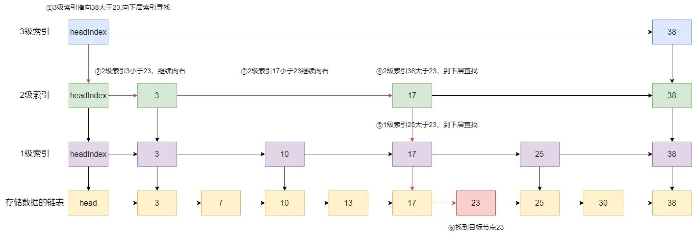

查询次数为 6 次，比较极端，和普通有序链表查询次数一样，原因很简单，23 这个节点没有在索引上命中。一旦我们将查询目标改为 25 或者
38，在多级索引的结构下，查询次数就会有质的飞跃。

跳表的索引层数是随机生成的，一般取决于元素的数量和数据分布情况。例如，如果一个跳表中有 n 个元素，那么索引的层数一般取
`log2(n)`。在跳表中，每个节点都有一个前向指针和一个后向指针，前向指针指向相邻的节点，后向指针指向相邻的节点的索引节点。跳表中的每个索引节点都包含一个指向下一个索引节点的指针，这样就形成了一种多级索引的结构。

通过多级索引，跳表可以实现较快的查找操作，时间复杂度为`O(log n)`，其中 n 为元素的数量。同时，跳表也可以较为容易地实现插入和删除操作，时间复杂度也为
`O(log n)`。跳表相对于其他数据结构的优势在于其简单性、易于实现和较高的查询效率，因此在一些场景下被广泛应用。

### ConcurrentSkipListMap 适用场景

使用场景符合以下 3 个条件时，我们建议使用`ConcurrentSkipListMap`:

1. 高并发访问操作:这一点是基本条件，没有多线程的情况我们更建议使用`HashMap`和`TreeMap`。多线程场景下
   `ConcurrentSkipListMap`存取效率和线程数无关，所以存取效率远远高于`ConcurrentHashMap`。
2. 有序操作:`ConcurrentSkipListMap`底层采用跳表实现的，进行插入时可以会按照`key`选取合适的位置进行插入，所以对于升序或者降序遍历时，
   `ConcurrentSkipListMap`有着较好的表现。
3. 范围查询:`ConcurrentSkipListMap`提供了`headMap`、`tailMap`、`subMap`等方法，支持需要进行有序的区间查询操作。

## ConcurrentSkipListMap 使用示例

### 并发插入

`ConcurrentSkipListMap`支持多线程插入操作，我们这里尝试用 100 个线程并发插入，查看是否会出现并发情况导致某些键值对插入失败导致丢失。

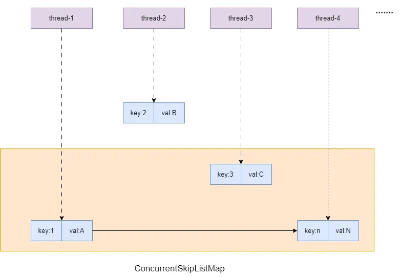

对应代码如下:

```java
public static void main(String[] args) {
    ConcurrentSkipListMap<Integer, Integer> map = new ConcurrentSkipListMap<>();
    //创建一个含有100个线程的线程池
    ExecutorService threadPool = Executors.newFixedThreadPool(100);


    //向线程池提交100个插入操作
    for (int i = 0; i < 100; i++) {
        final int num = i;

        threadPool.execute(() -> {
            map.put(num, num);
        });
    }

    //关闭并等待线程池结束
    threadPool.shutdown();
    while (!threadPool.isTerminated()) {

    }

    //输出concurrentSkipListMap的size
    System.out.println("concurrentSkipListMap size:" + map.size());

}
```

输出结果如下，可以看出并发插入的键值对并没有缺失。

```java
concurrentSkipListMap size:100
```

### 乐观锁

`ConcurrentSkipListMap`的插入操作支持并发场景下实现不存在才能插入键值对的操作，这一点就很适合实现一个乐观锁，例如我们有多个线程要插入
`key`为 1 的键值对，仅允许第一个完成插入的线程进行进一步操作，那么我们就可以使用`putIfAbsent`。

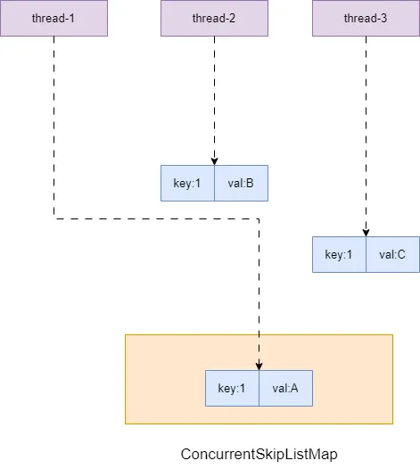

我们用 100 个线程模拟尝试并发存入一个 key 为 1 的键值对，只有插入返回 null 才说明插入成功，其余返回不为空的操作则说明 key
为 1 的键值对已经有人插入了,乐观锁获取失败。

```java
public static void main(String[] args) {
    ConcurrentSkipListMap<Integer, Integer> map = new ConcurrentSkipListMap<>();
    //创建一个含有10个线程的线程池
    ExecutorService threadPool = Executors.newFixedThreadPool(100);


    //向线程池提交100个插入操作
    for (int i = 0; i < 100; i++) {
        final int key = 1;
        final int value = RandomUtil.randomInt(0, 100);

        threadPool.execute(() -> {
            Integer result = map.putIfAbsent(key, value);
            //第一次插入操作会返回null
            if (result == null) {
                System.out.println("first insertion key:" + key + " value:" + value);
            }
        });
    }

    //关闭并等待线程池结束
    threadPool.shutdown();
    while (!threadPool.isTerminated()) {

    }

    //输出concurrentSkipListMap的get(1)
    System.out.println("concurrentSkipListMap get(1) result:" + map.get(1));

}
```

输出结果如下，可以看到最终输出的结果就是第一个线程插入的结果。

```java
first insertion
key:1value:7

concurrentSkipListMap get(1) result:7
```

### 有序查询

因为底层是用跳表实现的原因，`ConcurrentSkipListMap`支持各种需要有序性才能做到的查询，例如:

1. 查询大于当前 key 的最小键值对。
2. 查询第一个键值对。
3. 查询最后一个键值对。
4. 取出第一个键值对。
5. 取出最后一个键值对。

```java
public static void main(String[] args) {
    // 创建ConcurrentSkipListMap
    ConcurrentSkipListMap<Integer, String> cslm = new ConcurrentSkipListMap<>();

    //插入测试数据
    cslm.put(3, "Geeks");
    cslm.put(2, "from");
    cslm.put(1, "Hi!");
    cslm.put(5, "Geeks");
    cslm.put(4, "for");

    // 输出ConcurrentSkipListMap内部的元素
    System.out.println("Initial Map : " + cslm);

    // 找到等于2或者大于2的最小键值对，假如我们ConcurrentSkipListMap key为2的键值对不存在，那么最终会输出键值对为3的值
    System.out.println("ceilingEntry-2: " + cslm.ceilingEntry(2));

    // 输出第一个键值对
    System.out.println("firstEntry: " + cslm.firstEntry());

    // 输出最后一个键值对
    System.out.println("lastEntry: " + cslm.lastEntry());

    // 取出并打印第一个键值对
    System.out.println("pollFirstEntry: " + cslm.pollFirstEntry());

    // 输出经过上一步取出后排在第一位的键值对
    System.out.println("now firstEntry: " + cslm.firstEntry());

    //  取出并打印排最后的键值对
    System.out.println("pollLastEntry: " + cslm.pollLastEntry());

    //  输出经过上一步取出后排在最后一位的键值对
    System.out.println("now lastEntry: " + cslm.lastEntry());
}
```

输出结果:

```java
Initial Map :{1=Hi!,2=from,3=Geeks,4=for,5=Geeks}
ceilingEntry-2:2=from
firstEntry:1=Hi!
lastEntry:5=Geeks
pollFirstEntry:1=Hi!
now firstEntry:2=from
pollLastEntry:5=Geeks
now lastEntry:4=for
```

### 并发修改

`ConcurrentSkipListMap`的`replace`支持安全的并发修改，通过比较要修改的 key 的 value 和读取到 value
是否一致来确定此时是否有其他线程修改，然后通过`CAS`的方式将 value 修改为新值。

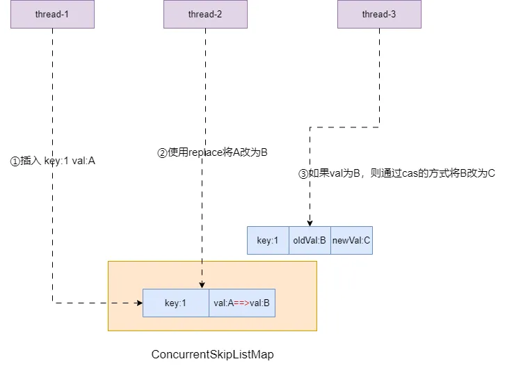

代码示例如下，笔者用两个线程模拟并发操作，其中线程 2 用到了 replace 方法，只有 value 为 B 时才会将 value 修改为
C,示例代码如下,可能出现两种情况:

1. 线程 1 先将 map 中的 A 改为 B，则线程 2 读取到的 value 为 B，修改成功。
2. 线程 2 先执行，希望将 key 为 1 的 value 由 B 改为 C，因为线程 1 还未执行修改，所以线程 2 修改失败。

```java
public static void main(String[] args) throws InterruptedException {

    CountDownLatch countDownLatch = new CountDownLatch(2);

    // 创建ConcurrentSkipListMap
    ConcurrentSkipListMap<Integer, String> cslm = new ConcurrentSkipListMap<>();
    cslm.put(1, "A");

    //线程1随机休眠后 将A改为B
    Thread t1 = new Thread(() -> {
        try {
            TimeUnit.SECONDS.sleep(RandomUtil.randomInt(1, 3));
        } catch (InterruptedException e) {
            e.printStackTrace();
        }

        System.out.println("replace A to B in the map,oldValue:" + cslm.replace(1, "B"));
        countDownLatch.countDown();
    });


    //线程2判断如果key为1的键值对value为B，则用CAS将其修改为C
    Thread t2 = new Thread(() -> {
        try {
            TimeUnit.SECONDS.sleep(RandomUtil.randomInt(1, 3));
        } catch (InterruptedException e) {
            e.printStackTrace();
        }

        boolean result = cslm.replace(1, "B", "C");

        System.out.println("t2 replace result:" + result);

        countDownLatch.countDown();
    });


    t1.start();
    t2.start();


    countDownLatch.await();

    System.out.println("cslm get(1) result:" + cslm.get(1));


}
```

这里笔者就贴出一段输出结果，可以看到本次实验线程 1 先执行，所以线程 2 修改成功。

```java
replace A
to B
in the
map,oldValue:A
t2 replace
result:true

cslm get(1) result:C
```

### 并发删除

同样的`ConcurrentSkipListMap`也支持并发安全删除，如下代码所示，只有 value 为 B 时 key 为 1 的键值对才会被删除。

```java
public static void main(String[] args) throws InterruptedException {

    CountDownLatch countDownLatch = new CountDownLatch(2);

    // 创建ConcurrentSkipListMap
    ConcurrentSkipListMap<Integer, String> cslm = new ConcurrentSkipListMap<>();
    cslm.put(1, "A");

    //线程1随机休眠后 将A改为B
    Thread t1 = new Thread(() -> {
        try {
            TimeUnit.SECONDS.sleep(RandomUtil.randomInt(1, 3));
        } catch (InterruptedException e) {
            e.printStackTrace();
        }

        System.out.println("replace A to B in the map,oldValue:" + cslm.replace(1, "B"));
        countDownLatch.countDown();
    });


    //线程2判断如果key为1的键值对value为B，则将其删除
    Thread t2 = new Thread(() -> {
        try {
            TimeUnit.SECONDS.sleep(RandomUtil.randomInt(1, 3));
        } catch (InterruptedException e) {
            e.printStackTrace();
        }

        boolean result = cslm.remove(1, "B");

        System.out.println("t2 remove result:" + result);

        countDownLatch.countDown();
    });


    t1.start();
    t2.start();


    countDownLatch.await();

    System.out.println("cslm get(1) result:" + cslm.get(1));


}
```

输出结果如下，可以看到当线程 2 先执行时，线程 1 还未将 A 修改为 B，所以并发删除失败。

```java
t2 remove
result:false
replace A
to B
in the
map,oldValue:A

cslm get(1) result:B
```

### 范围操作

`ConcurrentSkipListMap`提供了各种有序的范围查找方法，示例代码如下:

```java
public static void main(String[] args) throws InterruptedException {

    ConcurrentSkipListMap<Integer, Integer> map = new ConcurrentSkipListMap<>();

    for (int i = 0; i < 10; i++) {
        map.put(i, i);
    }

    //查询key<=4的键值对
    System.out.println(map.headMap(4, true));
    //查询key<4的键值对
    System.out.println(map.headMap(4, false));

    //查询key>=4的键值对
    System.out.println(map.tailMap(4, true));
    //查询key>4的键值对
    System.out.println(map.tailMap(4, false));

    //查询key为[2,5)的键值对
    System.out.println(map.subMap(2, 5));
    //查询key为[2,5]的键值对
    System.out.println(map.subMap(2, true, 5, true));


}
```

输出结果

```java
{0=0,1=1,2=2,3=3,4=4}
        {0=0,1=1,2=2,3=3}
        {4=4,5=5,6=6,7=7,8=8,9=9}
        {5=5,6=6,7=7,8=8,9=9}
        {2=2,3=3,4=4}
        {2=2,3=3,4=4,5=5}
```

### 有序迭代

`ConcurrentSkipListMap`迭代时支持升序或者降序迭代,示例代码如下:

```java
 public static void main(String[] args) throws InterruptedException {

    ConcurrentSkipListMap<Integer, Integer> map = new ConcurrentSkipListMap<>();

    for (int i = 0; i < 10; i++) {
        map.put(i, i);
    }

    // 获取降序的ConcurrentSkipListMap迭代器
    NavigableSet navigableSet = map.descendingKeySet();

    System.out.println("descendingKeySet: ");

    // 倒叙遍历
    Iterator itr = navigableSet.iterator();
    while (itr.hasNext()) {
        Integer key = (Integer) itr.next();
        System.out.println("key:" + key + " value:" + map.get(key));
    }


    // 获取升序的ConcurrentSkipListMap迭代器
    navigableSet = map.keySet();

    System.out.println("ascendingKeySet: ");

    // 倒叙遍历
    itr = navigableSet.iterator();
    while (itr.hasNext()) {
        Integer key = (Integer) itr.next();
        System.out.println("key:" + key + " value:" + map.get(key));
    }

}
```

输出结果:

```java
descendingKeySet:
key:9value:9
key:8value:8
key:7value:7
key:6value:6
key:5value:5
key:4value:4
key:3value:3
key:2value:2
key:1value:1
key:0value:0
ascendingKeySet:
key:0value:0
key:1value:1
key:2value:2
key:3value:3
key:4value:4
key:5value:5
key:6value:6
key:7value:7
key:8value:8
key:9value:9
```

## ConcurrentSkipListMap 源码解析

### 类图

从`ConcurrentSkipListMap`的类图可以看出，它通过继承`SortedMap`实现有序，继承`NavigableMap`实现可比较性，再通过继承
`ConcurrentMap`实现操作的线程安全。

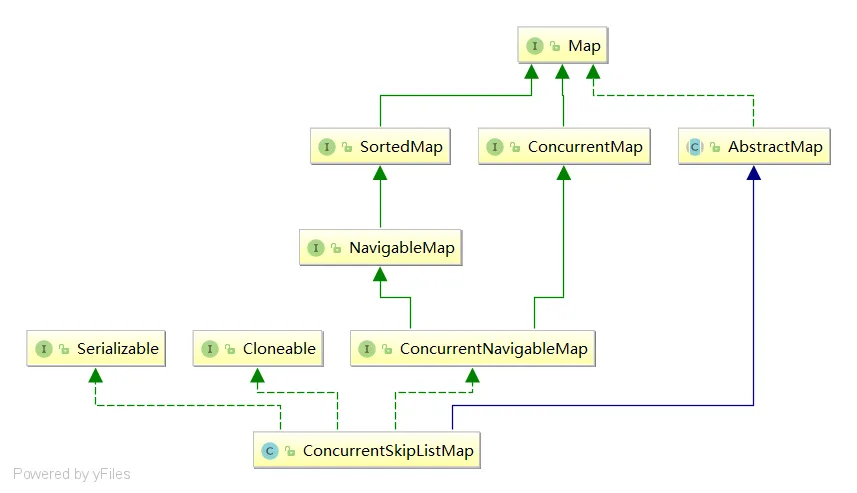

### 核心类定义

`ConcurrentSkipListMap`中有一个`final`类`Node`用于存储键值对信息，从修饰符中我们可以看出:

1. `Node`中`key`不可被修改，这一点很好理解，键值对的 key 只有值是可以改变的，所以 key 用 final 修饰。
2. `value`用`volatile`保证了并发操作修改的可见性。
3. `next`指向`Node`的后继节点，同样用`volatile`修饰保证可见性。

```java
 static final class Node<K, V> {
    final K key;
    volatile Object value;
    volatile Node<K, V> next;

    //略

}
```

`ConcurrentSkipListMap`底层是由跳表构成，为了维护跳表的多级索引，`ConcurrentSkipListMap`封装了`Index`类，如下所示:

```java
static class Index<K, V> {
    //指向被索引的节点
    final Node<K, V> node;
    //指向下一等级的索引
    final Index<K, V> down;
    //指向后继索引
    volatile Index<K, V> right;
    //略
}
```

核心成员变量含义:

1. `node`:指向需要被索引的键值对，用`final`修饰，所以一旦`Index`一旦指向某个键值对就不能修改指向地址了。
2. `down`:跳表的多级索引有多层，`down`引用指向其下层索引，如果下层不存在则设置为 null，同样用`final`修饰指向不可改变。
3. `right`:指向当前索引的后继索引，因为索引对应的节点可能被删除，所以没用`final`修饰，而是用`volatile`保证可见性。

每级索引都会有个头节点，即我们的`HeadIndex`，从源码中可以看到`HeadIndex`继承了`Index`，它不仅可以记录节点引用、下级索引引用、后继索引引用，还增加了一个
`level`用于记录当前索引层级。

```java
static final class HeadIndex<K, V> extends Index<K, V> {
    //记录当前索引层级，初始化的1级索引level为1
    final int level;

    HeadIndex(Node<K, V> node, Index<K, V> down, Index<K, V> right, int level) {
        super(node, down, right);
        this.level = level;
    }
}
```

通过查阅上文的定义，我们对`ConcurrentSkipListMap`底层跳表有了整体的认识:

1. 最底层存储的就是键值对，每个键值对用`next`指向后继节点。
2. 每级索引都用`level`记录层级，用 node 指向被索引节点。
3. 低级别的索引通过`down`指针指向低等级索引。
4. 各层级索引都用`right`指向后继索引。


### 构造方法

`ConcurrentSkipListMap`的构造方法核心逻辑都差不多，这里我们就以默认构造方法展开讨论。默认构造方法会将比较器设置为
null，然后通过`initialize`完成初始化。

```java
 public ConcurrentSkipListMap() {
    this.comparator = null;
    //初始化容器
    initialize();
}
```

步入`initialize`可以看到，它进行了如下几个步骤:

1. 该方法的逻辑会将`keySet` 、`entrySet` 等迭代容器设置为 null
2. 初始化键值对链表的头节点`Node`，key 为 null，value 为`BASE_HEADER(查看源码是一个不可变的静态Object对象)`。
3. 创建一个索引头节点`HeadIndex`，指向`Node`，`level`设置为 1，再让`head`指向这个索引头节点。

```java
private void initialize() {
    //初始化后续可能用到的迭代集合
    keySet = null;
    entrySet = null;
    values = null;
    descendingMap = null;
    //初始化1级索引，并指向链表头节点
    head = new HeadIndex<K, V>(new Node<K, V>(null, BASE_HEADER, null),
            null, null, 1);
}
```

经过上述初始化后的`ConcurrentSkipListMap`逻辑结构如下图所示:


### findPredecessor 方法(重要)

无论是 get 还是 put 都会看到一个`findPredecessor`
方法，是真正体现跳表查询优势的核心方法，它会从最高级别的索引检索是否有符合要求的节点。  
我们还是以这张图为例，我们希望通过`findPredecessor`查到 key 为 3 的前驱节点。


代码首先会从`head`指向的最高级索引(图中为 level2)开始，用一个引用 q 指向`headIndex`，r 指向后继节点，然后比较 r 所指向的节点的
key 是否大于本次入参的 key，结果发现 4 大于 3，说明本层没有 key 为 3 的索引，于是继续向下级索引开始搜寻。


于是 q 来到 1 级索引的 headIndex，r 来到对应的后继节点，比较 r 对应 node 的 key 和入参 key，发现 2<3，于是 q 和 r 向前推进。


再次比较 r 指向的 node 的 key，发现 4 大于 3，于是 q 继续向下走，来到的 node 链表。

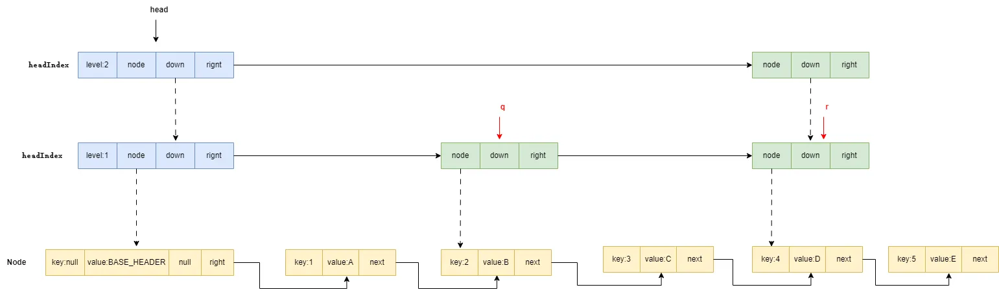

终于 r 对应的 node 的 key 等于我们传入的 3，所以 q 就是我们要找的前驱节点直接返回出去即可。

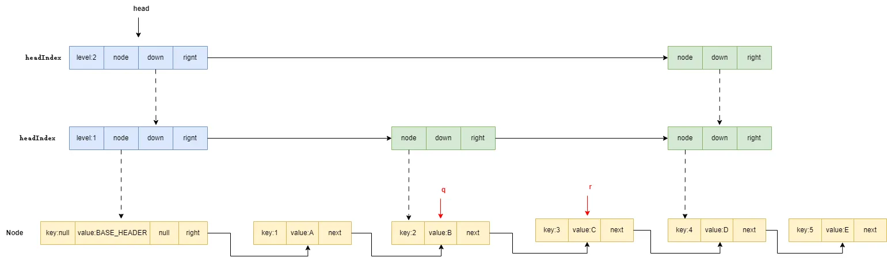

对应的源码和注释如下，读者可自行参阅:

```java
private Node<K, V> findPredecessor(Object key, Comparator<? super K> cmp) {
    //key为空抛出空指针异常
    if (key == null)
        throw new NullPointerException();

    for (; ; ) {
        //从高级别索引开始查找，q指向最高级别的headIndex，r指向后继节点
        for (Index<K, V> q = head, r = q.right, d; ; ) {
            if (r != null) {
                Node<K, V> n = r.node;
                K k = n.key;
                //如果n为空，索引该节点被删除了，进行一次cas让q直接指向r的后继节点，和r指向的节点断开联系。如果unlink失败则说明其他线程也有相同操作，退出内部循环
                if (n.value == null) {
                    if (!q.unlink(r))
                        break;
                    //unlink成功后，让r指向q的最新后继节点，即unlink进行cas操作之后的新后继节点
                    r = q.right;
                    continue;
                }
                //比较key和索引指向node的k，如果key比k大，则让q和r继续向后走
                if (cpr(cmp, key, k) > 0) {
                    q = r;
                    r = r.right;
                    continue;
                }
            }
            //如果d的下一级为null则说明到达node节点且该节点的key和入参的key相等，直接返回前驱节点q
            if ((d = q.down) == null)
                return q.node;
            //到这里说明上述步骤没有找到对应节点，索引要继续向下，q指向d(即下层索引),r指向下级索引的后继节点
            q = d;
            r = d.right;
        }
    }
}
```

### put 方法

`put`方法入口会检查 value 是否为空，如果为空则抛出空指针异常，反之调用`doPut`，注意`doPut`第三个参数传 false，这意味着这个相同键值对存在
map 中一样执行修改操作。

```java
public V put(K key, V value) {
    if (value == null)
        throw new NullPointerException();
    return doPut(key, value, false);
}
```

`doPut`执行步骤比较长，整体来说分为三步:

1. 找到合适的位置插入新节点。
2. 生成随机决定是否要为当前键值对设置索引。
3. 将新索引维护到各级索引上。

先说第一步,假设我们的`ConcurrentSkipListMap`已经有了一个 key 为 0 和 key 为 1 的键值对(下文简称为 node0 和 node1)
，希望继续插入一个 key 为 2 的键值对。

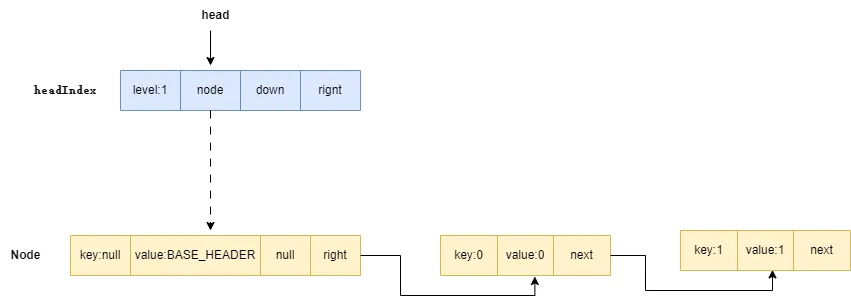

通过一级索引查找小于 2 的最大节点，发现此时一级索引只有一个元素，所以 b 指向默认索引节点`BASE_HEADER`,n 指向其后继节点
node0。


经过比对发现 node0 的 key 比我们要插入的 key2 小，所以 b 和 n 两个指针向后移动，如下图，再次比较发现 node1 的 key 还是比 2
小，指针继续向前推进。

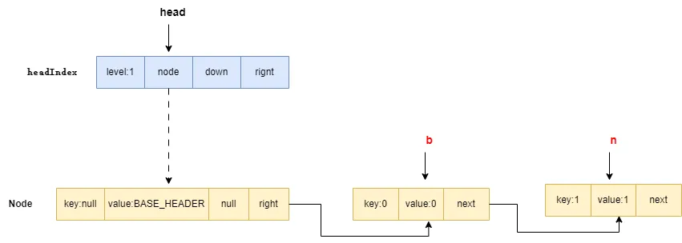

最终发现 n 为空了，于是创建一个 key 为 2，value 为 2 的 Node，用 CAS 的方式追加到链表末尾。

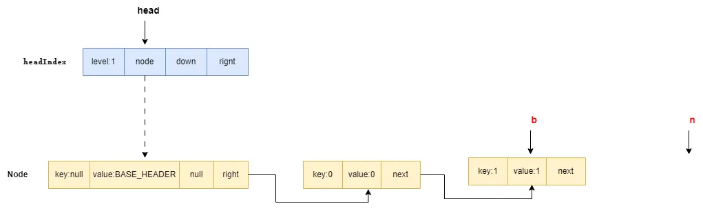

添加完成后的 Node 链表如下图所示，自此我们的插入新节点这一步完成。

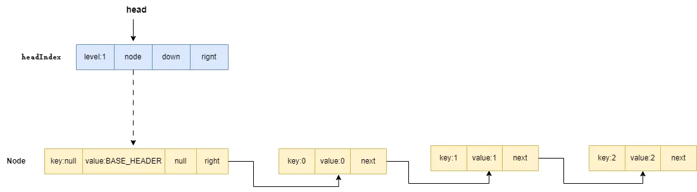

对应步骤的源码如下，笔者已详尽注释，读者可自行参阅:

```java
outer:for(;;){
        //从一级索引找到小于key的最大值
        for(
        Node<K, V> b = findPredecessor(key, cmp), n = b.next;
;){
        if(n !=null){
Object v;
int c;
//获取n的后继节点并赋值给f
Node<K, V> f = n.next;
//如果n不是b的后继节点说明当前链表被其他线程修改了，我们需要结束内部循环，重新进入
                    if(n !=b.next)
        break;
        //如果n的值为空说明被删除了，调用helpDelete进行一下清理工作将n删除，并通过CAS方式将b指向f，简言之就算 b->n(value为空)->f  变成b->f
        if((v =n.value)==null){   // n is deleted
        n.

helpDelete(b, f);
                        break;
                                }
                                //b被删除了，直接结束内部循环
                                if(b.value ==null||v ==n) // b is deleted
        break;

        //比较一下key和n的key的大小，如果key比n的key大，则b、n两个指针向后推进，跳出本次循环
        if((c =

cpr(cmp, key, n.key))>0){
b =n;
n =f;
                        continue;
                                }
                                //如果比较结果相等，则通过CAS方式交换一下值并返回旧值即可
                                if(c ==0){
        if(onlyIfAbsent ||n.

casValue(v, value)){
@SuppressWarnings("unchecked")
V vv = (V) v;
                            return vv;
                        }
                                break; // restart if lost race to replace value
                                }

                                }
//代码走到这里说明当前的key链表中最大的节点，需要创建一个追加到链表末尾
z =new Node<K, V>(key,value,n);
        //通过CAS的方式将z追加到Node链表末尾，如果失败则说明其他线程先于本线程做一些改动，我们需要退出内部循环重新进入循环重复插入操作
        if(!b.

casNext(n, z))
        break;
        //插入工作全部完成，退出外部大循环，进入下一步。
        break outer;
            }
                    }
```

完成节点插入后，就需要进行索引维护的工作，当前线程为生成一个随机数和`0x80000001(一个高低位都为1的二进制)`进行与运算，判断其结果是否为
0。这一步我们可以直接理解为判断随机数是否是一个正偶数，如果是则为当前节点创建索引。

以我们的例子新添加的 node2，经上述判断发现需要创建索引，再进一步通过`((rnd >>>= 1) & 1) != 0`
判断是否需要新增多级别索引，这里我们假设是不需要的。所以我们为 node2 节点在 1 级索引上创建一个索引。

如下图所示，因为我们的`ConcurrentSkipListMap`只有 1 级索引，所以就在 level1 上创建个索引。

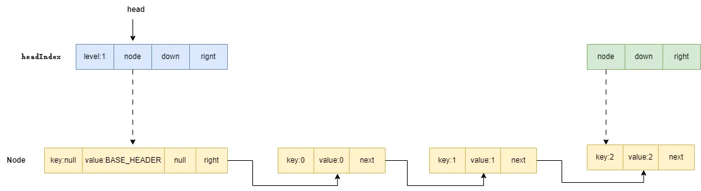

这里补充一下，上文我们只说了无需创建新层级索引的情况，假如我们经过随机运算得出要为`Node`新建 2 级索引，
`ConcurrentSkipListMap`就会新建一个`level`为 2 的`headIndex`，从`level1`至`level2`开始逐层遍历为`node2`创建索引，索引间用
`down`指针关联。  
因为新建高级索引时，会同步为低级索引创建索引节点，这也是为什么索引等级越低越稠密，查到目标节点的命中率越高。

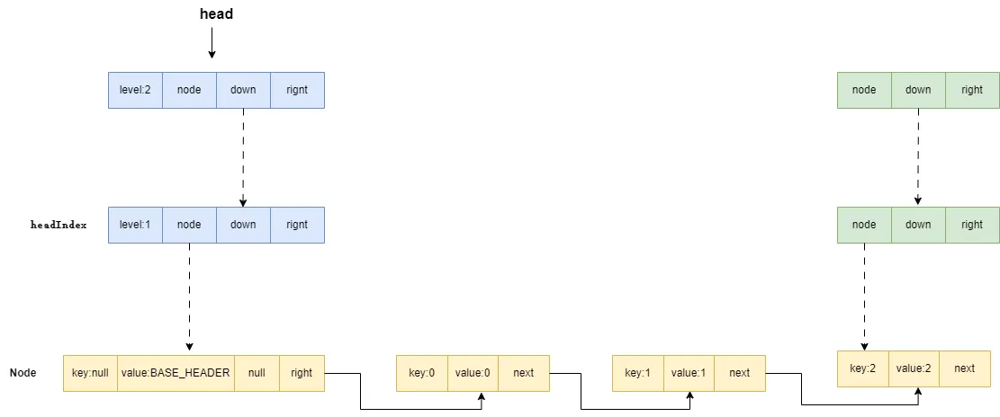

自此我们完成了第 2 大步，创建索引，对应源码如下所示:

```java
        //生成随机数
int rnd = ThreadLocalRandom.nextSecondarySeed();
//如果是正偶数为当前节点创建索引
        if((rnd &0x80000001)==0){
        int level = 1, max;
//通过右移运算确定要创建几级索引
            while(((rnd >>>=1)&1)!=0)
        ++level;

Index<K, V> idx = null;
//h指向一级索引头节点
HeadIndex<K, V> h = head;
//如果level小于h.level说明无需新建高级别索引,遍历level次，为每级索引链表创建索引，node指向新建Node，down指向高1级的索引
            if(level <=(max =h.level)){
        for(
int i = 1;
i <=level; ++i)
//创建索引,node指向z(新建的Node)，down指向低1个级别的索引，例如:level为2的idx的down就指向level为1对应的索引。
idx =new Index<K, V>(z,idx,null);
        }
        else{ // level大于当前索引级别，需要创建新的索引链表
level =max +1; //设置新一层索引级别为当前索引层级+1
//创建一个数组，长度为索引的级别数+1,记录每一层级指向新增节点的索引
@SuppressWarnings("unchecked")
Index<K, V>[] idxs =
        (Index<K, V>[]) new Index<?, ?>[level + 1];
//从level 1开始为新节点创建索引，各层索引用down指针串联
                for(
int i = 1;
i <=level; ++i)
idxs[i]=idx =new Index<K, V>(z,idx,null);


        for(;;){
//h设置为指向当前最高级别的索引头节点
h =head;
//记录当前索引链表最高层级数
int oldLevel = h.level;
//如果level 比oldLevel小，说明此时有别的线程做修改了，结束循环
                    if(level <=oldLevel)
        break;

HeadIndex<K, V> newh = h;
Node<K, V> oldbase = h.node;
//循环为每层索引链表创建当前新增节点的索引，用down指针相关联
                    for(
int j = oldLevel + 1;
j <=level; ++j)
newh =new HeadIndex<K, V>(oldbase,newh,idxs[j],j);
        //使用cas的方式让head指向新建的headIndex
        if(

casHead(h, newh)){
h =newh;
idx =idxs[level =oldLevel];
        break;
        }
        }
        }
```

最后一步就是将这些索引和对应层级的索引链表关联起来，代码会从低级索引开始将新建的索引添加到索引链中。因为我们只有 1 级索引，直接从
1 级索引开始遍历，q 指向`headIndex`，r 指向后继节点。因为我们的后继节点为 null，所以新建的索引直接通过 CAS 的方式追加到链表末端。

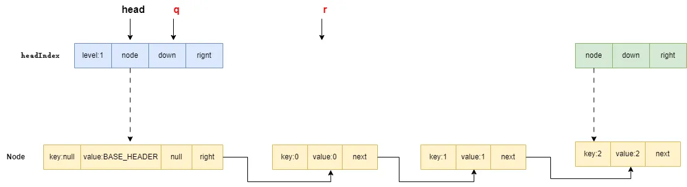

最终索引串联起来，此时我们的`ConcurrentSkipListMap`逻辑结构就变成下面这样。

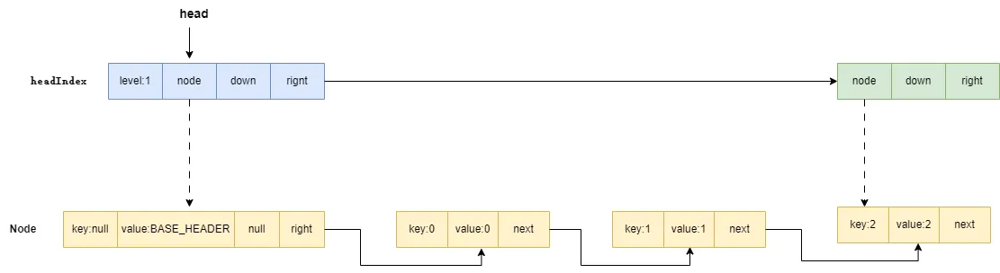

这一步的源码如下:

```java

splice:for(
int insertionLevel = level;
;){
//拿到最新的索引级别
int j = h.level;
//从高级别索引开始遍历，将新建索引用cas的方式串联到索引链表上
                for(
        Index<K, V> q = h, r = q.right, t = idx;
;){

        if(q ==null||t ==null)
        break splice;
                    if(r !=null){
Node<K, V> n = r.node;

int c = cpr(cmp, key, n.key);
                        if(n.value ==null){
        if(!q.

unlink(r))
        break;
r =q.right;
                            continue;
                                    }
                                    // 如果key比当前比较的键值对的key大，则将q和r都往后移动一位
                                    if(c >0){
q =r;
r =r.right;
                            continue;
                                    }
                                    }
                                    //用cas的方式将将t插入到索引链表上，并让r作为其后继节点
                                    if(j ==insertionLevel){
        if(!q.

link(r, t))
        break; // restart
        if(t.node.value ==null){

findNode(key);
                            break splice;
                        }
                                //insertionLevel 为0时，说明各层索引链都维护完成了退出循环
                                if(--insertionLevel ==0)
        break splice;
                    }

                            if(--j >=insertionLevel &&j<level)
t =t.down;

//上述步骤完成后，q指向下一层的索引，r指向下一层索引的后继索引，进入下一论循环维护新节点索引的位置。
q =q.down;
r =q.right;
                }
                        }
```

自此`ConcurrentSkipListMap`插入全流程就讲解完成了。

### get 方法

`ConcurrentSkipListMap`的 get 方法核心逻辑就是通过上文的`findPredecessor`找到小于 key 的最大值 b，例如我们要查找 key 为 3
的值，那么 b 就是 2，对应后继节点 n 为 3，n 的后继节点 f 为 4。再让 n 和 key 和我们要查询的 key 进行比对，发现两者一致直接返回，反之
b、n 两个指针向前移动一个位置，继续查找。

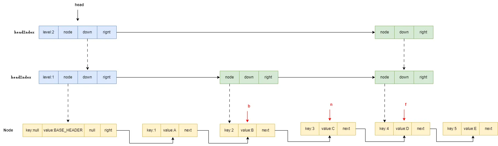

可以看到源码中的 get 方法会将 key 传入`doGet`方法中，再将`doGet`的结果返回。

```java
public V get(Object key) {
    return doGet(key);
}
```

步入`doGet`具体执行流程为:

1. 进入循环通过`findPredecessor`小于 key 的最大节点 b，设置一个变量 n 存储 b 的后继节点，设置一个变量 f 存储 n 的后继节点，节点关系为
   b->n->f。
2. 进行各种非空校验，决定是否结束循环。
3. 如果 n 的 key 和 key 相等，直接返回 n 对应的 node 的 value。
4. 如果 n 的 key 大于 key，则说明 map 中没有 key 的 value，直接返回 null。
5. 反之让 b 指向 n，n 指向 f，即将 b 和 n 两个节点向前移动，继续比对查到是否存在 key 的 value。
6. 循环执行 2-5，直到得到结果。

```java
private V doGet(Object key) {
    //key为空抛出空指针
    if (key == null)
        throw new NullPointerException();
    Comparator<? super K> cmp = comparator;

    outer:
    for (; ; ) {
        //通过findPredecessor小于key的最大节点，n为b的后继节点
        for (Node<K, V> b = findPredecessor(key, cmp), n = b.next; ; ) {
            Object v;
            int c;
            //如果n为空则说明map内部找不到对应的key，直接退出循环返回null
            if (n == null)
                break outer;
            //f设置为n的后继节点，逻辑结构为:b->n->f
            Node<K, V> f = n.next;
            //如果n不为b的后继节点则说明n被其他线程修改了顺序，直接退出内部循环，进行下一次循环重新查找
            if (n != b.next)
                break;
            //v为空说明n被其他线程删除了，调用helpDelete通过CAS方式让b和f连接，构成b->f，并结束内部循环
            if ((v = n.value) == null) {
                n.helpDelete(b, f);
                break;
            }
            //b的value为空说明b被删除，结束内部循环，重新一轮新的查找
            if (b.value == null || v == n)
                break;
            //n和key比对结果相等，直接返回value
            if ((c = cpr(cmp, key, n.key)) == 0) {
                @SuppressWarnings("unchecked") V vv = (V) v;
                return vv;
            }
            //key小于n的key，说明当前map找不到对应key的值，直接退出循环返回null
            if (c < 0)
                break outer;
            b = n;
            n = f;
        }
    }
    return null;
}
```

### remove 方法

`remove`方法核心逻辑会调用`doRemove`，返回删除节点的值，如果没找到要删除的 node 则返回 null。

```java
 public V remove(Object key) {
    return doRemove(key, null);
}
```

`doRemove`的逻辑就是通过`findPredecessor`找到可能是待删除节点的前驱节点 b，以及 b 的后继节点 n，还有 n 的后继节点
f。假如我们要删除的节点的 key 为 3(简称为 node3)，`findPredecessor`的查询结果如下图，可以看到 b 指向 node2，f 指向 node4:


经过比对发现 node3 就是我们要删除的节点，通过 CAS 的方式将这个 node 的 value 设置为
null，如果失败则说明其他线程有修改，则退出本次循环，再次从上一步开始执行删除逻辑。

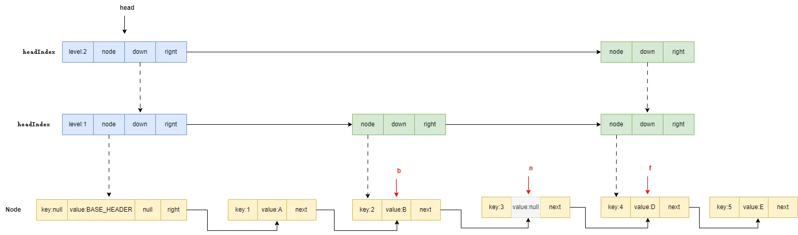

紧接着核心的两步来了，第一步会通过 CAS 的方式让待删节点 node3 指向一个新建的节点，该节点会指向 n 的后继节点即 node4。

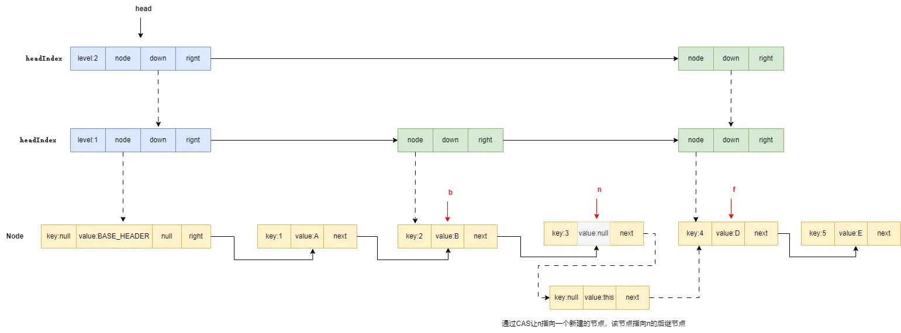

最后 b 指向的 node2 通过 CAS 指向被删节点的后继节点，和 n 指向的 node3 的节点断开连接，被删节点自此成为垃圾等待被 GC。

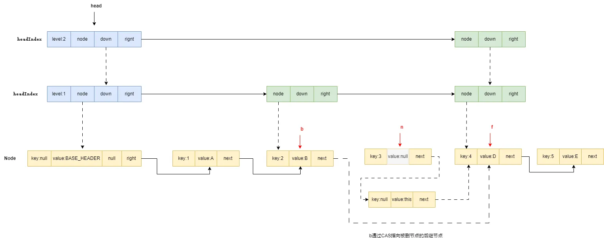

对应的`doRemove`源码如下，读者可自行参阅:

```java
final V doRemove(Object key, Object value) {
    if (key == null)
        throw new NullPointerException();
    Comparator<? super K> cmp = comparator;
    outer:
    for (; ; ) {
        //查找小于key的最大值对应节点b，n指向其后继节点
        for (Node<K, V> b = findPredecessor(key, cmp), n = b.next; ; ) {
            Object v;
            int c;
            //n为空说明没找到直接退出并返回null
            if (n == null)
                break outer;
            //f指向n的后继节点，构成b->n->f
            Node<K, V> f = n.next;
            //如果n不为b的后继节点，说明其他线程有做调整直接结束内部循环，进入下次循环
            if (n != b.next)
                break;
            //n对应的值为空，说明n节点被删除，调用helpDelete维护一下b和f的关系，并结束内部循环
            if ((v = n.value) == null) {
                n.helpDelete(b, f);
                break;
            }
            //b为空说明b被删除，退出内部循环，进行下一次循环
            if (b.value == null || v == n)
                break;
            //key小于n的key说明map中没有要删除的key直接退出循环，返回null
            if ((c = cpr(cmp, key, n.key)) < 0)
                break outer;
            //如果key大于n的key则让b和n向前推进查找等于key的节点
            if (c > 0) {
                b = n;
                n = f;
                continue;
            }
            //如果传入value不为空，且value不等与查到的v说明n被其他线程修改了，不可删除直接退出循环，因为我们remove传如null所以跳过这个判断
            if (value != null && !value.equals(v))
                break outer;
            //到此说明找到要删除的节点，采用CAS方式将value设置为null
            if (!n.casValue(v, null))
                break;
            //通过n.appendMarker(f)实现CAS将n的next指针指向一个新建的node，让n和f断开联系，再通过b.casNext(n, f)让b的next指向f
            if (!n.appendMarker(f) || !b.casNext(n, f))
                findNode(key);
            else {

                findPredecessor(key, cmp);      // clean index
                if (head.right == null)
                    tryReduceLevel();
            }
            //返回删除的node的value
            @SuppressWarnings("unchecked") V vv = (V) v;
            return vv;
        }
    }
    return null;
}
```

## ConcurrentSkipListMap 锁分离技术

`锁分离技术(Lock Striping)`是一种并发编程中常见的技术，通过减小锁的粒度，确保尽可能多的线程可以操作不同的数据，提高线程的并发度和性能。

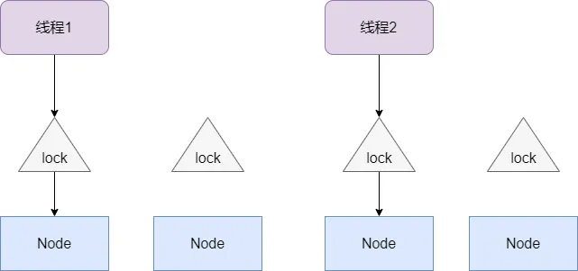

在 Java 中`ConcurrentSkipListMap`、`ConcurrentHashMap`等并发容器都用到了锁分离技术，但是两者的实现却有如下区别:

1. `ConcurrentHashMap`则是通过`分段锁(Segment Locking)`，而`ConcurrentSkipListMap`实现锁分离是通过
   `乐观锁(Optimistic Locking)`，这也是为什么我们查看`Node`源码时发现 value 和 next 都用 volatile 修饰(保证使用 CAS
   操作数据时对其它线程可见)。
2. `ConcurrentSkipListMap`锁的是对应 key 的 Node，而`ConcurrentHashMap`锁的是对应 key 经过哈希运算的 Node，这个 Node
   上可能存在一个到多个节点(因为多个 key 经过哈希运算得到会到一个 bucket 上)，所以前者相较于`ConcurrentHashMap`
   锁的粒度更小，并发度更高，而且前者是通过 CAS 操作而不是互斥锁修改，因此也避免了频繁的线程阻塞和上下文切换的开销。
3. `ConcurrentSkipListMap`实现锁分离是通过 CAS，而 CAS
   的原子操作是需要硬件支持实现的,所以修改时存在一定的开销。在极端情况下(多个线程操作同一个 key)，`ConcurrentSkipListMap`
   可能会出现大量线程修改失败不断循环重试的情况，相较于`ConcurrentHashMap`分段锁+互斥锁升级的实现来说并发操作的开销更大，所以我们使用时需要考虑到这些情况。

## ConcurrentSkipListMap 常见面试题

### ConcurrentSkipListMap 的特点是什么？

答：`ConcurrentSkipListMap`是 JDK1.6 提供的并发映射，它有如下特点:

1. 由跳表实现的映射集，查询和插入等操作的时间复杂度为`O(log n)`。
2. 基于乐观锁机制实现并发安全操作，锁粒度小且并发度高。
3. 支持有序性的操作，例如:查询指定范围的映射、查询大于或者小于某个 key 值的键值对、升序和降序遍历。

### ConcurrentSkipListMap 和 TreeMap 的区别是什么？

答：`ConcurrentSkipListMap`和`TreeMap`的区别:

1. `ConcurrentSkipListMap`底层是由`跳表(Skip List)`实现的，`TreeMap`底层是由`红黑树(Red-Black Tree)`实现的。
2. `ConcurrentSkipListMap`是线程安全的并发容器,`TreeMap`是非线程安全的映射。

### ConcurrentSkipListMap 的并发性是如何保证的？

答：`ConcurrentSkipListMap`通过`锁分离技术(Lock Striping)`减小锁的粒度，再通过 CAS 操作+volatile
这种乐观锁的方式修改数据尽可能的避免线程上下文切换和阻塞的开销。

### ConcurrentSkipListMap 的时间复杂度是多少？

答：因为底层使用跳表的缘故,`ConcurrentSkipListMap`操作和查询的平均时间复杂度为`O(log n)`，所以查询的时间复杂度相比时间复杂度为
O(1)的并发映射`ConcurrentHashMap`更复杂。

### ConcurrentSkipListMap 和 ConcurrentHashMap 区别

答: 关于`ConcurrentSkipListMap`和`ConcurrentHashMap`区别可以参考 StackOverflow 上的回答:


> These two classes vary in a few ways.  
> ConcurrentHashMap does not guarantee* the runtime of its operations as part of its contract. It also allows tuning for
> certain load factors (roughly, the number of threads concurrently modifying it).  
> ConcurrentSkipListMap, on the other hand, guarantees average O(log(n)) performance on a wide variety of operations. It
> also does not support tuning for concurrency's sake. ConcurrentSkipListMap also has a number of operations that
> ConcurrentHashMap doesn't: ceilingEntry/Key, floorEntry/Key, etc. It also maintains a sort order, which would otherwise
> have to be calculated (at notable expense) if you were using a ConcurrentHashMap.  
> Basically, different implementations are provided for different use cases. If you need quick single key/value pair
> addition and quick single key lookup, use the HashMap. If you need faster in-order traversal, and can afford the extra
> cost for insertion, use the SkipListMap.
>


原文地址:[https://stackoverflow.com/questions/1811782/when-should-i-use-concurrentskiplistmap  
](https://stackoverflow.com/questions/1811782/when-should-i-use-concurrentskiplistmap)

大抵意思是说，对于需要多线程操作的映射来说，假如你需要能够快速插入和查询单一键值对,那么`ConcurrentHashMap`
更合适，因为它的平均查询时间复杂度为 O(1)远低于`ConcurrentSkipListMap`。如果你需要更高的并发度和有序性的遍历和范围查询等操作,那么更建议使用
`ConcurrentSkipListMap`。

## 参考文献

深入理解高并发编程：JDK 核心技术

Java 并发集合（二）-ConcurrentSkipListMap
分析和使用:[https://www.cnblogs.com/java-zzl/p/9767255.html](https://www.cnblogs.com/java-zzl/p/9767255.html)

ConcurrentSkipListMap -
秒懂 :[https://www.cnblogs.com/crazymakercircle/p/13928386.html#autoid-h3-7-4-0](https://www.cnblogs.com/crazymakercircle/p/13928386.html#autoid-h3-7-4-0)

ConcurrentSkipListMap in Java with
Examples:[https://www.geeksforgeeks.org/concurrentskiplistmap-in-java-with-examples/](https://www.geeksforgeeks.org/concurrentskiplistmap-in-java-with-examples/)

从源码看世界：深入淺出 ConcurrentSkipListMap
核心原理:[https://zhuanlan.zhihu.com/p/148432182](https://zhuanlan.zhihu.com/p/148432182)

J.U.C 之 ConcurrentSkipListMap:[https://juejin.cn/post/6844903958499033095](https://juejin.cn/post/6844903958499033095)

