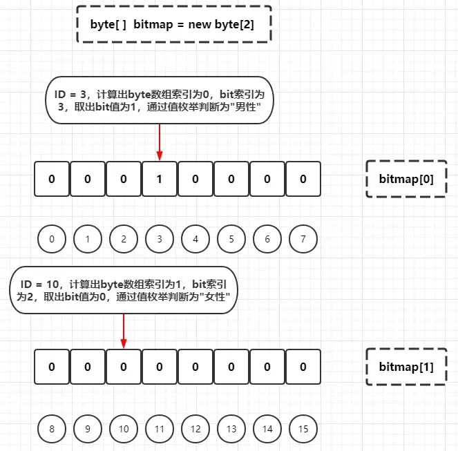
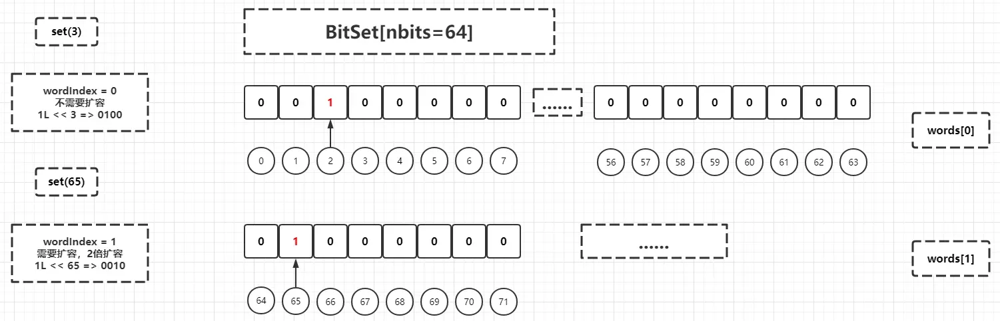

> 整理自：https://www.cnblogs.com/throwable/p/15759956.html
>


`JDK`中的`BitMap`的实现是`java.util.BitSet` 。

## BitMap 简介

`BitMap`，直译为位图，是一种数据结构，代表了有限域中的稠集（`Dense Set`
），每一个元素至少出现一次，没有其他的数据和元素相关联。在索引，数据压缩等方面有广泛应用（来源于维基百科词条）。计算机中
`1 byte = 8 bit`，一个比特（`bit`，称为比特或者位）可以表示`1`或者`0`两种值，通过一个比特去标记某个元素的值，而`KEY`或者
`INDEX`就是该元素，构成一张映射关系图。因为采用了`Bit`作为底层存储数据的单位，所以可以**极大地节省存储空间**。


在`Java`中，一个`int`类型的整数占`4`字节，`32`比特，`int`的最大值也就是`20`多亿（具体是`2147483647`）。假设现在有一个需求，在
`20`亿整数中判断某个整数`m`是否存在，要求使用内存必须小于或者等于`4GB`。如果每个整数都使用`int`存储，那么存放`20`亿个整数，需要
`20亿 * 4byte /1024/1024/1024`约等于`7.45GB`，显然无法满足需求。如果使用`BitMap`，只需要`20亿 bit`内存，也就是
`20亿/8/1024/1024/1024`约等于`0.233GB`。在数据量极大的情况下，数据集具备有限状态，可以考虑使用`BitMap`存储和进行后续计算等处理。现在假设用
`byte`数组去做`BitMap`的底层存储结构，初始化一个容量为`16`的`BitMap`实例，示例如下：


可见当前的`byte`数组有两个元素`bitmap[0]`（虚拟下标为`[0,7]`）和`bitmap[1]`（虚拟下标为`[8,15]`）。这里假定使用上面构造的这个
`BitMap`实例去存储客户`ID`和客户性别关系（比特为`1`代表男性，比特为`0`代表女性），把`ID`等于`3`的男性客户和`ID`等于`10`
的女性客户添加到`BitMap`中：


由于`1 byte = 8 bit`，通过客户`ID`除以`8`就可以定位到需要存放的`byte`数组索引，再通过客户`ID`基于`8`取模，就可以得到需要存放的
`byte`数组中具体的`bit`的索引：

```shell
# ID等于3的男性客户
逻辑索引 = 3
byte数组索引 = 3 / 8 = 0
bit索引 = 3 % 8 = 3
=> 也就是需要存放在byte[0]的下标为3的比特上，该比特设置为1

# ID等于10的女性客户
逻辑索引 = 10
byte数组索引 = 10 / 8 = 1
bit索引 = 10 % 8 = 2
=> 也就是需要存放在byte[1]的下标为2的比特上，该比特设置为0
```

然后分别判断客户`ID`为`3`或者`10`的客户性别：



如果此时再添加一个客户`ID`为`17`的男性用户，由于旧的`BitMap`只能存放`16`个比特，所以需要扩容，判断`byte`数组中只需新增一个
`byte`元素（`byte[2]`）即可：


原则上，底层的`byte`数组可以不停地扩容，当`byte`数组长度达到`Integer.MAX_VALUE`，`BitMap`的容量达到最大值。

## BitSet 简单使用

`java.util.BitSet`虽然名字上称为`Set`，但实际上它就是`JDK`中内置的`BitMap`实现，1 这个类算是一个十分古老的类，从注释上看是
`JDK1.0`引入的，不过大部分方法是`JDK1.4`之后新添加或者更新的。以前一小节的例子基于`BitSet`做一个`Demo`：

```java
public class BitSetApp {

    public static void main(String[] args) {
        BitSet bitmap = new BitSet(16);
        bitmap.set(3, Boolean.TRUE);
        bitmap.set(11, Boolean.FALSE);
        System.out.println("Index 3 of bitmap => " + bitmap.get(3));
        System.out.println("Index 11 of bitmap => " + bitmap.get(11));
        bitmap.set(17, Boolean.TRUE);
        // 这里不会触发扩容，因为BitSet中底层存储数组是long[]
        System.out.println("Index 17 of bitmap => " + bitmap.get(17));
    }
}

// 输出结果
Index 3
of bitmap =>true
Index 11
of bitmap =>false
Index 17
of bitmap =>true
```

`API`使用比较简单，为了满足其他场景，`BitSet`还提供了几个实用的静态工厂方法用于构造实例，范围设置和清除比特值和一些集合运算等，这里不举例，后面分析源码的时候会详细展开。

## BitSet 源码分析

> 这里以 JDK11 为例，分析一下 `BitSet` 的底层核心源码。
>


前文提到，`BitMap`如果使用`byte`数组存储，当新添加元素的逻辑下标超过了初始化的`byte`
数组的最大逻辑下标就必须进行扩容。为了尽可能减少扩容的次数，除了需要按实际情况定义初始化的底层存储结构，还应该选用能够"
承载"更多比特的数据类型数组，因此在`BitSet`中底层的存储结构选用了`long`数组，一个`long`整数占`64`比特，位长是一个`byte`整数的
`8`倍，在需要处理的数据范围比较大的场景下可以有效减少扩容的次数。后文为了简化分析过程，在模拟底层`long`数组变化时候会使用尽可能少的元素去模拟。
`BitSet`顶部有一些关于其设计上的注释，这里简单罗列概括成几点：

+ `BitSet`是可增长比特向量的一个实现，设计上每个比特都是一个布尔值，比特的逻辑索引是非负整数
+ `BitSet`的所有比特的初始化值为`false`（整数`0`）
+ `BitSet`的`size`属性与其实现有关，`length`属性（比特表的逻辑长度）与实现无关
+ `BitSet`在设计上是非线程安全，多线程环境下需要额外的同步处理

按照以往分析源码的习惯，先看`BitSet`的所有核心成员属性：

```java
public class BitSet implements Cloneable, java.io.Serializable {

    // words是long数组，一个long整数为64bit，2^6 = 64，这里选取6作为words的寻址参数，可以基于逻辑下标快速定位到具体的words中的元素索引
    private static final int ADDRESS_BITS_PER_WORD = 6;

    // words中每个元素的比特数，十进制值是64
    private static final int BITS_PER_WORD = 1 << ADDRESS_BITS_PER_WORD;

    // bit下标掩码，十进制值是63
    private static final int BIT_INDEX_MASK = BITS_PER_WORD - 1;

    // 掩码，十进制值-1，也就是64个比特全是1，用于部分word掩码的左移或者右移
    private static final long WORD_MASK = 0xffffffffffffffffL;

    /**
     * 序列化相关，略过
     */
    private static final ObjectStreamField[] serialPersistentFields = {
            new ObjectStreamField("bits", long[].class),
    };

    /**
     * 底层的比特存储结构，long数组，同时也是序列化字段"bits"的对应值
     */
    private long[] words;

    /**
     * 已经使用的words数组中的元素个数，注释翻译：在当前BitSet的逻辑长度中的word（words的元素）个数，瞬时值
     */
    private transient int wordsInUse = 0;

    /**
     * 标记words数组的长度是否用户
     */
    private transient boolean sizeIsSticky = false;

    // JDK 1.0.2使用的序列化版本号
    private static final long serialVersionUID = 7997698588986878753L;

    // 暂时省略其他方法
}
```

接着看`BitSet`的几个辅助方法：

```java
// 基于bit的逻辑下标定位words中word元素的索引，直接右移6位
// 举例：bitIndex = 3，那么bitIndex >> ADDRESS_BITS_PER_WORD => 0，说明定位到words[0]
// 举例：bitIndex = 35，那么bitIndex >> ADDRESS_BITS_PER_WORD => 1，说明定位到words[1]
private static int wordIndex(int bitIndex) {
    return bitIndex >> ADDRESS_BITS_PER_WORD;
}

// 每个公共方法都必须保留这些不变量，内部变量的恒等式校验，字面意思就是每个公共方法必须调用此恒等式校验
// 第一条恒等式：当前BitSet为空或者最后一个words元素不能为0（其实就是当前BitSet不为空）
// 第二条恒等式：wordsInUse边界检查，范围是[0, words.length]
// 第三条恒等式：wordsInUse或者等于words.length，意味着用到了所有words的元素；或者words[wordsInUse] == 0，意味着words中索引为[wordsInUse, words.length - 1]的元素都没有被使用
private void checkInvariants() {
    assert (wordsInUse == 0 || words[wordsInUse - 1] != 0);
    assert (wordsInUse >= 0 && wordsInUse <= words.length);
    assert (wordsInUse == words.length || words[wordsInUse] == 0);
}

// 重新计算wordsInUse的值，也就是刷新已使用的words元素计算值
// 基于当前的wordsInUse - 1向前遍历到i = 0，找到最近一个不为0的words[i]，然后重新赋值为i + 1，这里i是words数组的索引
// wordsInUse其实是words数组最后一个不为0的元素的下标加1，或者说用到的words的元素个数，称为逻辑容量(logical size)
private void recalculateWordsInUse() {
    // Traverse the bitset until a used word is found
    int i;
    for (i = wordsInUse - 1; i >= 0; i--)
        if (words[i] != 0)
            break;

    wordsInUse = i + 1; // The new logical size
}
```

然后看`BitSet`的构造函数和静态工厂方法：

```java
// 默认的公共构造方法，比特表的逻辑长度为64，words数组长度为2，标记sizeIsSticky为false，也就是比特表的长度不是用户自定义的
public BitSet() {
    initWords(BITS_PER_WORD);
    sizeIsSticky = false;
}

// 自定义比特表逻辑长度的构造方法，该长度必须为非负整数，标记sizeIsSticky为true，也就是比特表的长度是由用户自定义的
public BitSet(int nbits) {
    if (nbits < 0)
        throw new NegativeArraySizeException("nbits < 0: " + nbits);
    initWords(nbits);
    sizeIsSticky = true;
}

// 初始化words数组，数组的长度为length = (nbits - 1) / 64 + 1
// 例如nbits = 16，相当于long[] words = new long[(16 - 1) / 64 + 1] => new long[1];
// 例如nbits = 65，相当于long[] words = new long[(65 - 1) / 64 + 1] => new long[2];
// 以此类推
private void initWords(int nbits) {
    words = new long[wordIndex(nbits - 1) + 1];
}

// 直接自定义底层的words数组构造方法，标记所有words的元素都被使用
private BitSet(long[] words) {
    this.words = words;
    this.wordsInUse = words.length;
    checkInvariants();
}

// 直接自定义底层的words数组构造方法，这个构造方法和上一个方法不一样，会从入参long数组从后面开始遍历，直到遍历到第一个元素或者不为0的元素，这样可以尽量截断无用的高位的0元素
// 简单来说就是相当于：BitSet.valueOf(new long[]{1L, 0L}) = 移除后面的0元素 => BitSet.valueOf(new long[]{1L})
public static BitSet valueOf(long[] longs) {
    int n;
    for (n = longs.length; n > 0 && longs[n - 1] == 0; n--)
        ;
    return new BitSet(Arrays.copyOf(longs, n));
}

// 直接自定义底层的words数组构造方法，要求入参为LongBuffer类型，需要把LongBuffer => long[] words，方法和BitSet valueOf(long[] longs)处理逻辑一致
public static BitSet valueOf(LongBuffer lb) {
    lb = lb.slice();
    int n;
    for (n = lb.remaining(); n > 0 && lb.get(n - 1) == 0; n--)
        ;
    long[] words = new long[n];
    lb.get(words);
    return new BitSet(words);
}

// 下面两个构造方法都是基于byte数组从后面开始遍历，直到遍历到第一个元素或者不为0的元素，截断出一个新的数组，然后转化为long数组构造BitSet实例
public static BitSet valueOf(byte[] bytes) {
    return BitSet.valueOf(ByteBuffer.wrap(bytes));
}

public static BitSet valueOf(ByteBuffer bb) {
    // 小端字节排序
    bb = bb.slice().order(ByteOrder.LITTLE_ENDIAN);
    int n;
    // 从后向前遍历获到第一个元素或者第一个不为0的元素
    for (n = bb.remaining(); n > 0 && bb.get(n - 1) == 0; n--)
        ;
    // 这里需要考虑字节容器中的字节元素个数不是8的倍数的情况
    long[] words = new long[(n + 7) / 8];
    // 截断后面的0元素
    bb.limit(n);
    int i = 0;
    // 剩余元素个数大于等于8时候，按照64位去读取
    while (bb.remaining() >= 8)
        words[i++] = bb.getLong();
    // 剩余元素个数小于8时候，按照byte读取，并且通过掩码计算和左移填充到long数组元素中
    for (int remaining = bb.remaining(), j = 0; j < remaining; j++)
        words[i] |= (bb.get() & 0xffL) << (8 * j);
    return new BitSet(words);
}
```

这里构造函数的源码不是十分复杂，比较繁琐的是静态工厂方法`BitSet valueOf(ByteBuffer bb)`，这里举例推演一下：

```java
ByteBuffer byteBuffer = ByteBuffer.allocate(10);
byteBuffer.

order(ByteOrder.LITTLE_ENDIAN);
byteBuffer.

putLong(1L);
byteBuffer.

put((byte)3);
        byteBuffer.

put((byte)1);
        byteBuffer.

flip();

BitSet bitSet = BitSet.valueOf(byteBuffer);
System.out.

println(bitSet.size());
        System.out.

println(bitSet.length());

// 输出结果
        128
        73
```

过程如下：


接着看常规的`set`、`get`和`clear`方法：

```java
// 设置指定的逻辑索引的比特为true
public void set(int bitIndex) {
    // 比特逻辑索引必须大于等于0
    if (bitIndex < 0)
        throw new IndexOutOfBoundsException("bitIndex < 0: " + bitIndex);
    // 计算words数组元素的索引
    int wordIndex = wordIndex(bitIndex);
    // 判断是否需要扩容，如果需要则进行words数组扩容
    expandTo(wordIndex);
    // 相当于words[wordIndex] = words[wordIndex] | (1L << bitIndex)
    // 注意long的左移如果超过63位会溢出，也就是1L << 64 => 1L,1L << 65 => 1L << 1,1L << 66 => 1L << 2... 以此类推
    // 这里相当于把左移结果直接和对应的words元素进行或运算，前者因为是基于1进行左移，二进制数一定是只有一个比特为1，其他比特都是0的64比特二级制序列，或运算会让对应的words元素与前者对应的比特为1的比特值设置为1，并且重新赋值对应的words元素
    // 类似于这样：0000 0000 | 0000 1000 => 0000 1000
    words[wordIndex] |= (1L << bitIndex); // Restores invariants
    // 不变量恒等式断言校验
    checkInvariants();
}

// 基于计算的words数组元素下标进行扩容
private void expandTo(int wordIndex) {
    // 计算当前的words元素下标需要的words数组长度
    int wordsRequired = wordIndex + 1;
    // 如果当前的words元素下标需要的words数组长度大于当前已经使用的words数组中的元素个数，则进行扩容（未必一定扩容数组，扩容方法里面还有一层判断）
    if (wordsInUse < wordsRequired) {
        // 基于需要的words数组长度进行扩容
        ensureCapacity(wordsRequired);
        // 重置当前已经使用的words数组中的元素个数
        wordsInUse = wordsRequired;
    }
}

// 基于计算的words数组元素下标进行扩容，满足前提下进行数组拷贝
private void ensureCapacity(int wordsRequired) {
    // 当前words数组长度比需要的words数组长度小，则进行扩容
    if (words.length < wordsRequired) {
        // 分配的新数组的长度是旧words数组元素和传入的需要的words数组长度之间的最大值
        int request = Math.max(2 * words.length, wordsRequired);
        // 数组扩容
        words = Arrays.copyOf(words, request);
        // 因为已经进行了扩容，所以要标记比特表的长度不是用户自定义的
        sizeIsSticky = false;
    }
}

// 获取指定的逻辑索引的比特的状态
public boolean get(int bitIndex) {
    // 比特逻辑索引必须大于等于0
    if (bitIndex < 0)
        throw new IndexOutOfBoundsException("bitIndex < 0: " + bitIndex);
    // 不变量恒等式断言校验
    checkInvariants();
    // 计算words数组元素的索引
    int wordIndex = wordIndex(bitIndex);
    // words数组元素的索引必须小于正在使用的words元素个数，并且把1L左移bitIndex结果直接和对应的words元素进行与运算的结果不是全部比特为0则返回true，否则返回false
    // 类似于这样（返回true的场景）：0000 1010 & 0000 1000 => 0000 1000 => 说明定位到的words中的元素曾经通过set方法设置过对应1L << bitIndex的比特为1
    // 类似于这样（返回false的场景）：0000 0110 & 0000 1000 => 0000 0000 => 说明定位到的words中的元素未曾通过set方法设置过对应1L << bitIndex的比特为1，对应比特使用的是默认值0
    return (wordIndex < wordsInUse) && ((words[wordIndex] & (1L << bitIndex)) != 0);
}

// 设置指定的逻辑索引的比特为false
public void clear(int bitIndex) {
    // 比特逻辑索引必须大于等于0
    if (bitIndex < 0)
        throw new IndexOutOfBoundsException("bitIndex < 0: " + bitIndex);
    // 计算words数组元素的索引
    int wordIndex = wordIndex(bitIndex);
    // 如果words数组元素的索引大于等于正在使用的words元素个数，说明该逻辑下标的比特处于初始化状态还未被使用，不用处理
    if (wordIndex >= wordsInUse)
        return;
    // 相当于words[wordIndex] = words[wordIndex] & (~(1L << bitIndex))
    // 把左移结果各比特取反然后和对应的words元素进行与运算，再重新赋值到对应的words元素
    // 类似于：0000 1100 & (~(0000 1000)) => 0000 1100 & 1111 0111 => 0000 0100
    words[wordIndex] &= ~(1L << bitIndex);
    // 重新计算wordsInUse的值，也就是刷新已使用的words元素计算值
    recalculateWordsInUse();
    // 不变量恒等式断言校验
    checkInvariants();
}
```

这里模拟一下`set`方法的过程：



接着看集合运算相关的方法：

```java
// 判断两个BitSet是否存在交集，这是一个判断方法，不会修改当前BitSet的结构
public boolean intersects(BitSet set) {
    // 对比当前BitSet实例和入参BitSet实例使用的words元素数量，取较小值作为遍历基准
    for (int i = Math.min(wordsInUse, set.wordsInUse) - 1; i >= 0; i--)
        // 遍历和对比每一个words数组的元素，只要满足与运算结果不为0就返回true（这个条件是很宽松的，只要底层逻辑比特表刚好两个BitSet实例在同一逻辑索引的比特都为1即可满足）
        if ((words[i] & set.words[i]) != 0)
            return true;
    return false;
}

// AND运算，底层是两个BitSet实例对应索引的words数组元素进行与运算，直观来看就是计算两个BitSet实例的交集，存放在本BitSet实例中
public void and(BitSet set) {
    // 入参为本BitSet实例，不进行处理
    if (this == set)
        return;
    // 如果当前BitSet实例已经使用的words数组元素数量比传入的多，那么当前BitSet实例把多出来那部分words数组元素置为0
    while (wordsInUse > set.wordsInUse)
        words[--wordsInUse] = 0;
    // 遍历当前的BitSet实例的words数组已使用的元素，与传入的BitSet实例的相同索引元素进行与运算和重新赋值
    for (int i = 0; i < wordsInUse; i++)
        words[i] &= set.words[i];
    // 重新计算wordsInUse的值，也就是刷新已使用的words元素计算值
    recalculateWordsInUse();
    // 不变量恒等式断言校验
    checkInvariants();
}

// OR运算，底层是两个BitSet实例对应索引的words数组元素进行或运算，直观来看就是计算两个BitSet实例的并集，存放在本BitSet实例中
public void or(BitSet set) {
    // 入参为本BitSet实例，不进行处理
    if (this == set)
        return;
    // 计算两个BitSet中words数组已使用元素的公共部分，其实也就是较小的wordsInUse
    int wordsInCommon = Math.min(wordsInUse, set.wordsInUse);
    // 当前的BitSet实例的words数组已使用的元素数量比传入的BitSet实例小，以传入的实例为准进行扩容，并且拷贝其wordsInUse值
    if (wordsInUse < set.wordsInUse) {
        ensureCapacity(set.wordsInUse);
        wordsInUse = set.wordsInUse;
    }
    // 两个BitSet实例words数组已使用元素的公共部分分别按索引进行或运算，赋值在当前BitSet实例对应索引的words元素
    for (int i = 0; i < wordsInCommon; i++)
        words[i] |= set.words[i];
    // 如果传入的BitSet实例还有超出words数组已使用元素的公共部分，这部分words数组元素也拷贝到当前的BitSet实例中，因为前面有扩容判断，走到这里当前BitSet实例的wordsInUse大于等于传入的BitSet实例的wordsInUse
    if (wordsInCommon < set.wordsInUse)
        System.arraycopy(set.words, wordsInCommon,
                words, wordsInCommon,
                wordsInUse - wordsInCommon);
    // 不变量恒等式断言校验
    checkInvariants();
}

// XOR运算，底层是两个BitSet实例对应索引的words数组元素进行异或运算，实现和OR基本相似，完成处理后需要重新计算当前BitSet实例的wordsInUse值
public void xor(BitSet set) {
    int wordsInCommon = Math.min(wordsInUse, set.wordsInUse);
    if (wordsInUse < set.wordsInUse) {
        ensureCapacity(set.wordsInUse);
        wordsInUse = set.wordsInUse;
    }
    // Perform logical XOR on words in common
    for (int i = 0; i < wordsInCommon; i++)
        words[i] ^= set.words[i];

    // Copy any remaining words
    if (wordsInCommon < set.wordsInUse)
        System.arraycopy(set.words, wordsInCommon,
                words, wordsInCommon,
                set.wordsInUse - wordsInCommon);
    recalculateWordsInUse();
    checkInvariants();
}


// AND NOT运算，底层是两个BitSet实例对应索引的words数组元素进行与运算之前传入BitSet实例对应索引的words数组元素先做非运算，过程和AND运算类似
public void andNot(BitSet set) {
    // Perform logical (a & !b) on words in common
    for (int i = Math.min(wordsInUse, set.wordsInUse) - 1; i >= 0; i--)
        words[i] &= ~set.words[i];
    recalculateWordsInUse();
    checkInvariants();
}
```

这里模拟一下`and`方法的过程：


接着看搜索相关方法（`nextXXXBit`、`previousYYYBit`），这里以`nextSetBit(int fromIndex)`方法为例子：

```java
// 以比特逻辑索引fromIndex为起点，向后搜索并且返回第一个状态为true的比特的逻辑索引，搜索失败则返回-1
public int nextSetBit(int fromIndex) {
    // 起始的比特逻辑索引必须大于等于0
    if (fromIndex < 0)
        throw new IndexOutOfBoundsException("fromIndex < 0: " + fromIndex);
    // 不变量恒等式断言校验
    checkInvariants();
    // 基于起始的比特逻辑索引计算words数组元素的索引
    int u = wordIndex(fromIndex);
    // words数组元素的索引超过已经使用的words数组元素数量，说明数组越界，直接返回-1
    if (u >= wordsInUse)
        return -1;
    // 这里和之前的set方法的左移类似，不过使用了-1L进行左移，例如-1L << 2 => 1111 1111 << 2 => 1111 1100（这里假设限制长度8，溢出的高位舍弃）
    // 举例：0000 1010 & (1111 1111 << 2) => 0000 1010 & 1111 1100 => 0000 1000（索引值为4，当前这里不一定得到存在比特为1的结果）
    long word = words[u] & (WORD_MASK << fromIndex);
    // 基于得到的word进行遍历
    while (true) {
        // 说明word中存在比特为1，计算和返回该比特的逻辑索引
        if (word != 0)
            // 基于起始的比特逻辑索引计算words数组元素的索引 * 64 + word中低位连续为0的比特数量
            return (u * BITS_PER_WORD) + Long.numberOfTrailingZeros(word);
        // 说明word中全部比特为0，则u需要向后递增，等于wordsInUse说明越界返回-1，这个if存在赋值和判断两个逻辑
        if (++u == wordsInUse)
            return -1;
        word = words[u];
    }
}
```

`nextSetBit(int fromIndex)`方法先查找`fromIndex`所在的`words`数组元素，不满足后再向后进行检索，该方法注释中还给出了一个经典的使用例子，这里摘抄一下：

```java
BitSet bitmap = new BitSet();
// add element to bitmap
// ... bitmap.set(1993);
for(
int i = bitmap.nextSetBit(0);
i >=0;i =bitmap.

nextSetBit(i +1)){
        // operate on index i here
        if(i ==Integer.MAX_VALUE){
        break; // or (i+1) would overflow
        }
        }
```

最后看规格属性相关的一些`Getter`方法：

```java
// 获取BitSet中的比特总数量
public int size() {
    // words数组长度 * 64
    return words.length * BITS_PER_WORD;
}

// 获取BitSet中的比特值为1的总数量
public int cardinality() {
    int sum = 0;
    // 获取每一个已使用的words数组元素的比特为1的数量然后累加
    for (int i = 0; i < wordsInUse; i++)
        sum += Long.bitCount(words[i]);
    return sum;
}

// 获取BitSet的逻辑大小（不计算只是初始化但是未使用的高位比特），简单来说就是words[wordsInUse - 1]中去掉高位比特连续0的第一个比特值为1的逻辑索引，例如0001 1010，高位连续3个0，逻辑索引为4
public int length() {
    if (wordsInUse == 0)
        return 0;
    return BITS_PER_WORD * (wordsInUse - 1) +
            (BITS_PER_WORD - Long.numberOfLeadingZeros(words[wordsInUse - 1]));
}
```

其他按范围设置或者清除值如`set(int fromIndex, int toIndex)`、`clear(int fromIndex, int toIndex)`等方法限于篇幅不进行详细分析，套路大致是相似的。

## BitSet 没有解决的问题

`ADDRESS_BITS_PER_WORD`的字段注释中也提到过：`The choice of word size is determined purely by performance concerns`（
`'word'`大小的选择纯粹是由性能考虑决定的）。这里的寻址基础值`6`的选择是因为底层选用了`long`
数组，尽可能减少底层数组的扩容次数。但是这里存在一个比较矛盾的问题，似乎在`JDK`中没有办法找到位宽比`long`大而且占用内存空间跟
`long`等效的数据类型，像`byte`、`String`（底层是`char`数组）等等都会在扩容次数方面远超`long`类型。因为底层是数组存储结构，*
*并且没有限定数组中元素的下边界和上边界**，在一些特定的场景下会浪费过多的无用内存空间。以前文提到过的例子做改造，如果要把
`10`亿到`20`亿之间的整数全部加装到`BitSet`实例中（这些值在`BitSet`的对应的逻辑比特索引的值都标记为`1`），那么在`BitSet`
实例的底层比特表中，逻辑索引`[0,10亿)`的值都会是初始化值`0`，也就是约一半的`words[N]`的值都是`0`
，这部分内存空间是完全被浪费掉的。在实际的业务场景中，很多时候业务的主键并不是使用数据库的自增主键，而是使用通过`SnowFlake`
这类算法生成的带自增趋势的数值主键，如果算法定义的基准时间戳比较大，那么生成出来的值会远超`int`类型的上限（使用`long`
类型承载）。也就是`BitSet`没有解决的问题如下：

+ 问题一：比特表的逻辑索引值上限是`Integer.MAX_VALUE`，目前没有办法扩展成`Long.MAX_VALUE`，原因是`JDK`中数组在底层设计的
  `length`属性是`int`类型的，可以从`java.lang.reflect.Array`类中得知此限制，笔者认为暂时无法从底层解决这个问题
+ 问题二：`BitSet`没有考虑已知比特表的逻辑索引范围的场景优化，也就是必须存储`[0,下边界)`这部分`0`值，在一些特定场景下会浪费过多的无用内存空间

对于问题一，可以考虑做一个简单的映射。假设现在需要存储`[Integer.MAX_VALUE + 1,Integer.MAX_VALUE + 3]`到`BitSet`实例中，可以实际存储
`[1,3]`，处理完毕后，通过`long realIndex = (long) bitIndex + Integer.MAX_VALUE`恢复实际的索引值，这样就可以逻辑上扩大
`BitSet`的存储范围，猜测可以满足`99%`以上的场景：

```java
public class LargeBitSetApp {

    public static void main(String[] args) {
        long indexOne = Integer.MAX_VALUE + 1L;
        long indexTwo = Integer.MAX_VALUE + 2L;
        long indexThree = Integer.MAX_VALUE + 3L;
        BitSet bitmap = new BitSet(8);
        // set(int fromIndex, int toIndex) => [fromIndex,toIndex)
        bitmap.set((int) (indexOne - Integer.MIN_VALUE), (int) (indexThree - Integer.MIN_VALUE) + 1);
        System.out.printf("Index = %d,value = %s\n", indexOne, bitmap.get((int) (indexOne - Integer.MIN_VALUE)));
        System.out.printf("Index = %d,value = %s\n", indexTwo, bitmap.get((int) (indexTwo - Integer.MIN_VALUE)));
        System.out.printf("Index = %d,value = %s\n", indexThree, bitmap.get((int) (indexThree - Integer.MIN_VALUE)));
    }
}

// 输出结果
Index =2147483648,value =true
Index =2147483649,value =true
Index =2147483650,value =true
```

对于问题二，已经有现成的实现，就是类库`RoaringBitmap`
，仓库地址是：https://github.com/RoaringBitmap/RoaringBitmap。该类库被`Apache`的多个大数据组件使用，经得起生产环境的考验。引入依赖如下：

```xml

<dependency>
    <groupId>org.roaringbitmap</groupId>
    <artifactId>RoaringBitmap</artifactId>
    <version>0.9.23</version>
</dependency>
```

简单使用：

```java
public class RoaringBitmapApp {

    public static void main(String[] args) {
        RoaringBitmap bitmap = RoaringBitmap.bitmapOf(1, 2, 3, Integer.MAX_VALUE, Integer.MAX_VALUE - 1);
        System.out.println(bitmap.contains(Integer.MAX_VALUE));
        System.out.println(bitmap.contains(1));
    }
}

// 输出结果
true
        true
```

`RoaringBitmap`区分了不同场景去建立底层的存储容器：

+ 稀疏场景：使用`ArrayContainer`容器，元素数量小于`4096`
+ 密集场景：使用`BitmapContainer`容器，类似`java.util.BitSet`的实现，元素数量大于`4096`
+ 聚集场景（理解为前两种场景的混合）：使用`RunContainer`容器

## 小结

学习和分析`BitSet`的源码是为了更好地在实际场景中处理有限状态的大批量数据集合之间的运算，刚好在笔者的业务中有匹配的场景，后面有机会的话在另一篇实战文章中再详细展开。

参考资料：

+ `JDK11`相关源码
+ [RoaringBitmap Performance Tricks](https://richardstartin.github.io/posts/roaringbitmap-performance-tricks)

