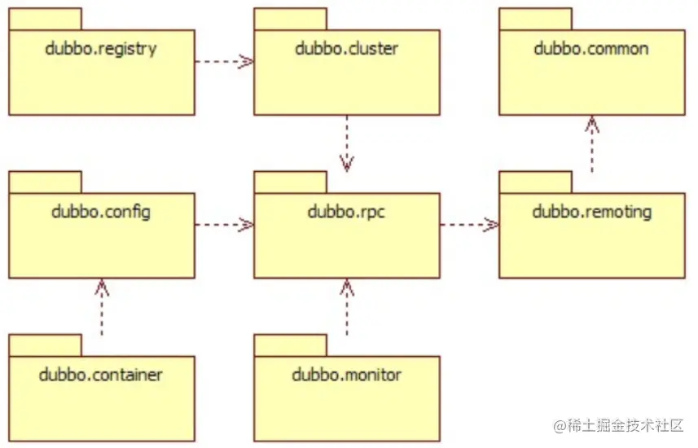

> 作者：源码笔记
> 链接：https://juejin.cn/post/6844904067936813063
> 来源：稀土掘金
> 著作权归作者所有。商业转载请联系作者获得授权，非商业转载请注明出处。

# 分析开源项目源码，我们该如何入手分析？（授人以渔）

## 1 前言

本文接上篇文章跟大家聊聊我们为什么要学习源码？学习源码对我们有用吗？，那么本篇文章再继续跟小伙伴们聊聊源码这个话题。

在工作之余开始写SpringBoot源码分析专栏前，跟小伙伴们聊聊“分析开源项目源码，我们该如何入手分析？”这个话题，我们就随便扯皮，反正是跟小伙伴们一起学习交流，没必要太正式。

## 2 学习开源框架源码到底难不难？

那么，先跟小伙伴们聊聊学习开源框架源码的感受，请问你们认为学习开源框架源码到底难不难？这是一个开放的话题，可谓仁者见仁，智者见智。有一些开源大牛们会说，So
easy！；有一些有源码阅读习惯且工作多年的小伙伴们会说，还好。；有一些刚开始学习源码的小伙伴们会说，太难了！。是的，不同工作经验不同技术层次的人的回答是不一样的。

那么刚开始学习开源项目源码难不难呢？应该对绝大部分小伙伴们来说应该是偏难的。为什么呢？可能有以下四点原因：

1. **一个能流行起来的成熟的开源项目必定功能齐全，可扩展，而功能齐全可扩展的开源项目必定很复杂，代码量大。**
   比如Spring5框架的源码行数达到了六七十万行，SpringBoot的源码行数达到了25万行左右，Dubbo和RocketMQ的源码行数达到了10万行。一个成熟的开源项目代码量这么多，可以想象其有多复杂。

2. **阅读源码时，我们有时候无法猜透源码作者当时编码时的想法。**
   因为在刚开始阅读源码的过程中，我们肯定会遇到很不懂的代码，不知道作者为何这么写，为何在这个位置写代码，这些都是很正常的，因为当初作者为啥这么写，可能是针对一些比较特殊的业务场景，或者为了某方面的性能等等，我们根本无法猜透。打个不太恰当的比喻，阅读源码猜测作者的心思就像当初遇到一个自己喜欢的姑娘，猜测她的心思一样，比如猜测她喜欢什么，她的兴趣爱好是什么。其实刚开始阅读源码也一样，有些地方我们一开始是无法猜透作者的心思的。

3. **有些开源框架可能集操作系统知识，数据结构，算法和设计模式于一身。**
   是的，优秀的框架必定是集成了很多设计模式于一身，目前为止笔者还没见过哪种流行的又没有应用设计模式的框架哈。比如很多框架运用了单例模式，工厂模式，责任链模式，装饰器模式和模板方法模式等，因为使用设计模式能让框架易于扩展。同时，不乏一些框架应用了一些操作系统层面的知识，这一块比较底层，相信很多学java的小伙伴没接触过。此外，开源框架某些地方会用到数据结构和算法，举个栗子，比如Dubbo默认有四种负载均衡策略，而每种策略又对应一种算法，其中又数RoundRobinLoadBalance负载均衡策略最复杂，一开始实现RoundRobinLoadBalance负载均衡的方式并不太完美或者说有bug，Dubbo也是重写过RoundRobinLoadBalance几次，
   **最终借鉴了Nginx的RoundRobinLoadBalance负载均衡算法。**

   > 上篇文章《跟大家聊聊我们为什么要学习源码？学习源码对我们有用吗？》也说过优秀框架之间的思想都是互相借鉴的，这就是我们要学习源码的原因之一。

   这里好像扯的有点远了，总之这里要说明的是阅读优秀框架是有一定难度的。

4.

有些开源框架注释太少也增加了阅读源码的难度。说到开源项目注释，如果我们阅读老外写的的框架源码可能还好，一般都会有大量注释，比如Spring框架，可以说几乎每个方法都有注释，这个就给我们阅读源码起了很大的帮助。不过唯一不好的可能就是英文注释，阅读对英语有一定的要求。其实英文注释还好，遇到不懂的，百度翻一下就好了。其实比较头疼的就是一些国内优秀的开源框架，其注释可以说是很少的，这无疑大大增加了阅读的难度，甚至有些框架的文档也不齐全，那就更加GG了。

## 3 该如何入手去分析开源框架源码？

前面跟小伙伴们聊了阅读源码的难度，千万不要被吓慌了。不可否认，刚开始阅读某个开源项目的源码是有一定的难度。注意，前面的用词是刚开始，刚开始哈。也就是说如果我们坚持阅读源码的话，养成阅读源码是陶冶情操的习惯的话（网上看到的这句话，这里引用装装逼，嘿嘿），长期坚持下来再去阅读其他项目的源码，游刃有余不敢说，但肯定可以很快入手。

那么，我们该如何入手去分析开源框架源码呢？

首先，结合前面所说的阅读源码之所以难的原因，我们就要有针对性的去克服解决。比如有空多学学设计模式，算法和英语。这些软实力确实对阅读源码有很大帮助。

其次，阅读源码的前提是什么？当然，阅读源码是要建立在会使用的基础上，就像若还不会走路就学骑单车一样，若连用都不会就去钻研源码可能会适得其反。

最后，我们阅读源码要注意一些技巧，现在根据自身经历总结一下相关思路和技巧，如下：

1. **开始阅读源码时，先对框架的模块及其关系有一个整体的认识。** 我们要对框架项目的模块和目录要有一个全盘的了解，要知道每个模块是干嘛的，然后要了解模块与模块之间的关系。
   >
   举个栗子，比如Dubbo的模块分包核心的主要有以下八个，如下图，我们要知道最基础的的模块应该是dubbo-common公共逻辑模块，这个模块作为最基础的模块，主要是提供了通用模型和工具类；然后dubbo-remoting是远程通讯模块，依赖于dubbo-common模块，相当于Dubbo协议的实现；而dubbo-rpc则是远程调用模块，依赖于dubbo-remoting模块，抽象各种协议，以及动态代理；dubbo-cluster是集群模块，依赖于dubbo-rpc模块，将多个服务提供方伪装为一个提供方，包括：负载均衡,
   容错，路由等。
   > 
2. **分析源码先从父类或父接口开始分析。**
   因为父类或者父接口往往代表了一类功能，这些基类或基类接口往往抽象了各个具体子类共有的属性和行为，一些比较基础的方法都在父类中实现，然后留个模板方法给子类去实现即可（模板方法的应用）。
   > 举个栗子，这里还是拿Dubbo的负载均衡来说吧，如下图，LoadBalance是各种负载均衡策略的超级接口，定义了 select
   方法用来实现选择哪台机器；然后AbstractLoadBalance是一个抽象类，实现了LoadBalance接口，在覆盖了 select 方法后，其又增加了
   calculateWarmupWeight 和 getWeight 权重相关的两个方法，因为这些方法都跟具体的负载均衡策略类有关，故在父类实现了。值得注意的是AbstractLoadBalance抽象类的
   select 方法中里留了个给子类覆盖的 doSelect 方法，具体的负载均衡策略将在doSelect中实现。
   > 
3. **阅读源码前首先要找到启动类 。** 阅读分析源码时要先从启动类开始，因此找到框架启动的入口很重要。
4. **阅读源码时要分清主干和枝节代码。**
   找到启动入口后，然后就可以顺着启动入口一步一步调试来阅读源码了。不过在初次调试源码时值得注意的是一定要分清主次代码，即要先阅读主干代码，其他枝枝节节的代码没明白的可以放一边。切忌一开始就深入细节然后出不来了，这样就会造成只见冰山一角而看不到全貌的感觉。
5. **阅读源码前要分清主次模块。**
   即阅读分析源码不能漫无目的，全盘通读，我们要从我们平时有用到的模块开始分析。每个人的时间都很宝贵，我们要把时间花在刀刃上。比如SpringBoot增加的新特性中有自动配置，而自动配置特性又非常重要，因此可以挑选自动配置来进行源码分析。
6. **要充分利用源码项目的测试类。**之前也说过，一个框架之所以能流行，必定是经过大量测试的。因此如果我们像具体了解某个类和某个方法，我们可以充分利用这些测试类来辅助我们源码分析。
7. **要学会一些调试技巧。**
   这一点也很重要，比如在调试过程中如何查看调用关系等等，这里不多说，如何高效学习和阅读源码这篇文章中分享了大量调试的干活，小伙伴们可以瞅瞅。此外，还要学会有技巧的搜索源码，说到这里，下面举个栗子。
   > 举个Spring事件监听的栗子。比如我们现在要知道哪个监听器监听了ContextRefreshedEvent事件，此时我们可以通过idea全局搜索"(
   ContextRefreshedEvent"
   关键字，得到以下截图：从下图可以看到spring-webmvc模块的FrameworkServlet，spring-context模块的ScheduledAnnotationBeanPostProcessor,和spring-jms模块的JmsListenerEndpointRegistry等类订阅了ContextRefreshedEvent事件，那么在容器刷新的时候这几个类将会监听到ContextRefreshedEvent事件，执行一些初始化逻辑。
   > 
8. 肯定还有大量的阅读源码技巧，希望本文能起到抛砖引玉的作用，期待小伙伴们可以留言分享下，让笔者也收益一下。

## 4 学源码，谈实践，论坚持

最后，我们学习源码不是为了学习而学习，最理想的效果我们要学以致用。比如把从源码中学习到的设计模式，接口设计方法，面向对象原则和相关算法等等都可以应用到我们手头的项目中，这才是我们学习源码的最终目的，也是源码学习的最理想的效果。可能这里有些小伙伴会说，我平时参与的项目都是业务类的项目，而不是开发基础框架，开发中间件，CRUD比较多，可能学习基础框架的源码对我们用处很少。其实不是的，只要你有参与项目，学习源码我们学习的是思想，我们就可以把源码框架设计中的思想应用到我们的项目中。

最后的最后，我们来谈谈坚持，这是最难能可贵的。很多大道理我们都懂，比如要坚持运动，坚持学习，坚持...，可是就是没能坚持下来，包括我自己，嘿嘿。坚持这东西太南了，不过还是应该给自己立个flag吧，把自己有用到的框架比如SpringBoot,Spring,Mybatis,Dubbo,SpringCloud等框架源码都阅读分析一遍，加油，小伙伴们共勉！

