> 原文链接：https://blog.csdn.net/w605283073/article/details/89290798

# 如何高效学习和阅读源码？

## 一、背景

作为Java开发工程师，想进阶，阅读别人项目的源码，尤其是开源的优秀核心技术栈的源码必不可少的步骤。

那么有什么高效的阅读源码的方法呢？

常见的比如买一些 《xxx源码解析》图书，但是存在一个问题，刚开始看的时候非常吃力，跟不上，显得很枯燥，而且很可能看完可能还是毫无头绪。

又不如直接拉源码下来，又不知道如何入手。

今天和好友探讨过这个问题，把我们认为比较好的阅读和学习源码的技巧整理在这里。

## 二、好的方法

（1）拉源码，通过单元测试，调试技巧，各种IDE的辅助功能和插件了解调用关系。

（2）根据单元测试打断点，查看调用栈。

（3）结合源码解读的图书和文章再去理解。

（4）结合官方文档的功能文档和架构文档来读。

> 如dubbo的架构图
> 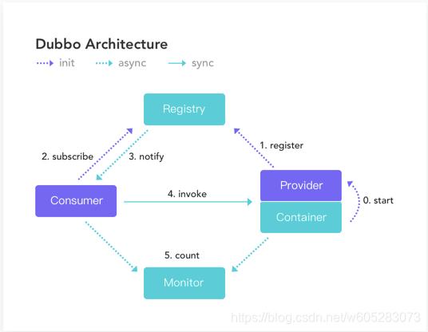
> 对从整体掌握源码和原理有极大的帮助，dubbo官方文档甚至还有配套的源码截图。

（5）带着问题或者遇到问题后深入研究某一块，可以查看 pull request 或者  issues。

（6）使用 chatgpt 或 cursor 等人工智能工具学习源码。

## 三、具体方法

### 3.1 github拉取源码+看源码注释+单元测试

去github上拉取源码（建议直接拉clone原项目或者fork之后的项目源码）。

建议fork源码，这样本地可以对源码加入自己的注释。

或者快捷键进入源码后，IDEA右上角有“Download Source”在项目中拉源码，方便调试和学习。

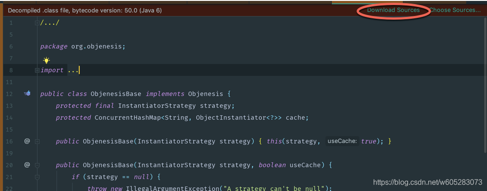

因为源码带有注释，而多数的开源项目，尤其是外国的优秀开源项目的注释都非常详细，包括类、函数的作用以及参数的含义都非常清楚。

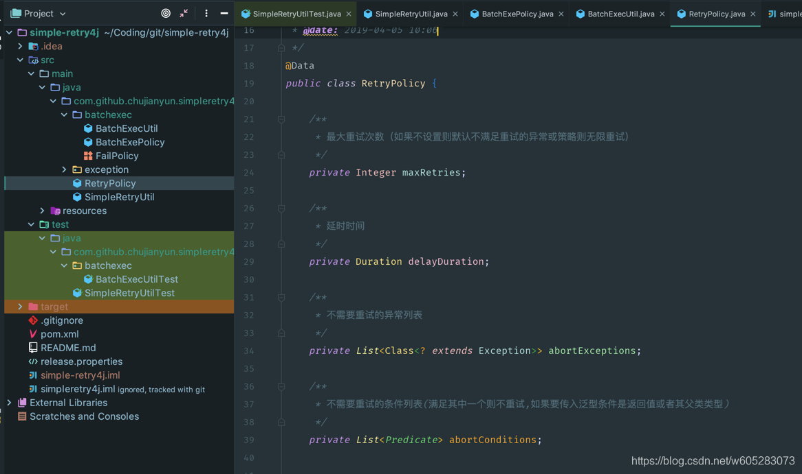

另外优秀的开源项目必然会有单元测试，几乎每个类都有单元测试。

想重点学习某个类，就运行某个单元测试，根据单元测试的角度了解函数的目的，用法等。

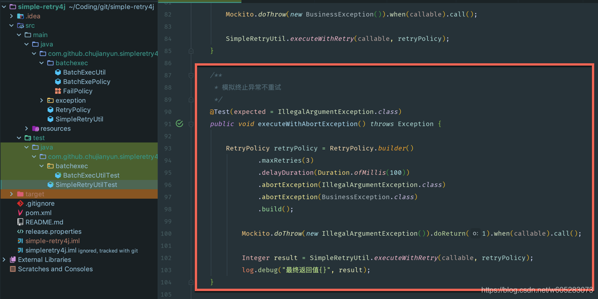

### 3.2 断点调试看调用栈大法

断点调试可以通过单步调试，通过堆栈信息，通过watch来查看类的各种属性。

对理解程序流程和数据变化有极大的帮助。

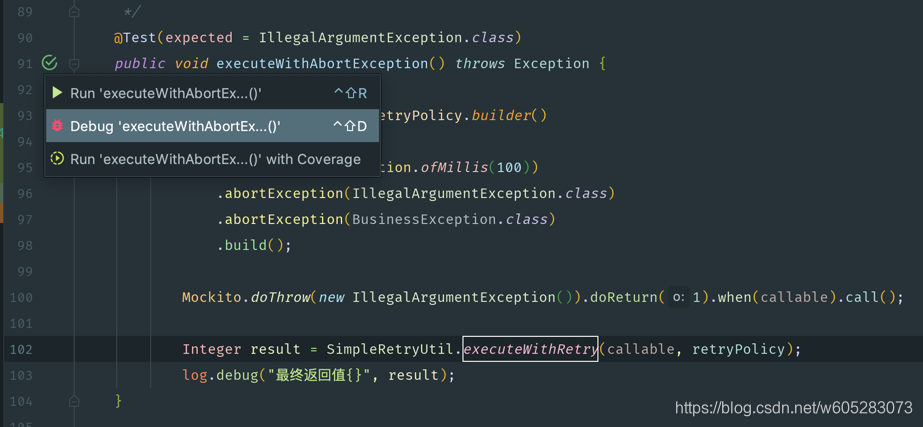

调试

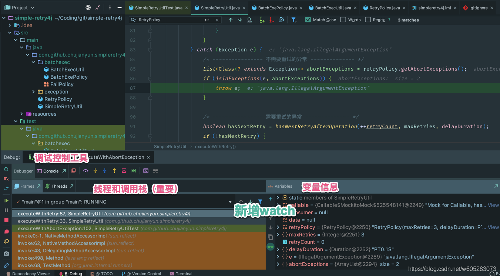

这里非常重要，因为常规的调试都是单步往下走，但是这里可以通过左下角的调用栈，查看已经入栈的栈帧，查看上层函数调用！！！

比如在spring生命周期的某个环节如构造方法中打了断点，在这里就可以追溯到bean的初始化初期的调用代码。

而且可以通过删除frame实现“回退”。

对分析源码有极大的帮助！！！！

### 3.3 结合 pull request 学源码

可以查看想学习的源码的 pull requests ，选择其中自己感兴趣的提交，查看解决什么问题，通过什么方法解决的，其他审查人员给了什么建议等。

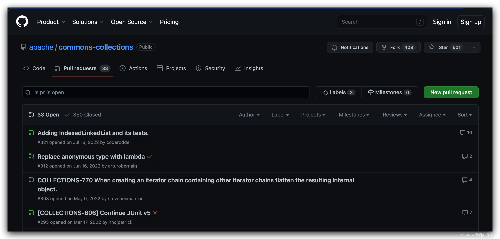

### 3.4 使用 AI 学习源码

可以使用 chatgpt、new bing、cursor 等对某个源码段落进行提问，让它给出解释，让它们给出相关代码示例等，帮助自己理解某段代码。

### 3.5 查看类中主要函数

mac快捷键 cmd+f12

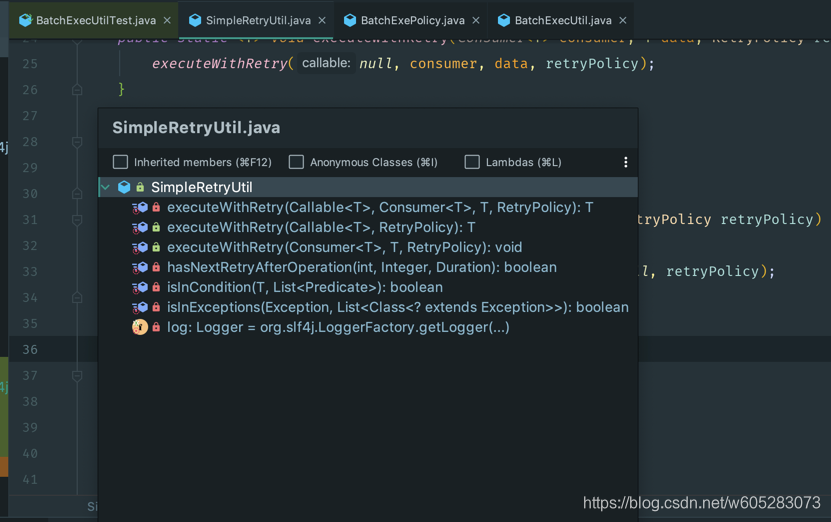

双击可以跳转到对应的函数源码。

### 3.6 查看继承关系大法

通过继承关系可以了解一个类“本质”是啥。

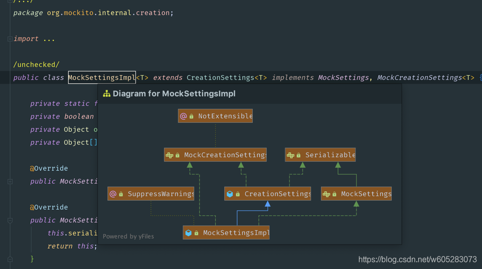

而且通过双击，可以跳转到继承关系的任何一个类的源码。

### 3.7 查看调用关系

通过“Call Hierarchy”查看调用的关系

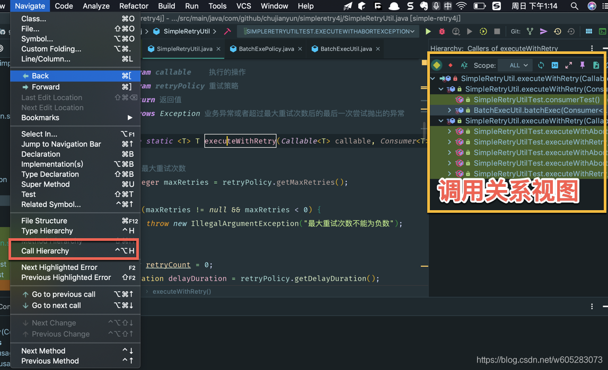

通过右键“find usages”查看调用

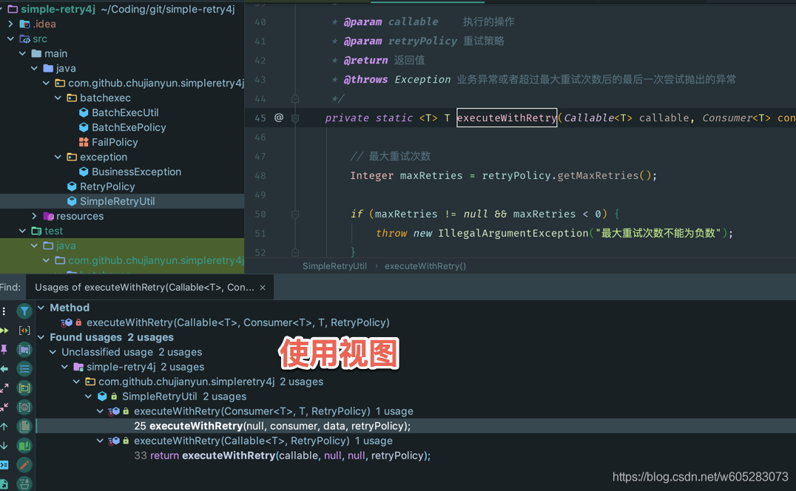

双击都可以去到源码中。

### 3.8 查看源码时不跳转显示参数或某个子函数的源码

mac上快捷键是cmd+y

这在研究源码时帮助很大，不仅节省很多时间，而且效果更好。

可以用在参数上，也可以用在子函数上。

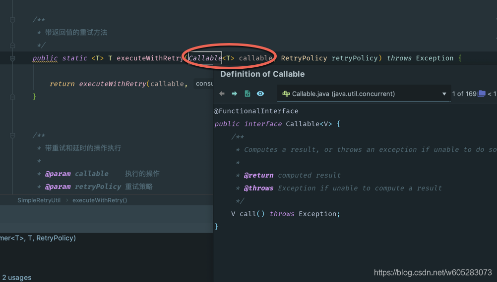

### 3.9 依赖关系（依赖矩阵、依赖UML等）

依赖矩阵

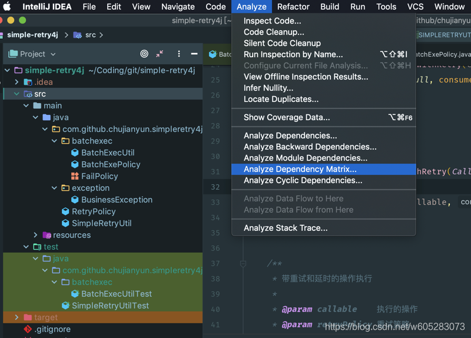

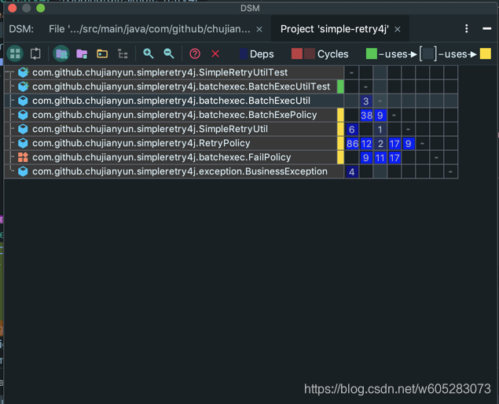

基本解释：

绿色使用了灰色的类，灰色类使用黄色类。

红色代表形成了循环依赖。

如图所示我们鼠标放在“BatchExecUtil”上，根据右上角的图示可知。

绿色部分 BatchExecUtilTest使用到了BatchExecUtil。

而BatchExecUtil又使用到了下面4个类。

可以切换到不同的类（行），查看关系，下图是切换到“SimpleRetryUtil”的视图：

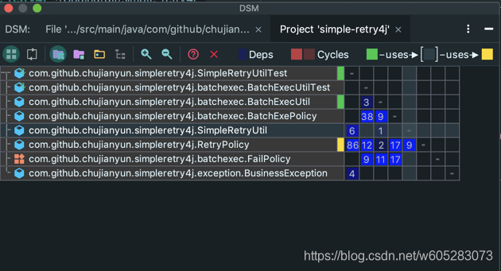