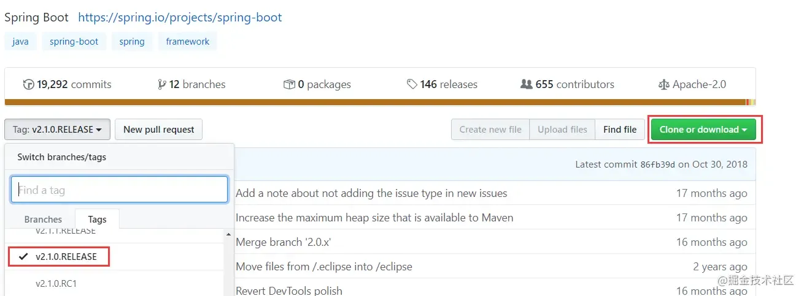
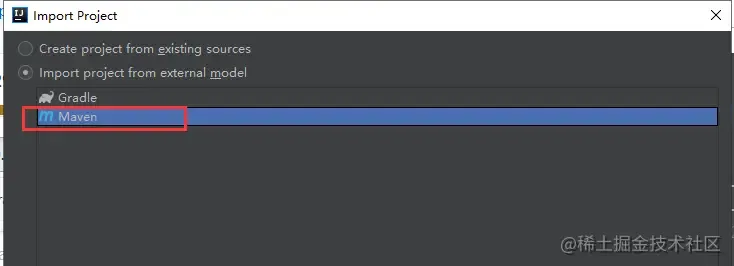
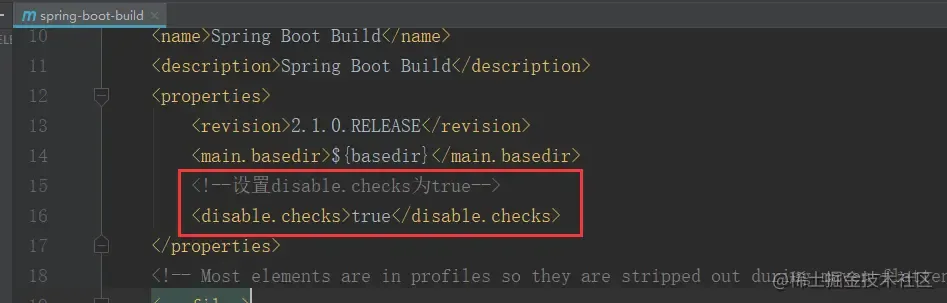
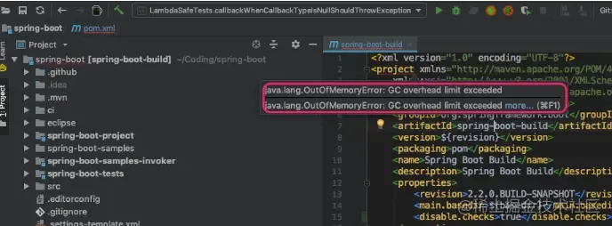
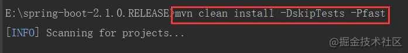
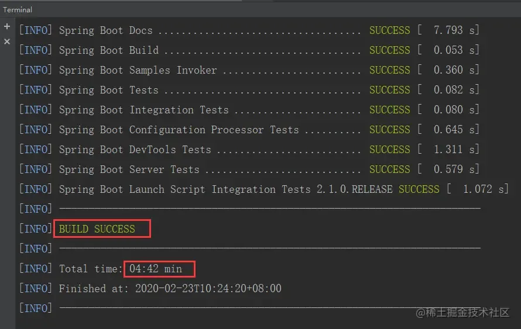
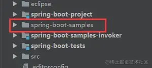
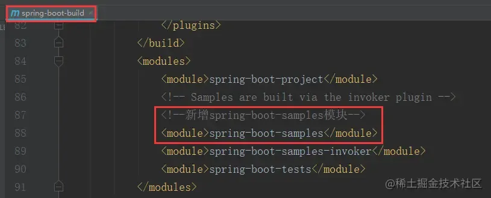
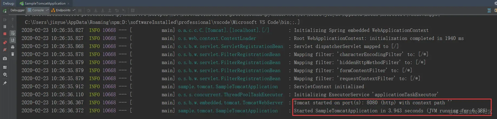
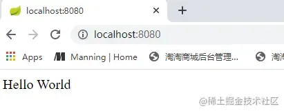

# 1 如何搭建自己的SpringBoot源码调试环境？

## 1 前言

这是 SpringBoot2.1 源码分析专题的第一篇文章，主要讲如何来搭建我们的源码阅读调试环境。如果有经验的小伙伴们可以略过此篇文章。

## 2 环境安装要求

- IntelliJ IDEA
- JDK1.8
- Maven3.5 以上

## 3 从 Github 上将 SpringBoot 源码项目下载下来

首先提供SpringBoot2.1.0的 github 地址： github.com/spring-proj…

因为要进行阅读源码和分析源码项目，我们是不是要在里面写一些注释帮助我们阅读理解源码，因此需要将 SpringBoot 源码项目 fork 到自己的 github 仓库中，然后再利用git clone url命令将已经 fork 到自己 github 仓库的 SpringBoot 源码拉取下来即可。 但由于以上方式往往很慢，通常会超时，所以笔者直接将 SpringBoot 项目直接下载下来，然后再导入 IDEA 中。



## 4 将 SpringBoot 源码项目导入到 IDEA 中

将刚才下载的 `spring-boot2.1.0.RELEASE` 项目选择 maven 方式导入到 IDEA 中，然后一直 next 即可导入完成，注意选择 JDK 版本是 1.8，maven 版本是 3.5+。



此时下载 maven 依赖是一个漫长的等待过程，建议 maven 没有配置（阿-里-云）仓库的小伙伴们配置一下，这样下载速度会快很多。参考配置 maven 使用（阿-里-云）仓库进行配置即可: https://blog.csdn.net/zhuzj12345/article/details/93200211。

## 5 编译构建 SpringBoot 源码项目

此时导入项目后，我们进行编译构建 SpringBoot 源码项目了，在构建之前做两个配置：

1、我们要禁用 maven 的代码检查，在根 `pom.xml` 中增加一下配置即可，如下图：



2、可能有的小伙伴们的 `pom.xml` 文件的 project 标签上显示`java.lang.OutOfMemoryError`错误，这是因为 IDEA 里的 Maven 的 importer 设置的 JVM 最大堆内存过小而导致的，如下图,此时可参考Maven 依赖包导入错误（IntelliJ IDEA）解决即可: https://blog.csdn.net/w605283073/article/details/85107497。



进行了上面的两点配置后，此时我们就可以直接执行以下 maven 命令来编译构建源码项目了。

```bash

mvn clean install -DskipTests -Pfast
```



此时又是漫长的等待，我这里等待 5 分钟左右就显示构建成功了，如下图：



6 运行 SpringBoot 自带的 sample

因为 SpringBoot 源码中的 spring-boot-samples 模块自带了很多 DEMO 样例，我们可以利用其中的一个 sample 来测试运行刚刚构建的 springboot 源码项目即可。但此时发现 spring-boot-samples 模块是灰色的，如下图：



这是因为 spring-boot-samples 模块没有被添加到根 pom.xml 中，此时将其添加到根 pom.xml 中即可，增加如下配置，如下图：



此时我们挑选 spring-boot-samples 模块下的 spring-boot-sample-tomcat 样例项目来测试好了，此时启动SampleTomcatApplication的main函数，启动成功界面如下：



然后我们再在浏览器发送一个 HTTP 请求，此时可以看到服务端成功返回响应，说明此时 SpringBoot 源码环境就已经构建成功了，接下来我们就可以进行调试了，如下图：



## 7 动手实践环节

前面已经成功构建了 SpringBoot 的源码阅读环境，小伙伴们记得自己动手搭建一套属于自己的 SpringBoot 源码调试环境哦，阅读源码动手调试很重要，嘿嘿。