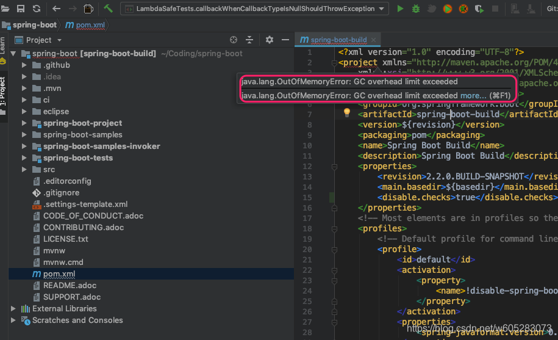
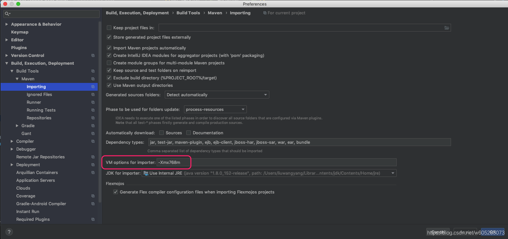

# Maven依赖包导入错误（IntelliJ IDEA）：GC overhead limit exceeded

## 问题描述：

最近使用IDEA导入SpringBoot源码来学习（遇到很多坑，参见另外一篇搭建SpringBoot源码环境的正确姿势（避坑必备）_
明明如月学长的博客-CSDN博客），

发现最外层的pom.xml文件的project标签上提示如下图所示的效果：



具体内容：

```bash
java.lang.OutOfMemoryError：GC overhead limit exceeded
```

该问题是于IDEA里为Maven的importer设置的JVM最大堆内存（-Xmx）过小而导致的.

## 解决方案

打开IDEA设置，找到Maven -->Importing选项卡



可以将这里的最大堆内存设置大一些比如 -Xmx3072m

然后重新打开或者导入项目即可