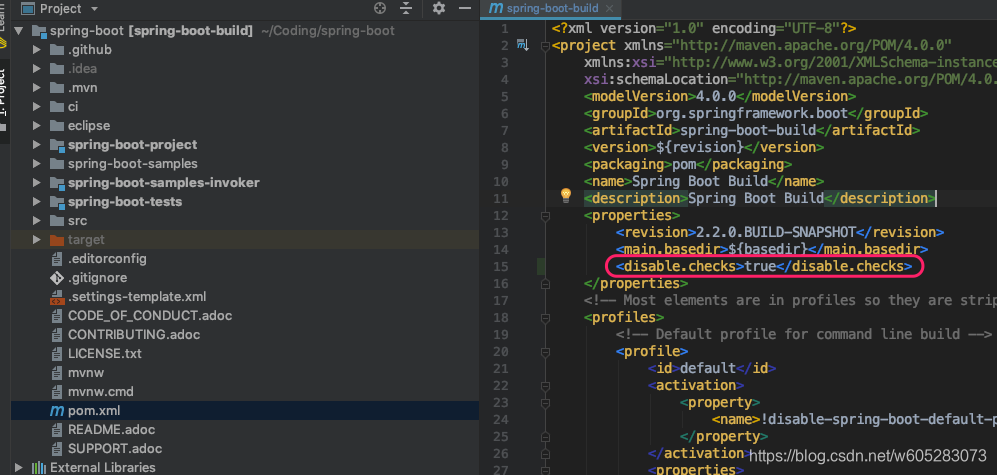
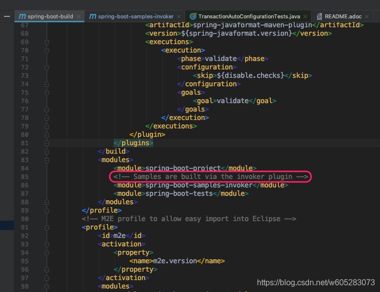
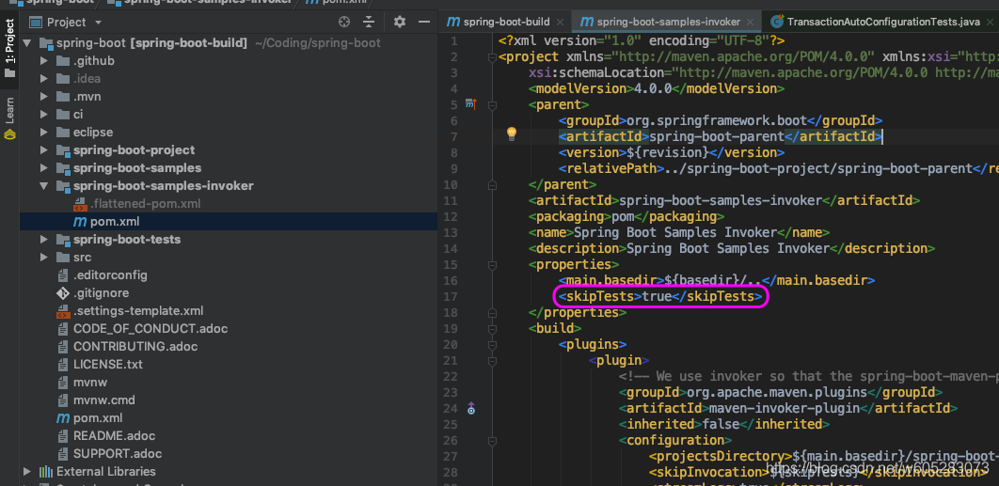
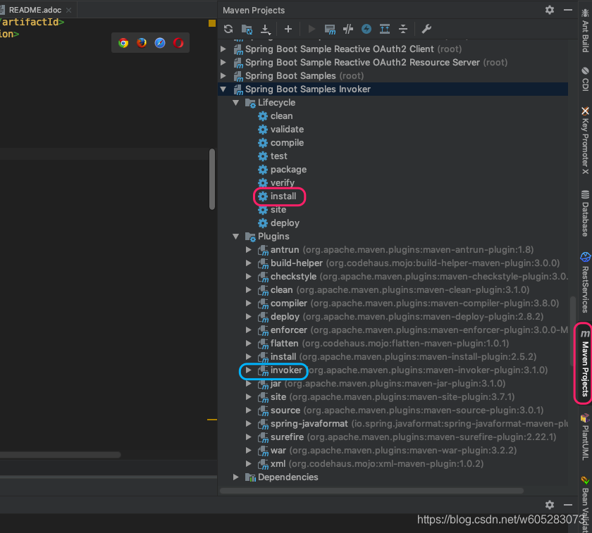
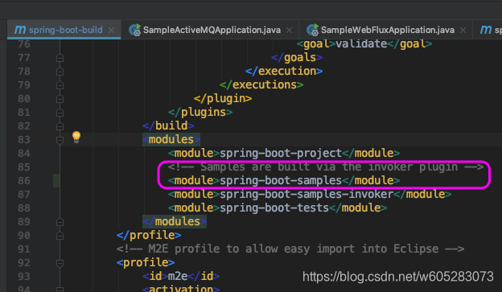
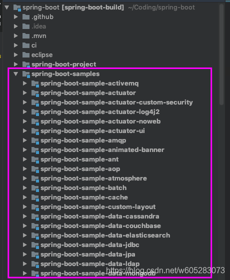
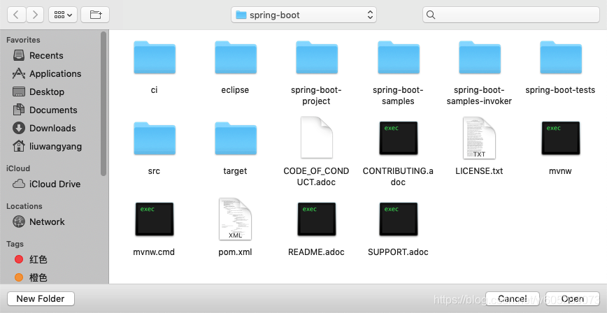
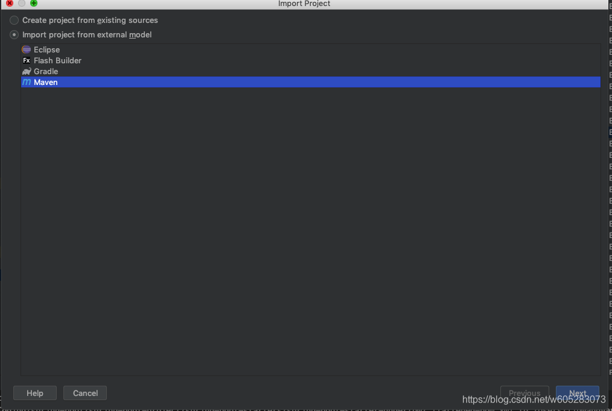

> 原文链接：https://blog.csdn.net/w605283073/article/details/85106902

# 搭建SpringBoot源码环境的正确姿势（避坑必备）

最近打算拉取SpringBoot源码，各种编译报错，各种问题。参考很多网上的教程，仍然是各种错误。

最终研究出来了搭建SpringBoot源码环境的正确姿势。

SpringBoot Github地址：https://github.com/spring-projects/spring-boot

## 0、环境准备

安装maven 3.5或者以上版本。

安装JDK 8或者以上。

## 1、fork到自己的库

当然如果你觉得不需要，可以忽略。

fork到自己的github的好处是后面自己的修改可以提交上去，可以随意造作..


## 2、 clone下来

clone下来后可以导入IDEA（也可以先不导入），导入步骤见最后。

## 3、设置Maven镜像

设置maven镜像如果不会可以自行百度。就是找到setting.xml然后再mirrors标签里粘贴如下内容。

```xml

<mirror>
    <id>nexus-aliyun</id>
    <mirrorOf>central</mirrorOf>
    <name>Nexus aliyun</name>
    <url>[http://maven.aliyun.com/nexus/content/groups/public](http://maven.aliyun.com/nexus/content/groups/public)
    </url>
</mirror>

<mirror>
<id>ibiblio</id>
<mirrorOf>central</mirrorOf>
<name>ibiblio Mirror of [http://repo1.maven.org/maven2/](http://repo1.maven.org/maven2/)</name>
<url>[http://mirrors.ibiblio.org/pub/mirrors/maven2/](http://mirrors.ibiblio.org/pub/mirrors/maven2/)</url>
</mirror>

<mirror>
<id>jboss-public-repository-group</id>
<mirrorOf>central</mirrorOf>
<name>JBoss Public Repository Group</name>
<url>
    [http://repository.jboss.org/nexus/content/groups/public](http://repository.jboss.org/nexus/content/groups/public)
</url>
</mirror>

<mirror>
<id>repo2</id>
<mirrorOf>central</mirrorOf>
<name>Human Readable Name for this Mirror.</name>
<url>[http://repo2.maven.org/maven2/](http://repo2.maven.org/maven2/)</url>
</mirror>


<mirror>
<id>ui</id>
<mirrorOf>central</mirrorOf>
<name>Human Readable Name for this Mirror.</name>
<url>[http://uk.maven.org/maven2/](http://uk.maven.org/maven2/)</url>
</mirror>

```

## 4、修改最外层pom.xml文件

<properties>下加

```xml

<disable.checks>true</disable.checks>
```



## 5. 安装并使用mvnwrapper编译项目

参见GitHub maven-wrapper:  https://github.com/takari/maven-wrapper

进入到spring-boot检出的目录

执行： mvn -N io.takari:maven:wrapper

然后执行： ./mvnw clean install -DskipTests -Pfast

然后看到如下结果，表示构建成功。

然后选取项目里的一个单元测试运行一下，走起，发现运行成功了。

## 6 构造spring-boot-sample模块

导入项目后发现spring-boot-sample模块没有显示模块样式，没有显示正常的模块结构。

我们再回到最外层的pom.xml文件，发现模块这里专门有一句话“Samples are built via the invoker plugin” 可见
samples模块是通过invoker插件来构建的。



进入invoker模块。

编辑其中的pom.xml文件在

<properties>下加

```xml

<skipTests>true</skipTests>
```



我们打开IDEA右侧的maven面板，执行install。



也可以cd 到该子模块，然后执行mvn clean build

然后在最外层的pom.xml整添加模块：<module>spring-boot-samples</module>



然后发现sample模块显示正常



然后再sample模块里运行一个DEMO，发现运行正常，搞定...

## 可能遇到的情况

如果pom.xml文件的project标签上显示java.lang.OutOfMemoryError：GC overhead limit exceeded，可以参考

https://blog.csdn.net/w605283073/article/details/85107497 来解决。

## SpringBoot源码导入IDEA

IDEA菜单 File -->New --> Project From Existing Sources



然后选择Maven --> Next



后面就一步步导入就可以了。

## 写在最后

如果还有错误，请具体看错误提示，耐心排查。如果有其他需要注意的，请评论探讨。

我的settring.xml文件配置

```xml
<?xml version="1.0" encoding="UTF-8"?>
<settings xmlns="http://maven.apache.org/SETTINGS/1.0.0"
          xmlns:xsi="http://www.w3.org/2001/XMLSchema-instance"
          xsi:schemaLocation="http://maven.apache.org/SETTINGS/1.0.0 http://maven.apache.org/xsd/settings-1.0.0.xsd">
    <servers>


    </servers>

    <mirrors>
        <mirror>
            <id>nexus-aliyun</id>
            <mirrorOf>central</mirrorOf>
            <name>Nexus aliyun</name>
            <url>http://maven.aliyun.com/nexus/content/groups/public)</url>
        </mirror>

        <mirror>
            <id>ibiblio</id>
            <mirrorOf>central</mirrorOf>
            <name>ibiblio Mirror of [http://repo1.maven.org/maven2/](http://repo1.maven.org/maven2/)</name>
            <url>http://mirrors.ibiblio.org/pub/mirrors/maven2/</url>
        </mirror>

        <mirror>
            <id>jboss-public-repository-group</id>
            <mirrorOf>central</mirrorOf>
            <name>JBoss Public Repository Group</name>
            <url>http://repository.jboss.org/nexus/content/groups/public</url>
        </mirror>

        <mirror>
            <id>repo2</id>
            <mirrorOf>central</mirrorOf>
            <name>Human Readable Name for this Mirror.</name>
            <url>http://repo2.maven.org/maven2/</url>
        </mirror>


        <mirror>
            <id>ui</id>
            <mirrorOf>central</mirrorOf>
            <name>Human Readable Name for this Mirror.</name>
            <url>http://uk.maven.org/maven2/</url>
        </mirror>
    </mirrors>

    <profiles>


        <!--回去开发的配置-->
        <profile>
            <id>home-dev</id>
            <repositories>


                <repository>
                    <id>nexus-aliyun</id>
                    <name>Nexus aliyun</name>
                    <url>http://maven.aliyun.com/nexus/content/groups/public</url>
                </repository>

                <repository>
                    <id>nexus-tmatesoft</id>
                    <name>Nexus tmatesoftn</name>
                    <url>https://maven.tmatesoft.com/content/groups/public/</url>
                </repository>


                <repository>
                    <id>ibiblio</id>
                    <name>Nexus ibiblio</name>
                    <url>http://maven.ibiblio.org/maven2/</url>
                </repository>


                <repository>
                    <id>nexus-repos1</id>
                    <name>Central Repository1</name>
                    <url>http://repo1.maven.org/maven2/</url>
                </repository>

                <repository>
                    <id>uk-maven2</id>
                    <name>Nexus uk maven2</name>
                    <url>http://uk.maven.org/maven2/</url>
                </repository>


            </repositories>
        </profile>

    </profiles>
    <activeProfiles>
        <activeProfile>home-dev</activeProfile>

    </activeProfiles>
</settings>
```