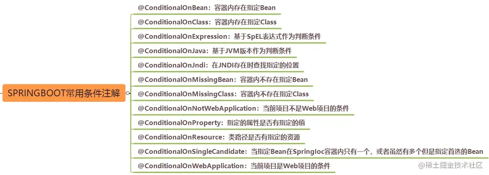
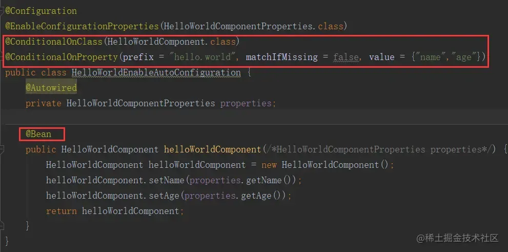
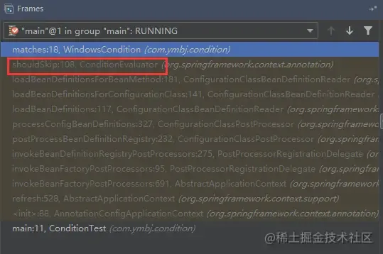
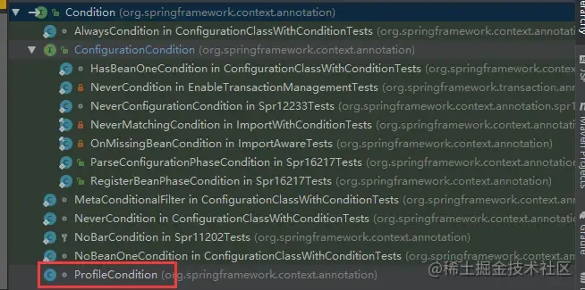

# 3 助力SpringBoot自动配置的条件注解原理揭秘

> 注：该源码分析对应 SpringBoot 版本为 2.1.0.RELEASE

## 1 前言

上一篇，我们分析了 SpringBoot 源码结构及各个模块 pom 之间的关系后，那么此篇开始就开始解开 SpringBoot 新特性之一--自动配置的神秘面纱了。因为
SpringBoot 自动配置原理是基于其大量的条件注解`ConditionalOnXXX`，因此，本节我们先来撸下 Spring 的条件注解的相关源码。

## 2 SpringBoot 的派生条件注解

我们都知道，SpringBoot 自动配置是需要满足相应的条件才会自动配置,因此 SpringBoot 的自动配置大量应用了条件注解
`ConditionalOnXXX`。如下图：



那么上图的条件注解如何使用呢？

> 举个栗子，我们来看下如何使用`@ConditionalOnClass`和`@ConditionalOnProperty`这两个注解，先看下图代码：



`HelloWorldEnableAutoConfiguration`这个自动配置类应用了`@ConditionalOnClass`和`ConditionalOnProperty`两个条件注解，那么只有在满足
`:classpath`中存在`HelloWorldComponent.class`和配置了`hello.world.name`和`hello.world.age`属性这两个条件的情况下才会创建
`HelloWorldComponent`这个`bean`。

其实 SpringBoot 的`@ConditionalOnXXX`等条件注解都是派生注解，那么什么是派生注解呢？ 就拿上面的栗子来说，以
`@ConditionalOnClass(HelloWorldComponent.class)`为例，我们打开`ConditionalOnClass`注解源码，如下：

```java

@Target({
        ElementType.TYPE,
        ElementType.METHOD
})
@Retention(RetentionPolicy.RUNTIME)
@Documented
@Conditional(OnClassCondition.class)
public @interface ConditionalOnClass {
    Class <<?>[]

    value()

    default {
    }

    ;

    String[] name() default {};
}

```

可以看到`@ConditionalOnClass`注解上面又标注了`@Conditional(OnClassCondition.class)`注解，因此`@ConditionalOnClass`是
`@Conditional`的派生注解，`@Conditional(OnClassCondition.class)`和`@ConditionalOnClass`注解是等价的，即这两个注解标注在某个配置类上的效果是等价的。

而 SpringBoot 的自动配置原理正是建立在这些大量的派生条件注解`@ConditionalOnXXX`之上，而这些条件注解的原理跟 Spring 的
`Condition` 接口有关。因此我们先来研究下 `Condition` 接口的相关源码。

## 3 Condition 接口

### 3.1 Condition 接口源码分析

分析 `Condition` 接口源码前先看下如何自定义`ConditionalOnXXX`注解,举个栗子，比如自定义一个`@ConditionalOnLinux`
注解，该注解只有在其属性`environment`是"linux"才会创建相关的 bean。定义了以下代码：

```java


/**
 * 实现spring 的Condition接口，并且重写matches()方法，如果@ConditionalOnLinux的注解属性environment是linux就返回true
 *
 */
public class LinuxCondition implements Condition {

    @Override
    public boolean matches(ConditionContext context, AnnotatedTypeMetadata metadata) {
        // 获得注解@ConditionalOnLinux的所有属性
        List<AnnotationAttributes> allAnnotationAttributes = annotationAttributesFromMultiValueMap(
                metadata.getAllAnnotationAttributes(
                        ConditionalOnLinux.class.getName()));
        for (AnnotationAttributes annotationAttributes : allAnnotationAttributes) {
            // 获得注解@ConditionalOnLinux的environment属性
            String environment = annotationAttributes.getString("environment");
            // 若environment等于linux，则返回true
            if ("linux".equals(environment)) {
                return true;
            }
        }
        return false;
    }
}

@Target({
        ElementType.TYPE,
        ElementType.METHOD
})
@Retention(RetentionPolicy.RUNTIME)
@Documented
@Conditional(LinuxCondition.class)
public @interface ConditionalOnLinux {
    // 标注是哪个环境
    String environment() default "";

}

@Configuration
public class ConditionConfig {
    // 只有`@ConditionalOnLinux`的注解属性`environment`是"linux"时才会创建bean
    @Bean
    @ConditionalOnLinux(environment = "linux")
    public Environment linuxEnvironment() {
        return new LinuxEnvironment();
    }
}
```

上面的代码我们捋一下：

1. `LinuxCondition`实现了`Condition`接口并实现了`matches`方法，而`matches`方法则判断`@ConditionalOnLinux`的注解属性
   `environment`是否"linux"，是则返回 true，否则 false。
2. 然后我们再定义了一个注解`@ConditionalOnLinux`，这个注解是`@Conditional`的派生注解，与
   `@Conditional(LinuxCondition.class)`等价，注意`@ConditionalOnLinux`注解定义了一个属性`environment`。而我们最终可以利用
   `LinuxCondition`的`matches`方法中的参数`AnnotatedTypeMetadata`来获取`@ConditionalOnLinux`的注解属性`environment`
   的值，从而用来判断值是否为 linux"。
3. 最后我们又定义了一个配置类`ConditionConfig`，在`linuxEnvironment`方法上标注了
   `@ConditionalOnLinux(environment = "linux")`。因此，这里只有 `LinuxCondition`的`matches`方法返回 true 才会创建`bean`。

学会了如何自定义`@ConditionalOnXXX`注解后，我们现在再来看下`Condition`接口的源码：

```java

@FunctionalInterface
public interface Condition {
    boolean matches(ConditionContext context, AnnotatedTypeMetadata metadata);
}
```

`Condition` 接口主要有一个`matches`方法，该方法决定了是否要注册相应的bean对象。其中`matches`方法中有两个参数，参数类型分别是
`ConditionContext`和`AnnotatedTypeMetadata`，这两个参数非常重要。它们分别用来获取一些环境信息和注解元数据从而用在`matches`
方法中判断是否符合条件。

> `ConditionContext`，顾名思义，主要是跟`Condition`的上下文有关，主要用来获取`Registry`,`BeanFactory`,`Environment`,
`ResourceLoader`和`ClassLoader`等。那么获取这些用来干什么呢？举个栗子，比如`OnResourceCondition`需要靠`ConditionContext`来获取
`ResourceLoader`来加载指定资源，`OnClassCondition`需要靠`ConditionContext`来获取`ClassLoader`来加载指定类等，下面看下其源码：

```java

public interface ConditionContext {
    BeanDefinitionRegistry getRegistry();

    @Nullable
    ConfigurableListableBeanFactory getBeanFactory();

    Environment getEnvironment();

    ResourceLoader getResourceLoader();

    @Nullable
    ClassLoader getClassLoader();
}

```

> `AnnotatedTypeMetadata`，这个跟注解元数据有关，利用`AnnotatedTypeMetadata`可以拿到某个注解的一些元数据，而这些元数据就包含了某个注解里面的属性，比如前面的栗子，利用
`AnnotatedTypeMetadata`可以拿到`@ConditionalOnLinux`的注解属性`environment`的值。下面看下其源码：

```java

public interface AnnotatedTypeMetadata {
    boolean isAnnotated(String annotationName);

    Map<String, Object> getAnnotationAttributes(String annotationName);

    Map<String, Object> getAnnotationAttributes(String annotationName, boolean classValuesAsString);

    MultiValueMap<String, Object> getAllAnnotationAttributes(String annotationName);

    MultiValueMap<String, Object> getAllAnnotationAttributes(String annotationName, boolean classValuesAsString);
}

```

回到刚才的栗子，我们知道`@ConditionalOnLinux`注解真正起作用的是`Condition`接口的具体实现类`LinuxCondition`的`matches`
方法，那么这个`matches`方法是在何时被调用的呢？

通过 idea 调试看调用的栈帧，如下图：



发现是在`ConditionEvaluator`的`shouldSkip`方法中调用了`LinuxCondition`的`matches`方法，自然我们再去看看
`ConditionEvaluator`的`shouldSkip`的方法执行了什么逻辑。

```java


// 这个方法主要是如果是解析阶段则跳过，如果是注册阶段则不跳过
public boolean shouldSkip(@Nullable AnnotatedTypeMetadata metadata, @Nullable ConfigurationPhase phase) {
// 若没有被@Conditional或其派生注解所标注，则不会跳过
    if (metadata == null || !metadata.isAnnotated(Conditional.class.getName())) {
        return false;
    }
// 没有指定phase，注意phase可以分为PARSE_CONFIGURATION或REGISTER_BEAN类型
    if (phase == null) {
// 若标有@Component，@Import，@Bean或@Configuration等注解的话，则说明是PARSE_CONFIGURATION类型
        if (metadata instanceof AnnotationMetadata &&
                ConfigurationClassUtils.isConfigurationCandidate((AnnotationMetadata) metadata)) {
            return shouldSkip(metadata, ConfigurationPhase.PARSE_CONFIGURATION);
        }
// 否则是REGISTER_BEAN类型
        return shouldSkip(metadata, ConfigurationPhase.REGISTER_BEAN);
    }

    List<Condition> conditions = new ArrayList<>();
    // TODO 获得所有标有@Conditional注解或其派生注解里面的Condition接口实现类并实例化成对象。
    // 比如@Conditional(OnBeanCondition.class)则获得OnBeanCondition.class，OnBeanCondition.class往往实现了Condition接口
    for (String[] conditionClasses : getConditionClasses(metadata)) {
        // 将类实例化成对象
        for (String conditionClass : conditionClasses) {
            Condition condition = getCondition(conditionClass, this.context.getClassLoader());
            conditions.add(condition);
        }
    }
    // 排序，即按照Condition的优先级进行排序
    AnnotationAwareOrderComparator.sort(conditions);

    for (Condition condition : conditions) {
        ConfigurationPhase requiredPhase = null;
        if (condition instanceof ConfigurationCondition) {
            // 从condition中获得对bean是解析还是注册
            requiredPhase = ((ConfigurationCondition) condition).getConfigurationPhase();
        }
        // 若requiredPhase为null或获取的阶段类型正是当前阶段类型且不符合condition的matches条件，则跳过
        if ((requiredPhase == null || requiredPhase == phase) && !condition.matches(this.context, metadata)) {
            return true;
        }
    }

    return false;
}
```

`shouldSkip`这个方法执行的逻辑主要是如果是解析阶段则跳过，如果是注册阶段则不跳过；如果是在注册阶段即`REGISTER_BEAN`
阶段的话，此时会得到所有的`Condition`接口的具体实现类并实例化这些实现类，然后再执行下面关键的代码进行判断是否需要跳过。

```java

if((requiredPhase ==null||requiredPhase ==phase)&&!condition.

matches(this.context, metadata)){
        return true;
        }

```

上面代码最重要的逻辑是调用了`Condition`接口的具体实现类的`matches`方法，若`matches`返回`false`，则跳过，不进行注册`bean`
的操作；若`matches`返回`true`，则不跳过，进行注册`bean`的操作；

好了，`Condition`的源码分析就到此为止，再往上翻调用方法的话应该就是 Spring 加载bean定义的相关源码了，不属于这里的分析范围。

### 3.2 Spring 的内置 Condition 接口实现类

前面我们学会了如何自定义条件注解及`Condition`的源码分析，那么我们不禁好奇，Spring 究竟内置了哪些`Condition`接口的实现类呢？

那么看下 Spring 的`Condition`接口的具体实现类的类图：



发现 Spring 内置的`Condition`接口的具体实现类虽然有多个，但只有`ProfileCondition`不是测试相关的，因此可以说真正的内置的
`Condition`接口的具体实现类只有`ProfileCondition`一个，非常非常少,这跟 SpringBoot 的大量派生条件注解形成了鲜明的对比。
`ProfileCondition`大家都知道，是跟环境有关，比如我们平时一般有`dev`,`test`和`prod`环境，而`ProfileCondition`
就是判断我们项目配置了哪个环境的。下面是`ProfileCondition`的源码，很简单，这里就不分析了。

```java

class ProfileCondition implements Condition {
    @Override
    public boolean matches(ConditionContext context, AnnotatedTypeMetadata metadata) {
        MultiValueMap<String, Object> attrs = metadata.getAllAnnotationAttributes(Profile.class.getName());
        if (attrs != null) {
            for (Object value : attrs.get("value")) {
                if (context.getEnvironment().acceptsProfiles(Profiles.of((String[]) value))) {
                    return true;
                }
            }
            return false;
        }
        return true;
    }
}

```

## 4 SpringBootCondition 源码解析

前面看到 Spring 对`Condition`的内置注解可以说只有`ProfileCondition`一个，但是我们都知道，SpringBoot 则内置了大量的条件注解
`ConditionalOnXXX`。在分析前，我们先来看一下`SpringBootCondition`的整体类图来个整体的理解，如下图：


可以看到`SpringBootCondition`作为 SpringBoot 条件注解的基类，处于整个类图的中心，它实现了`Condition`接口，然后又有很多具体的子类
`OnXXXCondition`,这些`OnXXXCondition`其实就是`@ConditionalOnXXX`的条件类。

我们先来看下`SpringBootCondition`这个父类是主要做了哪些事情，抽象了哪些共有的逻辑？

`SpringBootConditon`实现了`Condition`接口，作为 SpringBoot 众多条件注解`OnXXXCondtion`
的父类，它的作用主要就是打印一些条件注解评估报告的日志，比如打印哪些配置类是符合条件注解的，哪些是不符合的。打印的日志形式如下图：


因为`SpringBootConditon`实现了`Condition`接口，也实现了`matches`方法，因此该方法同样也是被`ConditionEvaluator`的
`shouldSkip`方法中调用，因此我们就以`SpringBootConditon`的`matches`方法为入口去进行分析。直接上代码：

```java


// SpringBootCondition.java
public final boolean matches(ConditionContext context,
                             AnnotatedTypeMetadata metadata) {
// 得到metadata的类名或方法名
    String classOrMethodName = getClassOrMethodName(metadata);
    try {
// 判断每个配置类的每个条件注解@ConditionalOnXXX是否满足条件，然后记录到ConditionOutcome结果中
// 注意getMatchOutcome是一个抽象模板方法，交给OnXXXCondition子类去实现
        ConditionOutcome outcome = getMatchOutcome(context, metadata);
// 打印condition评估的日志，哪些条件注解@ConditionalOnXXX是满足条件的，哪些是不满足条件的，这些日志都打印出来
        logOutcome(classOrMethodName, outcome);
// 除了打印日志外，这些是否匹配的信息还要记录到ConditionEvaluationReport中
        recordEvaluation(context, classOrMethodName, outcome);
// 最后返回@ConditionalOnXXX是否满足条件
        return outcome.isMatch();
    } catch (NoClassDefFoundError ex) {
        throw new IllegalStateException(
                "Could not evaluate condition on " + classOrMethodName + " due to "
                        + ex.getMessage() + " not "
                        + "found. Make sure your own configuration does not rely on "
                        + "that class. This can also happen if you are "
                        + "@ComponentScanning a springframework package (e.g. if you "
                        + "put a @ComponentScan in the default package by mistake)",
                ex);
    } catch (RuntimeException ex) {
        throw new IllegalStateException(
                "Error processing condition on " + getName(metadata), ex);
    }
}
```

上面代码的注释已经非常详细，我们知道了`SpringBootCondition`抽象了所有其具体实现类`OnXXXCondition`的共有逻辑--`condition`
评估信息打印，最重要的是封装了一个模板方法`getMatchOutcome(context, metadata)`，留给各个`OnXXXCondition`
具体子类去覆盖实现属于自己的判断逻辑，然后再返回相应的匹配结果给`SpringBootCondition`用于日志打印。

因此我们知道了`SpringBootCondition`其实就是用来打印`condition`评估信息的，对于其他枝节方法我们不必追究过深，免得丢了主线。我们现在的重点是放在交给
`OnXXXCondition`子类实现的模板方法上`getMatchOutcome(context, metadata)`;，因为这个方法将会由很多`OnXXXCondition`
覆盖重写判断逻辑，这里是我们接下来分析的重点。

因为`SpringBootCondition`有众多具体实现类，下面只挑`OnResourceCondition`，`OnBeanCondition`和`OnWebApplicationCondition`
进行讲解，而`AutoConfigurationImportFilter`跟自动配置有关，则留到自动配置源码解析的时候再进行分析。

### 4.1 OnResourceCondition 源码分析

现在先来看下一个逻辑及其简单的注解条件类`OnResourceCondition`，`OnResourceCondition`继承了`SpringBootCondition`父类，覆盖了其
`getMatchOutcome`方法，用于`@ConditionalOnResource`注解指定的资源存在与否。`OnResourceCondition`的判断逻辑非常简单，主要拿到
`@ConditionalOnResource`注解指定的资源路径后，然后用`ResourceLoader`根据指定路径去加载看资源存不存在。下面直接看代码:

先来看下`@ConditionalOnResource`的代码，

```java


@Target({ElementType.TYPE, ElementType.METHOD})
@Retention(RetentionPolicy.RUNTIME)
@Documented
@Conditional(OnResourceCondition.class)
public @interface ConditionalOnResource {

    /**
     * The resources that must be present.
     * @return the resource paths that must be present.
     */
    String[] resources() default {};

}
```

再来看`OnResourceCondition`的代码：

```java

@Order(Ordered.HIGHEST_PRECEDENCE + 20)
class OnResourceCondition extends SpringBootCondition {

    private final ResourceLoader defaultResourceLoader = new DefaultResourceLoader();

    @Override
    public ConditionOutcome getMatchOutcome(ConditionContext context,
                                            AnnotatedTypeMetadata metadata) {
        // 获得@ConditionalOnResource注解的属性元数据
        MultiValueMap<String, Object> attributes = metadata
                .getAllAnnotationAttributes(ConditionalOnResource.class.getName(), true);
        // 获得资源加载器，若ConditionContext中有ResourceLoader则用ConditionContext中的，没有则用默认的
        ResourceLoader loader = (context.getResourceLoader() != null)
                ? context.getResourceLoader() : this.defaultResourceLoader;
        List<String> locations = new ArrayList<>();
        // 将@ConditionalOnResource中定义的resources属性值取出来装进locations集合
        collectValues(locations, attributes.get("resources"));
        Assert.isTrue(!locations.isEmpty(),
                "@ConditionalOnResource annotations must specify at "
                        + "least one resource location");
        // missing集合是装不存在指定资源的资源路径的
        List<String> missing = new ArrayList<>();
        // 遍历所有的资源路径，若指定的路径的资源不存在则将其资源路径存进missing集合中
        for (String location : locations) {
            // 这里针对有些资源路径是Placeholders的情况，即处理 ${}
            String resource = context.getEnvironment().resolvePlaceholders(location);
            if (!loader.getResource(resource).exists()) {
                missing.add(location);
            }
        }
        // 如果存在某个资源不存在，那么则报错
        if (!missing.isEmpty()) {
            return ConditionOutcome.noMatch(ConditionMessage
                    .forCondition(ConditionalOnResource.class)
                    .didNotFind("resource", "resources").items(Style.QUOTE, missing));
        }
        // 所有资源都存在，那么则返回能找到就提的资源
        return ConditionOutcome
                .match(ConditionMessage.forCondition(ConditionalOnResource.class)
                        .found("location", "locations").items(locations));
    }

    // 将@ConditionalOnResource中定义的resources属性值取出来装进locations集合
    private void collectValues(List<String> names, List<Object> values) {
        for (Object value : values) {
            for (Object item : (Object[]) value) {
                names.add((String) item);
            }
        }
    }
}
```

可以看到`OnResourceCondition`的`getMatchOutcome`方法非常简单，这里不再详述。

### 4.2 OnBeanCondition 源码分析

`OnBeanCondition`同样继承了`FilteringSpringBootCondition`父类，覆盖了父类`FilteringSpringBootCondition`的`getOutcomes`
方法。而`FilteringSpringBootCondition`又是`SpringBootCondition`的子类，`FilteringSpringBootCondition`
跟自动配置类过滤有关，这里先不分析。值得注意的是`OnBeanCondition`同样重写了`SpringBootCondition`的`getMatchOutcome`方法，用来判断
Spring 容器中是否存在指定条件的bean。同时是`OnBeanCondition`是`@ConditionalOnBean`,`@ConditionalOnSingleCandidate`和
`ConditionalOnMissingBean`的条件类。

同样，先来看`OnBeanCondition`复写父类`SpringBootCondition`的`getMatchOutcome`方法的代码：

```java

@Override
public ConditionOutcome getMatchOutcome(ConditionContext context,
                                        AnnotatedTypeMetadata metadata) {
    ConditionMessage matchMessage = ConditionMessage.empty();
// (1)，配置类（metadata）标注@ConditionalOnBean注解的情况
    if (metadata.isAnnotated(ConditionalOnBean.class.getName())) {
// 将@ConditionalOnBean注解属性封装进BeanSearchSpec对象中
// 注意BeanSearchSpec是一个静态内部类，用来存储@ConditionalOnBean和@ConditionalOnMissingBean注解的属性值
        BeanSearchSpec spec = new BeanSearchSpec(context, metadata,
                ConditionalOnBean.class);
// 调用getMatchingBeans得到符合条件的bean
        MatchResult matchResult = getMatchingBeans(context, spec);
// 如果不匹配
        if (!matchResult.isAllMatched()) {
            String reason = createOnBeanNoMatchReason(matchResult);
            return ConditionOutcome.noMatch(ConditionMessage
                    .forCondition(ConditionalOnBean.class, spec).because(reason));
        }
// 如果匹配
        matchMessage = matchMessage.andCondition(ConditionalOnBean.class, spec)
                .found("bean", "beans")
                .items(Style.QUOTE, matchResult.getNamesOfAllMatches());
    }
// (2)，配置类（metadata）标注@ConditionalOnSingleCandidate注解的情况
    if (metadata.isAnnotated(ConditionalOnSingleCandidate.class.getName())) {
        BeanSearchSpec spec = new SingleCandidateBeanSearchSpec(context, metadata,
                ConditionalOnSingleCandidate.class);
        MatchResult matchResult = getMatchingBeans(context, spec);
        if (!matchResult.isAllMatched()) {
            return ConditionOutcome.noMatch(ConditionMessage
                    .forCondition(ConditionalOnSingleCandidate.class, spec)
                    .didNotFind("any beans").atAll());
        } else if (!hasSingleAutowireCandidate(context.getBeanFactory(),
                matchResult.getNamesOfAllMatches(),
                spec.getStrategy() == SearchStrategy.ALL)) {
            return ConditionOutcome.noMatch(ConditionMessage
                    .forCondition(ConditionalOnSingleCandidate.class, spec)
                    .didNotFind("a primary bean from beans")
                    .items(Style.QUOTE, matchResult.getNamesOfAllMatches()));
        }
        matchMessage = matchMessage
                .andCondition(ConditionalOnSingleCandidate.class, spec)
                .found("a primary bean from beans")
                .items(Style.QUOTE, matchResult.getNamesOfAllMatches());
    }
// (3)，配置类（metadata）标注@ConditionalOnMissingBean注解的情况
    if (metadata.isAnnotated(ConditionalOnMissingBean.class.getName())) {
        BeanSearchSpec spec = new BeanSearchSpec(context, metadata,
                ConditionalOnMissingBean.class);
        MatchResult matchResult = getMatchingBeans(context, spec);
        if (matchResult.isAnyMatched()) {
            String reason = createOnMissingBeanNoMatchReason(matchResult);
            return ConditionOutcome.noMatch(ConditionMessage
                    .forCondition(ConditionalOnMissingBean.class, spec)
                    .because(reason));
        }
        matchMessage = matchMessage.andCondition(ConditionalOnMissingBean.class, spec)
                .didNotFind("any beans").atAll();
    }
// 最终返回matchMessage
    return ConditionOutcome.match(matchMessage);
}
```

我们可以看到`OnBeanCondition`类覆盖的`getMatchOutcome`方法分别处理了标注`@ConditionalOnBean`,
`@ConditionalOnSingleCandidate`和`@ConditionalOnMissingBean`注解的情况，分别对应上面代码注释的`(1)`,`(2)`和`(3)`处。

现在我们只看针对`@ConditionalOnBean`注解的处理逻辑，从上面代码中可以看到若配置类（metadata）标注`@ConditionalOnBean`
注解的话，主要做了以下事情：

1. 将该注解属性提取出来封装进`BeanSearchSpec`对象中;
2. 然后调用`getMatchingBeans(context, spec)`方法来获取是否有匹配的`bean`；
3. 最后返回`bean`的匹配情况；

可以看到最重要的逻辑是第 2 步，那么我们再来看下`getMatchingBeans`方法，直接上代码：

```java


protected final MatchResult getMatchingBeans(ConditionContext context,
                                             BeanSearchSpec beans) {
// 获得Spring容器的beanFactory
    ConfigurableListableBeanFactory beanFactory = context.getBeanFactory();
// 判断bean的搜索策略是否是SearchStrategy.ANCESTORS策略
    if (beans.getStrategy() == SearchStrategy.ANCESTORS) {
        BeanFactory parent = beanFactory.getParentBeanFactory();
        Assert.isInstanceOf(ConfigurableListableBeanFactory.class, parent,
                "Unable to use SearchStrategy.PARENTS");
        beanFactory = (ConfigurableListableBeanFactory) parent;
    }
// MatchResult用来存储bean的匹配结果
    MatchResult matchResult = new MatchResult();
// 如果bean的搜索策略不是SearchStrategy.CURRENT的话，则置considerHierarchy为true
    boolean considerHierarchy = beans.getStrategy() != SearchStrategy.CURRENT;
// 获取TypeExtractor，TypeExtractor是用来判断bean的类型的
    TypeExtractor typeExtractor = beans.getTypeExtractor(context.getClassLoader());
// 获取是否有被忽略bean类型，若有的话将该bean类型的名称装进beansIgnoredByType集合
// 这里主要是针对@ConditionalOnMissingBean的ignored属性
    List<String> beansIgnoredByType = getNamesOfBeansIgnoredByType(
            beans.getIgnoredTypes(), typeExtractor, beanFactory, context,
            considerHierarchy);
// 遍历bean的所有类型
    for (String type : beans.getTypes()) {
// 调用getBeanNamesForType方法根据bean类型得到所有符合条件的bean类型，并放到typeMatches集合
        Collection<String> typeMatches = getBeanNamesForType(beanFactory, type,
                typeExtractor, context.getClassLoader(), considerHierarchy);
// 移除掉Ignored的类型
        typeMatches.removeAll(beansIgnoredByType);
// 若typeMatches为空，那么则说明正在遍历的这个type类型不符合匹配条件，此时用matchResult记录一下这个不符合条件的类型
        if (typeMatches.isEmpty()) {
            matchResult.recordUnmatchedType(type);
        }
// 若typeMatches不为空，那么则说明正在遍历的这个type类型符合匹配条件，此时用matchResult记录一下这个符合条件的类型
        else {
            matchResult.recordMatchedType(type, typeMatches);
        }
    }
// 这里针对@ConditionalOnBean等注解的annotation属性的处理
    for (String annotation : beans.getAnnotations()) {
        List<String> annotationMatches = Arrays
                .asList(getBeanNamesForAnnotation(beanFactory, annotation,
                        context.getClassLoader(), considerHierarchy));
        annotationMatches.removeAll(beansIgnoredByType);
        if (annotationMatches.isEmpty()) {
            matchResult.recordUnmatchedAnnotation(annotation);
        } else {
            matchResult.recordMatchedAnnotation(annotation, annotationMatches);
        }
    }
// 这里针对@ConditionalOnBean等注解的name属性的处理
    for (String beanName : beans.getNames()) {
// beansIgnoredByType集合不包含beanName且beanFactory包含这个bean，则匹配
        if (!beansIgnoredByType.contains(beanName)
                && containsBean(beanFactory, beanName, considerHierarchy)) {
            matchResult.recordMatchedName(beanName);
        }
// 否则，不匹配
        else {
            matchResult.recordUnmatchedName(beanName);
        }
    }
// 最后返回匹配结果
    return matchResult;
}
```

上面的逻辑主要是从 spring 容器中搜索有无指定条件的`bean`，搜索 Spring 容器搜索 bean 的话有三种搜索策略，分别是`CURRENT`,
`ANCESTORS`和`ALL`，分表表示只从当前的`context`中搜索`bean`，只从父`context`中搜索`bean`和从整个`context`中搜索`bean`
；定义了搜索策略后，然后再根据`BeanSearchSpec`对象封装的注解属性分别取指定的容器中查找有无符合条件的`bean`，然后再进行一些过滤。比如
`@ConditionalOnMissingBean`注解有定义`ignored`属性值，那么从容器中搜索到有符合条件的bean时，此时还要移除掉`ignored`指定的
`bean`。

好了，上面就已经分析了`OnBeanCondition`这个条件类了，我们坚持主线优先的原则，具体的细节代码不会深究。

### 4.3 OnWebApplicationCondition

`OnWebApplicationCondition`同样继承了`FilteringSpringBootCondition`父类，覆盖了父类`FilteringSpringBootCondition`的
`getOutcomes`方法。而`FilteringSpringBootCondition`又是`SpringBootCondition`的子类，`FilteringSpringBootCondition`
跟自动配置类过滤有关，这里先不分析。值得注意的是`OnWebApplicationCondition`同样重写了`SpringBootCondition`的
`getMatchOutcome`方法，用来判断当前应用是否 web 应用。同时是`OnWebApplicationCondition`是`@ConditionalOnWebApplication`
的条件类。

同样，先来看`OnWebApplicationCondition`重写`SpringBootCondition`的`getMatchOutcome`方法：

```java


public ConditionOutcome getMatchOutcome(ConditionContext context,
                                        AnnotatedTypeMetadata metadata) {
// 配置类是否标注有@ConditionalOnWebApplication注解
    boolean required = metadata
            .isAnnotated(ConditionalOnWebApplication.class.getName());
// 调用isWebApplication方法返回匹配结果
    ConditionOutcome outcome = isWebApplication(context, metadata, required);
// 若有标注@ConditionalOnWebApplication但不符合条件，则返回不匹配
    if (required && !outcome.isMatch()) {
        return ConditionOutcome.noMatch(outcome.getConditionMessage());
    }
// 若没有标注@ConditionalOnWebApplication但符合条件，则返回不匹配
    if (!required && outcome.isMatch()) {
        return ConditionOutcome.noMatch(outcome.getConditionMessage());
    }
// 这里返回匹配的情况，TODO 不过有个疑问：如果没有标注@ConditionalOnWebApplication注解，又不符合条件的话，也会执行到这里，返回匹配？
    return ConditionOutcome.match(outcome.getConditionMessage());
}
```

上面代码的逻辑很简单，主要是调用`isWebApplication`方法来判断当前应用是否是 web 应用。因此，我们再来看下`isWebApplication`
方法:

```java

private ConditionOutcome isWebApplication(ConditionContext context,
                                          AnnotatedTypeMetadata metadata, boolean required) {
// 调用deduceType方法判断是哪种类型，其中有SERVLET，REACTIVE和ANY类型，其中ANY表示了SERVLET或REACTIVE类型
    switch (deduceType(metadata)) {
// SERVLET类型
        case SERVLET:
            return isServletWebApplication(context);
// REACTIVE类型
        case REACTIVE:
            return isReactiveWebApplication(context);
        default:
            return isAnyWebApplication(context, required);
    }
}

```

在`isWebApplication`方法中，首先从`@ConditionalOnWebApplication`注解中获取其定义了什么类型，然后根据不同的类型进入不同的判断逻辑。这里我们只看下
`SERVLET`的情况判断处理，看代码：

```java


private ConditionOutcome isServletWebApplication(ConditionContext context) {
    ConditionMessage.Builder message = ConditionMessage.forCondition("");
// 若classpath中不存在org.springframework.web.context.support.GenericWebApplicationContext.class，则返回不匹配
    if (!ClassNameFilter.isPresent(SERVLET_WEB_APPLICATION_CLASS,
            context.getClassLoader())) {
        return ConditionOutcome.noMatch(
                message.didNotFind("servlet web application classes").atAll());
    }
// 若classpath中存在org.springframework.web.context.support.GenericWebApplicationContext.class，那么又分为以下几种匹配的情况
// session
    if (context.getBeanFactory() != null) {
        String[] scopes = context.getBeanFactory().getRegisteredScopeNames();
        if (ObjectUtils.containsElement(scopes, "session")) {
            return ConditionOutcome.match(message.foundExactly("'session' scope"));
        }
    }
// ConfigurableWebEnvironment
    if (context.getEnvironment() instanceof ConfigurableWebEnvironment) {
        return ConditionOutcome
                .match(message.foundExactly("ConfigurableWebEnvironment"));
    }
// WebApplicationContext
    if (context.getResourceLoader() instanceof WebApplicationContext) {
        return ConditionOutcome.match(message.foundExactly("WebApplicationContext"));
    }
// 若以上三种都不匹配的话，则说明不是一个servlet web application
    return ConditionOutcome.noMatch(message.because("not a servlet web application"));
}
```

对于是`SERVLET`的情况，首先根据`classpath`中是否存在
`org.springframework.web.context.support.GenericWebApplicationContext.class`，如果不存在该类，则直接返回不匹配；若存在的话那么又分为以下几种匹配的情况：

- session
- ConfigurableWebEnvironment
- WebApplicationContext

若上面三种情况都不匹配，则说明不是一个 servlet web application。

### 4.4 其他

由于 springboot 的`OnXXXCondition`类实现太多，不可能每个条件类都分析一遍，因此上面只分析了`OnResourceCondition`,
`OnBeanCondition`和`onWebApplicationCondition`的源码。我们分析源码不可能把所有代码都通读一遍的，阅读源码的话，只要理解了某个模块的类之间的关系及挑几个有代表性的类分析下就行，不可能一网打尽。

若有时间的话，推荐看下几个我们常用的条件类的源码：`OnPropertyCondition`,`OnClassCondition`和`OnExpressionCondition`等。

5 如何扩展 SpringBootCondition

前文我们知道了如何扩展 Spring 的`Condition`接口，那么我们该如何扩展 SpringBoot 的`SpringBootCondition`类呢？

推荐阅读springboot 之使用 SpringBootCondition获得答案

好了，本篇文章是 SpringBoot 自动配置源码分析的前置文章，这里分析了条件注解源码，那么下篇文章我们就来看看 SpringBoot
自动配置的源码了。

下节预告：

SpringBoot 新特性：SpringBoot 是如何自动配置的？--SpringBoot 源码（四）