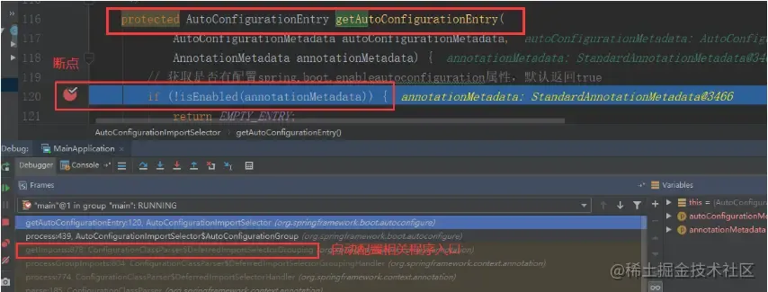
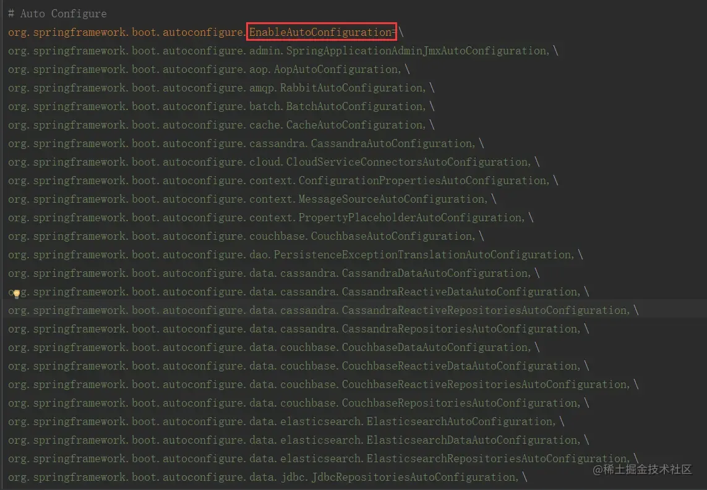
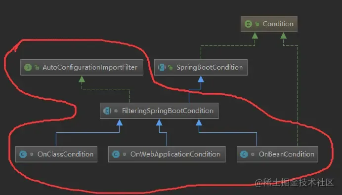

# 4 SpringBoot是如何实现自动配置的？

**注：该源码分析对应 SpringBoot 版本为 2.1.0.RELEASE**

## 1 前言

温故而知新，我们来简单回顾一下上篇的内容，上一篇我们分析了 SpringBoot 的条件注解`@ConditionalOnXxx` 的相关源码，现挑重点总结如下：

1. SpringBoot 的所有`@ConditionalOnXxx`的条件类`OnXxxCondition`都是继承于`SpringBootCondition`基类，而
   `SpringBootCondition`又实现了`Condition`接口。
2. `SpringBootCondition`基类主要用来打印一些条件注解评估报告的日志,这些条件评估信息全部来源于其子类注解条件类
   `OnXxxCondition`，因此其也抽象了一个模板方法`getMatchOutcome`留给子类去实现来评估其条件注解是否符合条件。
3. 前一篇我们也还有一个重要的知识点还没分析，那就是跟过滤自动配置类逻辑有关的`AutoConfigurationImportFilter`
   接口，这篇文章我们来填一下这个坑。

前面我们分析了跟 SpringBoot 的自动配置息息相关内置条件注解`@ConditionalOnXxx`后，现在我们就开始来撸 SpringBoot
自动配置的相关源码了。

## 2 @SpringBootApplication 注解

在开始前，我们先想一下，SpringBoot 为何一个标注有`@SpringBootApplication`注解的启动类通过执行一个简单的`run`方法就能实现
SpringBoot 大量`Starter`的自动配置呢？ 其实 SpringBoot 的自动配置就跟`@SpringBootApplication`这个注解有关，我们先来看下其这个注解的源码：

```java

@Target(ElementType.TYPE)
@Retention(RetentionPolicy.RUNTIME)
@Documented
@Inherited
@SpringBootConfiguration
@EnableAutoConfiguration
@ComponentScan(excludeFilters = {
        @Filter(type = FilterType.CUSTOM, classes = TypeExcludeFilter.class),
        @Filter(type = FilterType.CUSTOM, classes = AutoConfigurationExcludeFilter.class)
})
public @interface SpringBootApplication {
    // ...省略非关键代码
}
```

`@SpringBootApplication`标注了很多注解，我们可以看到其中跟 SpringBoot 自动配置有关的注解就有一个即
`@EnableAutoConfiguration`，因此，可以肯定的是 SpringBoot 的自动配置肯定跟`@EnableAutoConfiguration`息息相关(其中
`@ComponentScan`注解的`excludeFilters`属性也有一个类`AutoConfigurationExcludeFilter`
,这个类跟自动配置也有点关系，但不是我们关注的重点)。 现在我们来打开`@EnableAutoConfiguration`注解的源码：

```java

@Target(ElementType.TYPE)
@Retention(RetentionPolicy.RUNTIME)
@Documented
@Inherited
@AutoConfigurationPackage
@Import(AutoConfigurationImportSelector.class)
public @interface EnableAutoConfiguration {
    String ENABLED_OVERRIDE_PROPERTY = "spring.boot.enableautoconfiguration";

    Class<?>[] exclude() default {};

    String[] excludeName() default {};
}
```

看到`@EnableAutoConfiguration`注解又标有`@AutoConfigurationPackage`和`@Import(AutoConfigurationImportSelector.class)`
两个注解，顾名思义，`@AutoConfigurationPackage`注解肯定跟自动配置的包有关，而`AutoConfigurationImportSelector`则是跟
SpringBoot 的自动配置选择导入有关（Spring 中的`ImportSelector`是用来导入配置类的，通常是基于某些条件注解
`@ConditionalOnXxxx`来决定是否导入某个配置类）。

因此，可以看出`AutoConfigurationImportSelector`类是我们本篇的重点，因为 SpringBoot 的自动配置肯定有一个配置类，而这个配置类的导入则需要靠
`AutoConfigurationImportSelector`这个哥们来实现。

接下来我们重点来看`AutoConfigurationImportSelector`这个类，完了我们再简单分析下`@AutoConfigurationPackage`这个注解的逻辑。

## 3 如何去找 SpringBoot 自动配置实现逻辑的入口方法？

可以肯定的是 SpringBoot 的自动配置的逻辑肯定与 AutoConfigurationImportSelector 这个类有关，那么我们该如何去找到
SpringBoot 自动配置实现逻辑的入口方法呢？

在找 SpringBoot 自动配置实现逻辑的入口方法前，我们先来看下`AutoConfigurationImportSelector`的相关类图，好有个整体的理解。看下图：


可以看到`AutoConfigurationImportSelector`重点是实现了`DeferredImportSelector`接口和各种`Aware`接口，然后
`DeferredImportSelector`接口又继承了`ImportSelector`接口。

自然而然的，我们会去关注`AutoConfigurationImportSelector`复写`DeferredImportSelector`接口的实现方法`selectImports`方法，因为
`selectImports`方法跟导入自动配置类有关，而这个方法往往是程序执行的入口方法。经过调试发现`selectImports`方法很具有迷惑性，
`selectImports`方法跟自动配置相关的逻辑有点关系，但实质关系不大。

此时剧情的发展好像不太符合常理，此时我们又该如何来找到自动配置逻辑有关的入口方法呢？

最简单的方法就是在`AutoConfigurationImportSelector`类的每个方法都打上断点，然后调试看先执行到哪个方法。但是我们可以不这么做，我们回想下，自定义一个
`Starter`的时候我们是不是要在`spring.factories`配置文件中配置

```java
EnableAutoConfiguration=XxxAutoConfiguration
```

因此可以推断，SpringBoot 的自动配置原理肯定跟从`spring.factories`配置文件中加载自动配置类有关，于是结合
`AutoConfigurationImportSelector`的方法注释，我们找到了`getAutoConfigurationEntry`
方法。于是我们在这个方法里面打上一个断点，此时通过调用栈帧来看下更上层的入口方法在哪里，然后我们再从跟自动配置相关的更上层的入口方法开始分析。



通过图 1 我们可以看到，跟自动配置逻辑相关的入口方法在`DeferredImportSelectorGrouping`类的`getImports`方法处，因此我们就从
`DeferredImportSelectorGrouping`类的`getImports`方法来开始分析 SpringBoot 的自动配置源码好了。

## 4 分析 SpringBoot 自动配置原理

既然找到`ConfigurationClassParser.getImports()方法`是自动配置相关的入口方法，那么下面我们就来真正分析 SpringBoot
自动配置的源码了。

先看一下`getImports`方法代码：

```java
// ConfigurationClassParser.java
public Iterable<Group.Entry> getImports() {
    // 遍历DeferredImportSelectorHolder对象集合deferredImports，deferredImports集合装了各种ImportSelector，当然这里装的是AutoConfigurationImportSelector
    for (DeferredImportSelectorHolder deferredImport : this.deferredImports) {
        // 【1】，利用AutoConfigurationGroup的process方法来处理自动配置的相关逻辑，决定导入哪些配置类（这个是我们分析的重点，自动配置的逻辑全在这了）
        this.group.process(deferredImport.getConfigurationClass().getMetadata(),
                deferredImport.getImportSelector());
    }
    // 【2】，经过上面的处理后，然后再进行选择导入哪些配置类
    return this.group.selectImports();
}
```

标`【1】`处的的代码是我们分析的**重中之重**，自动配置的相关的绝大部分逻辑全在这里了，将在 4.1 分析自动配置的主要逻辑深入分析。那么
`this.group.process(deferredImport.getConfigurationClass().getMetadata(), deferredImport.getImportSelector())`；主要做的事情就是在
`this.group`即`AutoConfigurationGroup`对象的`process`方法中，传入的`AutoConfigurationImportSelector`
对象来选择一些符合条件的自动配置类，过滤掉一些不符合条件的自动配置类，就是这么个事情，无他。

注：

1. `AutoConfigurationGroup`：是`AutoConfigurationImportSelector`的内部类，主要用来处理自动配置相关的逻辑，拥有`process`和
   `selectImports`方法，然后拥有`entries`和`autoConfigurationEntries`集合属性，这两个集合分别存储被处理后的符合条件的自动配置类，我们知道这些就足够了；
2. `AutoConfigurationImportSelector`：承担自动配置的绝大部分逻辑，负责选择一些符合条件的自动配置类；
3. `metadata`:标注在 SpringBoot 启动类上的`@SpringBootApplication`注解元数据

标`【2】`的`this.group.selectImports`的方法主要是针对前面的`process`方法处理后的自动配置类再进一步有选择的选择导入，将在
4.2 有选择的导入自动配置类这小节深入分析。

### 4.1 分析自动配置的主要逻辑

这里继续深究前面 4 分析 SpringBoot 自动配置原理这节标`【1】`处的 `this.group.process`方法是如何处理自动配置相关逻辑的。

```java
// AutoConfigurationImportSelector$AutoConfigurationGroup.java

// 这里用来处理自动配置类，比如过滤掉不符合匹配条件的自动配置类
public void process(AnnotationMetadata annotationMetadata,
                    DeferredImportSelector deferredImportSelector) {
    Assert.state(
            deferredImportSelector instanceof AutoConfigurationImportSelector,
            () -> String.format("Only %s implementations are supported, got %s",
                    AutoConfigurationImportSelector.class.getSimpleName(),
                    deferredImportSelector.getClass().getName()));
    // 【1】,调用getAutoConfigurationEntry方法得到自动配置类放入autoConfigurationEntry对象中
    AutoConfigurationEntry autoConfigurationEntry = ((AutoConfigurationImportSelector) deferredImportSelector)
            .getAutoConfigurationEntry(getAutoConfigurationMetadata(),
                    annotationMetadata);
    // 【2】，又将封装了自动配置类的autoConfigurationEntry对象装进autoConfigurationEntries集合
    this.autoConfigurationEntries.add(autoConfigurationEntry);
    // 【3】，遍历刚获取的自动配置类
    for (String importClassName : autoConfigurationEntry.getConfigurations()) {
        // 这里符合条件的自动配置类作为key，annotationMetadata作为值放进entries集合
        this.entries.putIfAbsent(importClassName, annotationMetadata);
    }
}
```

上面代码中我们再来看标`【1】`的方法`getAutoConfigurationEntry`，这个方法主要是用来获取自动配置类有关，承担了自动配置的主要逻辑。直接上代码：

```java
// AutoConfigurationImportSelector.java

// 获取符合条件的自动配置类，避免加载不必要的自动配置类从而造成内存浪费
protected AutoConfigurationEntry getAutoConfigurationEntry(
        AutoConfigurationMetadata autoConfigurationMetadata,
        AnnotationMetadata annotationMetadata) {
    // 获取是否有配置spring.boot.enableautoconfiguration属性，默认返回true
    if (!isEnabled(annotationMetadata)) {
        return EMPTY_ENTRY;
    }
    // 获得@Congiguration标注的Configuration类即被审视introspectedClass的注解数据，
    // 比如：@SpringBootApplication(exclude = FreeMarkerAutoConfiguration.class)
    // 将会获取到exclude = FreeMarkerAutoConfiguration.class和excludeName=""的注解数据
    AnnotationAttributes attributes = getAttributes(annotationMetadata);
    // 【1】得到spring.factories文件配置的所有自动配置类
    List<String> configurations = getCandidateConfigurations(annotationMetadata,
            attributes);
    // 利用LinkedHashSet移除重复的配置类
    configurations = removeDuplicates(configurations);
    // 得到要排除的自动配置类，比如注解属性exclude的配置类
    // 比如：@SpringBootApplication(exclude = FreeMarkerAutoConfiguration.class)
    // 将会获取到exclude = FreeMarkerAutoConfiguration.class的注解数据
    Set<String> exclusions = getExclusions(annotationMetadata, attributes);
    // 检查要被排除的配置类，因为有些不是自动配置类，故要抛出异常
    checkExcludedClasses(configurations, exclusions);
    // 【2】将要排除的配置类移除
    configurations.removeAll(exclusions);
    // 【3】因为从spring.factories文件获取的自动配置类太多，如果有些不必要的自动配置类都加载进内存，会造成内存浪费，因此这里需要进行过滤
    // 注意这里会调用AutoConfigurationImportFilter的match方法来判断是否符合@ConditionalOnBean,@ConditionalOnClass或@ConditionalOnWebApplication，后面会重点分析一下
    configurations = filter(configurations, autoConfigurationMetadata);
    // 【4】获取了符合条件的自动配置类后，此时触发AutoConfigurationImportEvent事件，
    // 目的是告诉ConditionEvaluationReport条件评估报告器对象来记录符合条件的自动配置类
    // 该事件什么时候会被触发？--> 在刷新容器时调用invokeBeanFactoryPostProcessors后置处理器时触发
    fireAutoConfigurationImportEvents(configurations, exclusions);
    // 【5】将符合条件和要排除的自动配置类封装进AutoConfigurationEntry对象，并返回
    return new AutoConfigurationEntry(configurations, exclusions);
}
```

`AutoConfigurationEntry`方法主要做的事情就是获取符合条件的自动配置类，避免加载不必要的自动配置类从而造成内存浪费。我们下面总结下
`AutoConfigurationEntry`方法主要做的事情：

【1】从`spring.factories`配置文件中加载`EnableAutoConfiguration`自动配置类（注意此时是从**缓存**中拿到的哈）,获取的自动配置类如图
3 所示。这里我们知道该方法做了什么事情就行了，后面还会有一篇文章详述`spring.factories`的原理；

【2】若`@EnableAutoConfiguration`等注解标有要`exclude`的自动配置类，那么再将这个自动配置类排除掉；

【3】排除掉要`exclude`的自动配置类后，然后再调用`filter`方法进行进一步的过滤，再次排除一些不符合条件的自动配置类；*
*这个在稍后会详细分析。**

【4】经过重重过滤后，此时再触发`AutoConfigurationImportEvent`事件，告诉`ConditionEvaluationReport`
条件评估报告器对象来记录符合条件的自动配置类；（这个在 6 AutoConfigurationImportListener 这小节详细分析。）

【5】 最后再将符合条件的自动配置类返回。



总结了`AutoConfigurationEntry`方法主要的逻辑后，我们再来细看一下`AutoConfigurationImportSelector`的`filter`方法：

```java
// AutoConfigurationImportSelector.java

private List<String> filter(List<String> configurations,
                            AutoConfigurationMetadata autoConfigurationMetadata) {
    long startTime = System.nanoTime();
    // 将从spring.factories中获取的自动配置类转出字符串数组
    String[] candidates = StringUtils.toStringArray(configurations);
    // 定义skip数组，是否需要跳过。注意skip数组与candidates数组顺序一一对应
    boolean[] skip = new boolean[candidates.length];
    boolean skipped = false;
    // getAutoConfigurationImportFilters方法：拿到OnBeanCondition，OnClassCondition和OnWebApplicationCondition
    // 然后遍历这三个条件类去过滤从spring.factories加载的大量配置类
    for (AutoConfigurationImportFilter filter : getAutoConfigurationImportFilters()) {
        // 调用各种aware方法，将beanClassLoader,beanFactory等注入到filter对象中，
        // 这里的filter对象即OnBeanCondition，OnClassCondition或OnWebApplicationCondition
        invokeAwareMethods(filter);
        // 判断各种filter来判断每个candidate（这里实质要通过candidate(自动配置类)拿到其标注的
        // @ConditionalOnClass,@ConditionalOnBean和@ConditionalOnWebApplication里面的注解值）是否匹配，
        // 注意candidates数组与match数组一一对应
        /**********************【主线，重点关注】********************************/
        boolean[] match = filter.match(candidates, autoConfigurationMetadata);
        // 遍历match数组，注意match顺序跟candidates的自动配置类一一对应
        for (int i = 0; i < match.length; i++) {
            // 若有不匹配的话
            if (!match[i]) {
                // 不匹配的将记录在skip数组，标志skip[i]为true，也与candidates数组一一对应
                skip[i] = true;
                // 因为不匹配，将相应的自动配置类置空
                candidates[i] = null;
                // 标注skipped为true
                skipped = true;
            }
        }
    }
    // 这里表示若所有自动配置类经过OnBeanCondition，OnClassCondition和OnWebApplicationCondition过滤后，全部都匹配的话，则全部原样返回
    if (!skipped) {
        return configurations;
    }
    // 建立result集合来装匹配的自动配置类
    List<String> result = new ArrayList<>(candidates.length);
    for (int i = 0; i < candidates.length; i++) {
        // 若skip[i]为false，则说明是符合条件的自动配置类，此时添加到result集合中
        if (!skip[i]) {
            result.add(candidates[i]);
        }
    }
    // 打印日志
    if (logger.isTraceEnabled()) {
        int numberFiltered = configurations.size() - result.size();
        logger.trace("Filtered " + numberFiltered + " auto configuration class in "
                + TimeUnit.NANOSECONDS.toMillis(System.nanoTime() - startTime)
                + " ms");
    }
    // 最后返回符合条件的自动配置类
    return new ArrayList<>(result);
}
```

`AutoConfigurationImportSelector`的`filter`方法主要做的事情就是调用`AutoConfigurationImportFilter`接口的`match`
方法来判断每一个自动配置类上的条件注解（若有的话）`@ConditionalOnClass`,`@ConditionalOnBean`或
`@ConditionalOnWebApplication`是否满足条件，若满足，则返回 true，说明匹配，若不满足，则返回 false 说明不匹配。

我们现在知道`AutoConfigurationImportSelector`的`filter`方法主要做了什么事情就行了，现在先不用研究的过深，至于
`AutoConfigurationImportFilter`接口的`match`方法将在 5 AutoConfigurationImportFilter 这小节再详细分析，填补一下我们前一篇条件注解源码分析中留下的坑。

注意：我们坚持主线优先的原则，其他枝节代码这里不深究，以免丢了主线哈。

### 4.2 有选择的导入自动配置类

这里继续深究前面 4 分析 SpringBoot 自动配置原理这节标`【2】`处的 `this.group.selectImports`方法是如何进一步有选择的导入自动配置类的。直接看代码：

```java
// AutoConfigurationImportSelector$AutoConfigurationGroup.java

public Iterable<Entry> selectImports() {
    if (this.autoConfigurationEntries.isEmpty()) {
        return Collections.emptyList();
    }
    // 这里得到所有要排除的自动配置类的set集合
    Set<String> allExclusions = this.autoConfigurationEntries.stream()
            .map(AutoConfigurationEntry::getExclusions)
            .flatMap(Collection::stream).collect(Collectors.toSet());
    // 这里得到经过滤后所有符合条件的自动配置类的set集合
    Set<String> processedConfigurations = this.autoConfigurationEntries.stream()
            .map(AutoConfigurationEntry::getConfigurations)
            .flatMap(Collection::stream)
            .collect(Collectors.toCollection(LinkedHashSet::new));
    // 移除掉要排除的自动配置类
    processedConfigurations.removeAll(allExclusions);
    // 对标注有@Order注解的自动配置类进行排序，
    return sortAutoConfigurations(processedConfigurations,
            getAutoConfigurationMetadata())
            .stream()
            .map((importClassName) -> new Entry(
                    this.entries.get(importClassName), importClassName))
            .collect(Collectors.toList());
}

复制代码
```

可以看到，`selectImports`方法主要是针对经过排除掉`exclude`的和被`AutoConfigurationImportFilter`接口过滤后的满足条件的自动配置类再进一步排除
`exclude`的自动配置类，然后再排序。逻辑很简单，不再详述。

不过有个疑问，前面已经`exclude`过一次了，为何这里还要再`exclude`一次？

## 5 AutoConfigurationImportFilter

这里继续深究前面 4.1 节的 `AutoConfigurationImportSelector.filter`方法的过滤自动配置类的
`boolean[] match = filter.match(candidates, autoConfigurationMetadata);`这句代码。

因此我们继续分析`AutoConfigurationImportFilter`接口，分析其`match`方法，同时也是对前一篇`@ConditionalOnXxx`
的源码分析文章中留下的坑进行填补。

`AutoConfigurationImportFilter`接口只有一个`match`方法用来过滤不符合条件的自动配置类。

```java

@FunctionalInterface
public interface AutoConfigurationImportFilter {
    boolean[] match(String[] autoConfigurationClasses,
                    AutoConfigurationMetadata autoConfigurationMetadata);
}
```

同样，在分析`AutoConfigurationImportFilter`接口的`match`方法前，我们先来看下其类关系图：



可以看到,`AutoConfigurationImportFilter`接口有一个具体的实现类`FilteringSpringBootCondition`，
`FilteringSpringBootCondition`又有三个具体的子类：`OnClassCondition`,`OnBeanCondtition`和`OnWebApplicationCondition`。

**那么这几个类之间的关系是怎样的呢？**

`FilteringSpringBootCondition`实现了`AutoConfigurationImportFilter`接口的`match`方法，然后在
`FilteringSpringBootCondition`的`match`方法调用`getOutcomes`这个抽象模板方法返回自动配置类的匹配与否的信息。同时，最重要的是
`FilteringSpringBootCondition`的三个子类`OnClassCondition`,`OnBeanCondtition`和`OnWebApplicationCondition`
将会复写这个模板方法实现自己的匹配判断逻辑。

好了，`AutoConfigurationImportFilter`接口的整体关系已经清楚了，现在我们再进入其具体实现类`FilteringSpringBootCondition`的
`match`方法看看是其如何根据条件过滤自动配置类的。

```java
// FilteringSpringBootCondition.java

@Override
public boolean[] match(String[] autoConfigurationClasses,
                       AutoConfigurationMetadata autoConfigurationMetadata) {
    // 创建评估报告
    ConditionEvaluationReport report = ConditionEvaluationReport
            .find(this.beanFactory);
    // 注意getOutcomes是模板方法，将spring.factories文件种加载的所有自动配置类传入
    // 子类（这里指的是OnClassCondition,OnBeanCondition和OnWebApplicationCondition类）去过滤
    // 注意outcomes数组存储的是不匹配的结果，跟autoConfigurationClasses数组一一对应
    /*****************************【主线，重点关注】*********************************************/
    ConditionOutcome[] outcomes = getOutcomes(autoConfigurationClasses,
            autoConfigurationMetadata);
    boolean[] match = new boolean[outcomes.length];
    // 遍历outcomes,这里outcomes为null则表示匹配，不为null则表示不匹配
    for (int i = 0; i < outcomes.length; i++) {
        ConditionOutcome outcome = outcomes[i];
        match[i] = (outcome == null || outcome.isMatch());
        if (!match[i] && outcomes[i] != null) {
            // 这里若有某个类不匹配的话，此时调用父类SpringBootCondition的logOutcome方法打印日志
            logOutcome(autoConfigurationClasses[i], outcomes[i]);
            // 并将不匹配情况记录到report
            if (report != null) {
                report.recordConditionEvaluation(autoConfigurationClasses[i], this,
                        outcomes[i]);
            }
        }
    }
    return match;
}
```

`FilteringSpringBootCondition`的`match`方法主要做的事情还是调用抽象模板方法`getOutcomes`来根据条件来过滤自动配置类，而复写
`getOutcomes`模板方法的有三个子类，这里不再一一分析，**只挑选**`**OnClassCondition**`**复写的**`**getOutcomes**`**方法进行分析。
**

### 5.1 OnClassCondition

先直接上`OnClassCondition`复写的`getOutcomes`方法的代码：

```java
// OnClassCondition.java

protected final ConditionOutcome[] getOutcomes(String[] autoConfigurationClasses,
                                               AutoConfigurationMetadata autoConfigurationMetadata) {
    // Split the work and perform half in a background thread. Using a single
    // additional thread seems to offer the best performance. More threads make
    // things worse
    // 这里经过测试用两个线程去跑的话性能是最好的，大于两个线程性能反而变差
    int split = autoConfigurationClasses.length / 2;
    // 【1】开启一个新线程去扫描判断已经加载的一半自动配置类
    OutcomesResolver firstHalfResolver = createOutcomesResolver(
            autoConfigurationClasses, 0, split, autoConfigurationMetadata);
    // 【2】这里用主线程去扫描判断已经加载的一半自动配置类
    OutcomesResolver secondHalfResolver = new StandardOutcomesResolver(
            autoConfigurationClasses, split, autoConfigurationClasses.length,
            autoConfigurationMetadata, getBeanClassLoader());
    // 【3】先让主线程去执行解析一半自动配置类是否匹配条件
    ConditionOutcome[] secondHalf = secondHalfResolver.resolveOutcomes();
    // 【4】这里用新开启的线程取解析另一半自动配置类是否匹配
    // 注意为了防止主线程执行过快结束，resolveOutcomes方法里面调用了thread.join()来
    // 让主线程等待新线程执行结束，因为后面要合并两个线程的解析结果
    ConditionOutcome[] firstHalf = firstHalfResolver.resolveOutcomes();
    // 新建一个ConditionOutcome数组来存储自动配置类的筛选结果
    ConditionOutcome[] outcomes = new ConditionOutcome[autoConfigurationClasses.length];
    // 将前面两个线程的筛选结果分别拷贝进outcomes数组
    System.arraycopy(firstHalf, 0, outcomes, 0, firstHalf.length);
    System.arraycopy(secondHalf, 0, outcomes, split, secondHalf.length);
    // 返回自动配置类的筛选结果
    return outcomes;
}
```

可以看到，`OnClassCondition`的`getOutcomes`方法主要解析自动配置类是否符合匹配条件，当然这个匹配条件指自动配置类上的注解
`@ConditionalOnClass`指定的类存不存在于`classpath`中，存在则返回匹配，不存在则返回不匹配。

由于解析自动配置类是否匹配比较耗时，因此从上面代码中我们可以看到分别创建了`firstHalfResolver`和`secondHalfResolver`
两个解析对象，这两个解析对象个分别对应一个线程去解析加载的自动配置类是否符合条件，最终将两个线程的解析自动配置类的匹配结果合并后返回。

那么自动配置类是否符合条件的解析判断过程又是怎样的呢？现在我们分别来看一下上面代码注释标注的`【1】`，`【2】`，`【3】`和`【4】`处。

#### 5.1.1 createOutcomesResolver

这里对应前面 5.1 节的代码注释标注`【1】`处的`OutcomesResolver firstHalfResolver = createOutcomesResolver(...);`的方法：

```java
// OnClassCondition.java

private OutcomesResolver createOutcomesResolver(String[] autoConfigurationClasses,
                                                int start, int end, AutoConfigurationMetadata autoConfigurationMetadata) {
    // 新建一个StandardOutcomesResolver对象
    OutcomesResolver outcomesResolver = new StandardOutcomesResolver(
            autoConfigurationClasses, start, end, autoConfigurationMetadata,
            getBeanClassLoader());
    try {
        // new一个ThreadedOutcomesResolver对象，并将StandardOutcomesResolver类型的outcomesResolver对象作为构造器参数传入
        return new ThreadedOutcomesResolver(outcomesResolver);
    }
    // 若上面开启的线程抛出AccessControlException异常，则返回StandardOutcomesResolver对象
    catch (AccessControlException ex) {
        return outcomesResolver;
    }
}

复制代码
```

可以看到`createOutcomesResolver`方法创建了一个封装了`StandardOutcomesResolver`类的`ThreadedOutcomesResolver`解析对象。
我们再来看下`ThreadedOutcomesResolver`这个线程解析类封装`StandardOutcomesResolver`这个对象的目的是什么？我们继续跟进代码：

```java
// OnClassCondtion.java

private ThreadedOutcomesResolver(OutcomesResolver outcomesResolver) {
    // 这里开启一个新的线程，这个线程其实还是利用StandardOutcomesResolver的resolveOutcomes方法
    // 对自动配置类进行解析判断是否匹配
    this.thread = new Thread(
            () -> this.outcomes = outcomesResolver.resolveOutcomes());
    // 开启线程
    this.thread.start();
}

复制代码
```

可以看到在构造`ThreadedOutcomesResolver`对象时候，原来是开启了一个线程，然后这个线程其实还是调用了刚传进来的
`StandardOutcomesResolver`对象的`resolveOutcomes`方法去解析自动配置类。具体如何解析呢？稍后我们在分析`【3】`处代码
`secondHalfResolver.resolveOutcomes();`的时候再深究。

#### 5.1.2 new StandardOutcomesResolver

这里对应前面 5.1 节的`【2】`处的代码`OutcomesResolver secondHalfResolver = new StandardOutcomesResolver(...);`
，逻辑很简单，就是创建了一个`StandardOutcomesResolver`对象，用于后面解析自动配置类是否匹配，同时，新建的一个线程也是利用它来完成自动配置类的解析的。

#### 5.1.3 StandardOutcomesResolver.resolveOutcomes 方法

这里对应前面 5.1 节标注的`【3】`的代码`ConditionOutcome[] secondHalf = secondHalfResolver.resolveOutcomes();`。

这里`StandardOutcomesResolver.resolveOutcomes`方法承担了解析自动配置类匹配与否的全部逻辑，是我们要重点分析的方法，
`resolveOutcomes`方法最终把解析的自动配置类的结果赋给`secondHalf`数组。那么它是如何解析自动配置类是否匹配条件的呢？

```java
// OnClassCondition$StandardOutcomesResolver.java

public ConditionOutcome[] resolveOutcomes() {
    // 再调用getOutcomes方法来解析
    return getOutcomes(this.autoConfigurationClasses, this.start, this.end,
            this.autoConfigurationMetadata);
}

private ConditionOutcome[] getOutcomes(String[] autoConfigurationClasses,
                                       int start, int end, AutoConfigurationMetadata autoConfigurationMetadata) { // 只要autoConfigurationMetadata没有存储相关自动配置类，那么outcome默认为null，则说明匹配
    ConditionOutcome[] outcomes = new ConditionOutcome[end - start];
    // 遍历每一个自动配置类
    for (int i = start; i < end; i++) {
        String autoConfigurationClass = autoConfigurationClasses[i];
        // TODO 对于autoConfigurationMetadata有个疑问：为何有些自动配置类的条件注解能被加载到autoConfigurationMetadata，而有些又不能，比如自己定义的一个自动配置类HelloWorldEnableAutoConfiguration就没有被存到autoConfigurationMetadata中
        if (autoConfigurationClass != null) {
            // 这里取出注解在AutoConfiguration自动配置类类的@ConditionalOnClass注解的指定类的全限定名，
            // 举个栗子，看下面的KafkaStreamsAnnotationDrivenConfiguration这个自动配置类
            /**
             * @ConditionalOnClass(StreamsBuilder.class)
             * class KafkaStreamsAnnotationDrivenConfiguration {
             * // 省略无关代码
             * }
             */
            // 那么取出的就是StreamsBuilder类的全限定名即candidates = org.apache.kafka.streams.StreamsBuilder
            String candidates = autoConfigurationMetadata
                    .get(autoConfigurationClass, "ConditionalOnClass"); // 因为这里是处理某个类是否存在于classpath中，所以传入的key是ConditionalOnClass
            // 若自动配置类标有ConditionalOnClass注解且有值，此时调用getOutcome判断是否存在于类路径中
            if (candidates != null) {
                // 拿到自动配置类注解@ConditionalOnClass的值后，再调用getOutcome方法去判断匹配结果,若该类存在于类路径，则getOutcome返回null，否则非null
                /*******************【主线，重点关注】******************/
                outcomes[i - start] = getOutcome(candidates);
            }
        }
    }
    return outcomes;
}

复制代码
```

可以看到`StandardOutcomesResolver.resolveOutcomes`的方法中再次调用`getOutcomes`方法，主要是从`autoConfigurationMetadata`
对象中获取到自动配置类上的注解`@ConditionalOnClass`指定的类的全限定名，然后作为参数传入`getOutcome`
方法用于去类路径加载该类，若能加载到则说明注解`@ConditionalOnClass`满足条件，此时说明自动配置类匹配成功。

但是别忘了，这里只是过了`@ConditionalOnClass`注解这一关，若自动配置类还有其他注解比如`@ConditionalOnBean`，若该
`@ConditionalOnBean`注解不满足条件的话，同样最终结果是不匹配的。这里扯的有点远，我们回到`OnClassCondtion`的判断逻辑，继续进入
`getOutcome`方法看它是如何去判断`@ConditionalOnClass`注解满不满足条件的。

```java
// OnClassCondition$StandardOutcomesResolver.java

// 返回的outcome记录的是不匹配的情况，不为null，则说明不匹配；为null，则说明匹配
private ConditionOutcome getOutcome(String candidates) {
    // candidates的形式为“org.springframework.boot.autoconfigure.aop.AopAutoConfiguration.ConditionalOnClass=org.aspectj.lang.annotation.Aspect,org.aspectj.lang.reflect.Advice,org.aspectj.weaver.AnnotatedElement”
    try {// 自动配置类上@ConditionalOnClass的值只有一个的话，直接调用getOutcome方法判断是否匹配
        if (!candidates.contains(",")) {
            // 看到因为传入的参数是 ClassNameFilter.MISSING，因此可以猜测这里应该是得到不匹配的结果
            /******************【主线，重点关注】********************/
            return getOutcome(candidates, ClassNameFilter.MISSING,
                    this.beanClassLoader);
        }
        // 自动配置类上@ConditionalOnClass的值有多个的话，则遍历每个值（其值以逗号，分隔）
        for (String candidate : StringUtils
                .commaDelimitedListToStringArray(candidates)) {
            ConditionOutcome outcome = getOutcome(candidate,
                    ClassNameFilter.MISSING, this.beanClassLoader);
            // 可以看到，这里只要有一个不匹配的话，则返回不匹配结果
            if (outcome != null) {
                return outcome;
            }
        }
    } catch (Exception ex) {
        // We'll get another chance later
    }
    return null;
}

复制代码
```

可以看到，`getOutcome`方法再次调用重载方法`getOutcome`进一步去判断注解`@ConditionalOnClass`指定的类存不存在类路径中，跟着主线继续跟进去：

```java
// OnClassCondition$StandardOutcomesResolver.java

private ConditionOutcome getOutcome(String className,
                                    ClassNameFilter classNameFilter, ClassLoader classLoader) {
    // 调用classNameFilter的matches方法来判断`@ConditionalOnClass`指定的类存不存在类路径中
    /******************【主线，重点关注】********************/
    if (classNameFilter.matches(className, classLoader)) { // 这里调用classNameFilter去判断className是否存在于类路径中，其中ClassNameFilter又分为PRESENT和MISSING两种;目前只看到ClassNameFilter为MISSING的调用情况，所以默认为true的话记录不匹配信息；若传入ClassNameFilter为PRESENT的话，估计还要再写一个else分支
        return ConditionOutcome.noMatch(ConditionMessage
                .forCondition(ConditionalOnClass.class)
                .didNotFind("required class").items(Style.QUOTE, className));
    }
    return null;
}

复制代码
```

我们一层一层的剥，最终剥到了最底层了，这个真的需要足够耐心，没办法，源码只能一点一点的啃，嘿嘿。可以看到最终是调用
`ClassNameFilter`的`matches`方法来判断`@ConditionalOnClass`指定的类存不存在类路径中,若不存在的话，则返回不匹配。

我们继续跟进`ClassNameFilter`的源码：

```java
// FilteringSpringBootCondition.java

protected enum ClassNameFilter {
    // 这里表示指定的类存在于类路径中，则返回true
    PRESENT {
        @Override
        public boolean matches(String className, ClassLoader classLoader) {
            return isPresent(className, classLoader);
        }

    },
    // 这里表示指定的类不存在于类路径中，则返回true
    MISSING {
        @Override
        public boolean matches(String className, ClassLoader classLoader) {
            return !isPresent(className, classLoader); // 若classpath不存在className这个类，则返回true
        }

    };

    // 这又是一个抽象方法，分别被PRESENT和MISSING枚举类实现
    public abstract boolean matches(String className, ClassLoader classLoader);

    // 检查指定的类是否存在于类路径中
    public static boolean isPresent(String className, ClassLoader classLoader) {
        if (classLoader == null) {
            classLoader = ClassUtils.getDefaultClassLoader();
        }
        // 利用类加载器去加载相应类，若没有抛出异常则说明类路径中存在该类，此时返回true
        try {
            forName(className, classLoader);
            return true;
        }// 若不存在于类路径中，此时抛出的异常将catch住，返回false。
        catch (Throwable ex) {
            return false;
        }
    }

    // 利用类加载器去加载指定的类
    private static Class<?> forName(String className, ClassLoader classLoader)
            throws ClassNotFoundException {
        if (classLoader != null) {
            return classLoader.loadClass(className);
        }
        return Class.forName(className);
    }

}
复制代码
```

可以看到`ClassNameFilter`原来是`FilteringSpringBootCondition`的一个内部枚举类，其实现了判断指定类是否存在于`classpath`
中的逻辑，这个类很简单，这里不再详述。

#### 5.1.4 ThreadedOutcomesResolver.resolveOutcomes 方法

这里对应前面 5.1 节的标注的`【4】`的代码`ConditionOutcome[] firstHalf = firstHalfResolver.resolveOutcomes()`。

前面分析 5.1.3 StandardOutcomesResolver.resolveOutcomes 方法已经刨根追底，陷入细节比较深，现在我们需要跳出来继续看前面标注的
`【4】`的代码`ConditionOutcome[] firstHalf = firstHalfResolver.resolveOutcomes()`的方法哈。

这里是用新开启的线程去调用`StandardOutcomesResolver.resolveOutcomes`
方法解析另一半自动配置类是否匹配，因为是新线程，这里很可能会出现这么一种情况：主线程解析完属于自己解析的一半自动配置类后，那么久继续往下跑了，此时不会等待新开启的子线程的。

因此，为了让主线程解析完后，我们需要让主线程继续等待正在解析的子线程，直到子线程结束。那么我们继续跟进代码区看下
`ThreadedOutcomesResolver.resolveOutcomes`方法是怎样实现让主线程等待子线程的：

```java
// OnClassCondition$ThreadedOutcomesResolver.java

public ConditionOutcome[] resolveOutcomes() {
    try {
        // 调用子线程的Join方法，让主线程等待
        this.thread.join();
    } catch (InterruptedException ex) {
        Thread.currentThread().interrupt();
    }
    // 若子线程结束后，此时返回子线程的解析结果
    return this.outcomes;
}

复制代码
```

可以看到用了`Thread.join()`方法来让主线程等待正在解析自动配置类的子线程，这里应该也可以用`CountDownLatch`
来让主线程等待子线程结束。最终将子线程解析后的结果赋给`firstHalf`数组。

### 5.2 OnBeanCondition 和 OnWebApplicationCondition

前面 5.1 OnClassCondition 节深入分析了`OnClassCondition`是如何过滤自动配置类的，那么自动配置类除了要经过
`OnClassCondition`的过滤，还要经过`OnBeanCondition`和`OnWebApplicationCondition`这两个条件类的过滤，这里不再详述，有兴趣的小伙伴可自行分析。

## 6 AutoConfigurationImportListener

这里继续深究前面 4.1 节的 `AutoConfigurationImportSelector.getAutoConfigurationEntry`方法的触发自动配置类过滤完毕的事件
`fireAutoConfigurationImportEvents(configurations, exclusions);`这句代码。

我们直接点进`fireAutoConfigurationImportEvents`方法看看其是如何触发事件的：

```java
// AutoConfigurationImportSelector.java

private void fireAutoConfigurationImportEvents(List<String> configurations,
                                               Set<String> exclusions) {
    // 从spring.factories总获取到AutoConfigurationImportListener即ConditionEvaluationReportAutoConfigurationImportListener
    List<AutoConfigurationImportListener> listeners = getAutoConfigurationImportListeners();
    if (!listeners.isEmpty()) {
        // 新建一个AutoConfigurationImportEvent事件
        AutoConfigurationImportEvent event = new AutoConfigurationImportEvent(this,
                configurations, exclusions);
        // 遍历刚获取到的AutoConfigurationImportListener
        for (AutoConfigurationImportListener listener : listeners) {
            // 这里调用各种Aware方法用于触发事件前赋值，比如设置factory,environment等
            invokeAwareMethods(listener);
            // 真正触发AutoConfigurationImportEvent事件即回调listener的onXXXEveent方法。这里用于记录自动配置类的评估信息
            listener.onAutoConfigurationImportEvent(event);
        }
    }
}
```

如上，`fireAutoConfigurationImportEvents`方法做了以下两件事情：

1、调用`getAutoConfigurationImportListeners`方法从`spring.factoris`配置文件获取实现`AutoConfigurationImportListener`
接口的事件监听器；如下图，可以看到获取的是`ConditionEvaluationReportAutoConfigurationImportListener`：


2、遍历获取的各个事件监听器，然后调用监听器各种`Aware`方法给监听器赋值，最后再依次回调事件监听器的
`onAutoConfigurationImportEvent`方法，执行监听事件的逻辑。

此时我们再来看下`ConditionEvaluationReportAutoConfigurationImportListener`监听器监听到事件后，它的
`onAutoConfigurationImportEvent`方法究竟做了哪些事情：

```java
// ConditionEvaluationReportAutoConfigurationImportListener.java

public void onAutoConfigurationImportEvent(AutoConfigurationImportEvent event) {
    if (this.beanFactory != null) {
        // 获取到条件评估报告器对象
        ConditionEvaluationReport report = ConditionEvaluationReport
                .get(this.beanFactory);
        // 将符合条件的自动配置类记录到unconditionalClasses集合中
        report.recordEvaluationCandidates(event.getCandidateConfigurations());
        // 将要exclude的自动配置类记录到exclusions集合中
        report.recordExclusions(event.getExclusions());
    }
}
```

可以看到，`ConditionEvaluationReportAutoConfigurationImportListener`监听器监听到事件后，做的事情很简单，只是分别记录下符合条件和被
`exclude`的自动配置类。

## 7 AutoConfigurationPackages

前面已经详述了 SpringBoot 的自动配置原理了，最后的最后，跟 SpringBoot 自动配置有关的注解`@AutoConfigurationPackage`
还没分析，我们来看下这个注解的源码：

```java

@Target(ElementType.TYPE)
@Retention(RetentionPolicy.RUNTIME)
@Documented
@Inherited
@Import(AutoConfigurationPackages.Registrar.class)
public @interface AutoConfigurationPackage {
}
```

可以看到`@AutoConfigurationPackage`注解是跟 SpringBoot 自动配置所在的包相关的，即将 添加该注解的类所在的 package 作为
自动配置 package 进行管理。

接下来我们再看看`AutoConfigurationPackages.Registrar`类是干嘛的，直接看源码：

```java
//AutoConfigurationPackages.Registrar.java

static class Registrar implements ImportBeanDefinitionRegistrar, DeterminableImports {
    @Override
    public void registerBeanDefinitions(AnnotationMetadata metadata,
                                        BeanDefinitionRegistry registry) {
        register(registry, new PackageImport(metadata).getPackageName());
    }

    @Override
    public Set<Object> determineImports(AnnotationMetadata metadata) {
        return Collections.singleton(new PackageImport(metadata));
    }
}
```

可以看到`Registrar`类是`AutoConfigurationPackages`的静态内部类，实现了`ImportBeanDefinitionRegistrar`和
`DeterminableImports`两个接口。现在我们主要来关注下`Registrar`实现的`registerBeanDefinitions`方法,顾名思义，这个方法是注册
`bean`定义的方法。看到它又调用了`AutoConfigurationPackages`的`register`方法，继续跟进源码：

```java
// AutoConfigurationPackages.java

public static void register(BeanDefinitionRegistry registry, String... packageNames) {
    if (registry.containsBeanDefinition(BEAN)) {
        BeanDefinition beanDefinition = registry.getBeanDefinition(BEAN);
        ConstructorArgumentValues constructorArguments = beanDefinition
                .getConstructorArgumentValues();
        constructorArguments.addIndexedArgumentValue(0,
                addBasePackages(constructorArguments, packageNames));
    } else {
        GenericBeanDefinition beanDefinition = new GenericBeanDefinition();
        beanDefinition.setBeanClass(BasePackages.class);
        beanDefinition.getConstructorArgumentValues().addIndexedArgumentValue(0,
                packageNames);
        beanDefinition.setRole(BeanDefinition.ROLE_INFRASTRUCTURE);
        registry.registerBeanDefinition(BEAN, beanDefinition);
    }
}
```

如上，可以看到`register`方法注册了一个`packageNames`即自动配置类注解`@EnableAutoConfiguration`所在的所在的包名相关的
`bean`。那么注册这个`bean`的目的是为了什么呢？ 结合官网注释知道，注册这个自动配置包名相关的`bean`是为了被其他地方引用，比如
`JPA entity scanner`，具体拿来干什么久不知道了，这里不再深究了。

# 8 小结

好了，SpringBoot 的自动配置的源码分析就到这里了，比较长，有些地方也很深入细节，读完需要一定的耐心。

最后，我们再总结下 SpringBoot 自动配置的原理，主要做了以下事情：

1. 从 `spring.factories` 配置文件中加载自动配置类；
2. 加载的自动配置类中排除掉`@EnableAutoConfiguration`注解的`exclude`属性指定的自动配置类；
3. 然后再用`AutoConfigurationImportFilter`接口去过滤自动配置类是否符合其标注注解（若有标注的话）`@ConditionalOnClass`,
   `@ConditionalOnBean`和`@ConditionalOnWebApplication`的条件，若都符合的话则返回匹配结果；
4. 然后触发`AutoConfigurationImportEvent`事件，告诉`ConditionEvaluationReport`条件评估报告器对象来分别记录符合条件和
   `exclude`的自动配置类。
5. 最后 spring 再将最后筛选后的自动配置类导入 IOC 容器中

**最后留个自己的疑问，还望知道答案的大佬解答，这里表示感谢**：


> 为了避免加载不必要的自动配置类造成内存浪费，`FilteringSpringBootCondition`用于过滤`spring.factories`文件的自动配置类，而
`FilteringSpringBootCondition`为啥只有`OnOnBeanCondition`,`OnClassCondition`和`onWebApplicationCondition`这三个条件类用于过滤，为啥没有
`onPropertyCondtion`，`onResourceCondition`等条件类来过滤自动配置类呢？
>


下节预告： SpringBoot 的启动流程是怎样的？--SpringBoot 源码（五）


