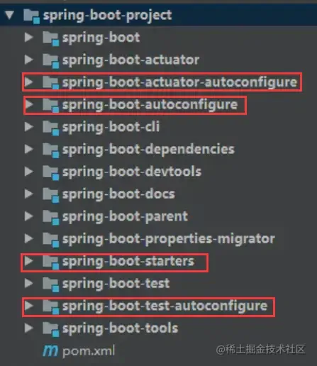
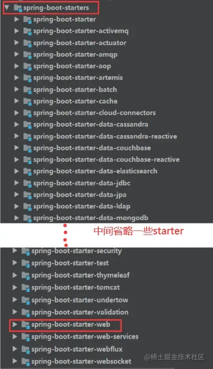
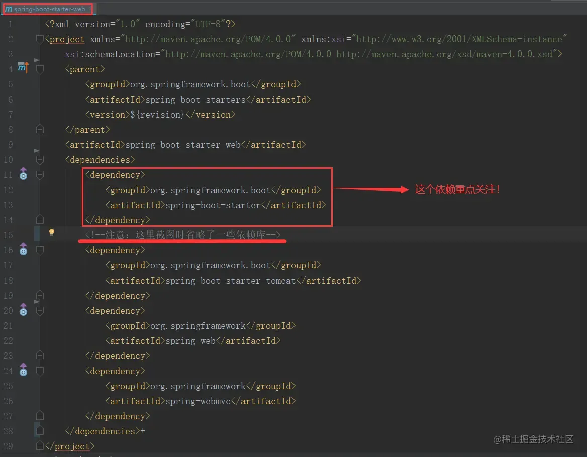
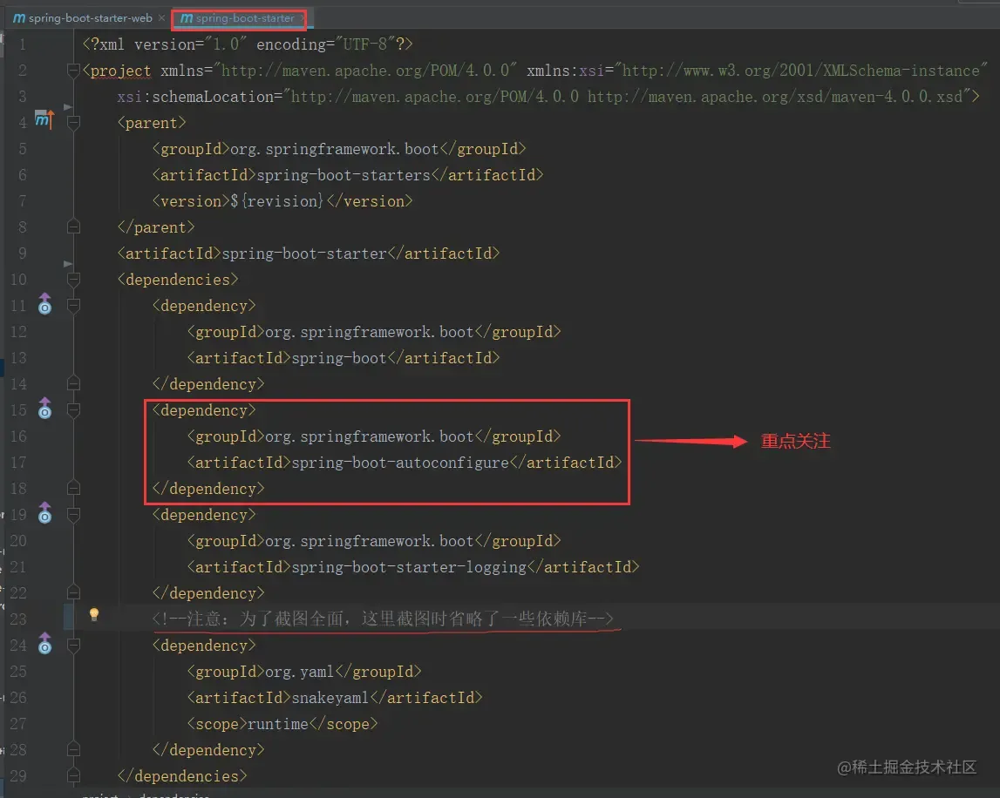
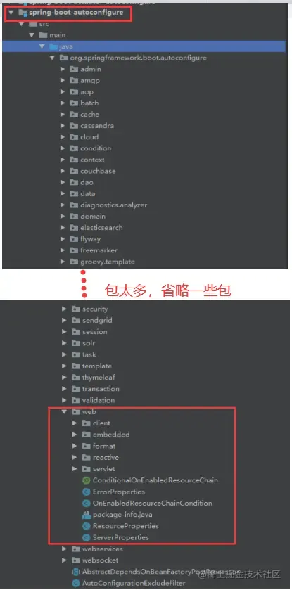
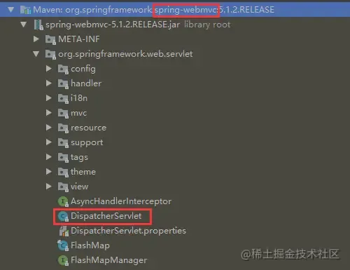
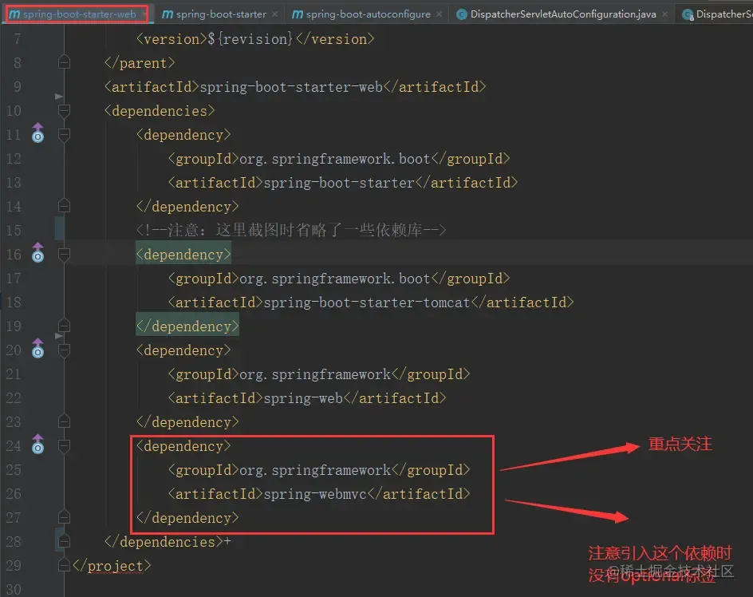

# 6 SpringBoot内置的各种Starter是怎样构建的？

**注：该源码分析对应SpringBoot版本为2.1.0.RELEASE**

## 1 温故而知新

本篇接 [外部配置属性值是如何被绑定到XxxProperties类属性上的？--SpringBoot源码（五）](https://juejin.cn/post/6844904090439270408)

温故而知新，我们来简单回顾一下上篇的内容，上一篇我们分析了SpringBoot**外部配置属性值是如何被绑定到XxxProperties类属性上**
的相关源码，现将外部属性绑定的重要步骤总结如下：

1. 首先是`@EnableConfigurationProperties`注解`import`了`EnableConfigurationPropertiesImportSelector`后置处理器；
2. `EnableConfigurationPropertiesImportSelector`后置处理器又向`Spring`容器中注册了`ConfigurationPropertiesBeanRegistrar`
   和`ConfigurationPropertiesBindingPostProcessorRegistrar`这两个`bean`；
3. 其中`ConfigurationPropertiesBeanRegistrar`向`Spring`容器中注册了`XxxProperties`类型的`bean`；
   `ConfigurationPropertiesBindingPostProcessorRegistrar`向`Spring`容器中注册了`ConfigurationBeanFactoryMetadata`和
   `ConfigurationPropertiesBindingPostProcessor`两个后置处理器；
4. `ConfigurationBeanFactoryMetadata`后置处理器在初始化`bean` `factory`时将`@Bean`注解的元数据存储起来，以便在后续的外部配置属性绑定的相关逻辑中使用；
5. `ConfigurationPropertiesBindingPostProcessor`后置处理器将外部配置属性值绑定到`XxxProperties`类属性的逻辑委托给
   `ConfigurationPropertiesBinder`对象，然后`ConfigurationPropertiesBinder`对象又最终将属性绑定的逻辑委托给`Binder`对象来完成。

可见，重要的是上面的**第5步**。

## 2 引言

我们都知道，SpringBoot内置了各种`Starter`起步依赖，我们使用非常方便，大大减轻了我们的开发工作。有了`Starter`
起步依赖，我们不用去考虑这个项目需要什么库，这个库的`groupId`和`artifactId`是什么？更不用担心引入这个版本的库后会不会跟其他依赖有没有冲突。


> **举个栗子**：现在我们想开发一个web项目，那么只要引入`spring-boot-starter-web`
> 这个起步依赖就可以了，不用考虑要引入哪些版本的哪些依赖了。像以前我们还要考虑引入哪些依赖库，比如要引入`spring-web`和
`spring-webmvc`依赖等；此外，还要考虑引入这些库的哪些版本才不会跟其他库冲突等问题。
>


那么我们今天暂时不分析SpringBoot自动配置的源码，由于起步依赖跟自动配置的关系是如影随形的关系，因此本篇先站在maven项目构建的角度来宏观分析下我们平时使用的
**SpringBoot内置的各种**`**Starter**`**是怎样构建的？**

## 3 Maven传递依赖的optional标签

在分析SpringBoot内置的各种`Starter`构建原理前，我们先来认识下Maven的`optional`标签，因为这个标签起到至关重要的作用。 Maven的
`optional`标签表示可选依赖即不可传递的意思，下面直接举个栗子来说明。

比如有`A`,`B`和`C`三个库，`C`依赖`B`，`B`依赖`A`。下面看下这三个库的`pom.xml`文件：

```java
// A的pom.xml

<? xml version = "1.0"
encoding="UTF-8"?>
<project xmlns="http://maven.apache.org/POM/4.0.0"
xmlns:xsi="http://www.w3.org/2001/XMLSchema-instance"
xsi:schemaLocation="http://maven.apache.org/POM/4.0.0 http://maven.apache.org/xsd/maven-4.0.0.xsd">

	<groupId>com.ymbj</groupId>
        <artifactId>A</artifactId>
	<version>1.0-SNAPSHOT</version>

</project>
复制代码
<? xml version = "1.0"
encoding="UTF-8"?>
<project xmlns="http://maven.apache.org/POM/4.0.0"
xmlns:xsi="http://www.w3.org/2001/XMLSchema-instance"
xsi:schemaLocation="http://maven.apache.org/POM/4.0.0 http://maven.apache.org/xsd/maven-4.0.0.xsd">

	<groupId>com.ymbj</groupId>
        <artifactId>B</artifactId>
	<version>1.0-SNAPSHOT</version>

    <!--注意是可选依赖-->
    <dependencies>
        <dependency>
            <groupId>com.ymbj</groupId>
            <artifactId>A</artifactId>
            <version>1.0-SNAPSHOT</version>
	    <optional>true</optional>
        </dependency>
    </dependencies>

</project>
复制代码
<? xml version = "1.0"
encoding="UTF-8"?>
<project xmlns="http://maven.apache.org/POM/4.0.0"
xmlns:xsi="http://www.w3.org/2001/XMLSchema-instance"
xsi:schemaLocation="http://maven.apache.org/POM/4.0.0 http://maven.apache.org/xsd/maven-4.0.0.xsd">

	<groupId>com.ymbj</groupId>
        <artifactId>C</artifactId>
	<version>1.0-SNAPSHOT</version>

    <dependencies>
        <dependency>
            <groupId>com.ymbj</groupId>
            <artifactId>B</artifactId>
            <version>1.0-SNAPSHOT</version>
        </dependency>
    </dependencies>

</project>
```

上面三个`A`,`B`和`C`库的`pom.xml`可知，`B`库依赖`A`库，然后`C`库又依赖了`B`库，那么请想一下，**Maven打包构建**`**C**`**库后，
**`**A**`**库有没有被引进来？**

答案肯定是**没有**，因为`B`库引入`A`库依赖时使用了`<optional>true</optional>`，即将Maven的`optional`标签值设为了`true`，此时
`C`库再引入`B`库依赖时，`A`库是不会被引入到`C`库的。

同时跟Maven传递依赖有关的还有一个`exclusions`标签，这个表示将某个库的某个子依赖排除掉，这里不再详述。

## 4 SpringBoot内置的各种Starter是怎样构建的？

我们现在来探究SpringBoot内置的各种`Starter`到底是怎样构建的呢？

还记得[如何分析SpringBoot源码模块及结构？](https://juejin.cn/post/6844904070818463751)
这篇文章分析的SpringBoot内部的模块之间的关系吗？先来回顾一下SpringBoot源码内部模块图：



图1

我们都知道，SpringBoot的`Starter`的构建的原理实质就是自动配置，因此由图1可以看到SpringBoot源码项目内部跟`Starter`
及其自动配置有关的模块有四个：`spring-boot-starters`,`spring-boot-actuator-autoconfigure`,`spring-boot-autoconfigure`和
`spring-boot-test-autoconfigure`。
每个模块的作用请看[如何分析SpringBoot源码模块及结构？](https://juejin.cn/post/6844904070818463751)这篇文章，这里不再赘述。

那么，`spring-boot-starters`模块跟后面三个自动配置有关的模块`xxx-autoconfigure`模块的关系是怎样的呢？

此时我们先来看看`spring-boot-starters`模块里面的结构是怎样的？



图2

由图2可以看到`spring-boot-starters`模块包含了SpringBoot内置的各种`starter`：`spring-boot-starter-xxx`。由于SpringBoot内置的各种
`starter`太多，以我们常用的`spring-boot-starter-web`起步依赖来探究好了。

我们首先看下`spring-boot-starter-web`模块内部结构：


图3

可以看到`spring-boot-starter-web`模块里面只有`.flattened-pom.xml`和`pom.xml`文件，**而没有任何代码**
！有点出乎我们意料。我们都知道若要用到SpringBoot的web功能时引入`spring-boot-starter-web`起步依赖即可，而现在
`spring-boot-starter-web`模块里面没有一行代码，那么`spring-boot-starter-web`究竟是如何构建的呢？会不会跟图1所示的
`spring-boot-autoconfigure`自动配置模块有关？

此时我们就需要看下`spring-boot-starter-web`模块的`pom.xml`文件内容：



图4

由图4可以看到，`spring-boot-starter-web`模块依赖了`spring-boot-starter`,`spring-boot-starter-tomcat`,`spring-web`和
`spring-webmvc`等模块，居然没有依赖`spring-boot-autoconfigure`自动配置模块!

由于`spring-boot-starter-web`模块肯定跟`spring-boot-autoconfigure`自动配置模块有关，所以`spring-boot-starter-web`
模块肯定是间接依赖了`spring-boot-autoconfigure`自动配置模块。

图4标有标注"重点关注"的`spring-boot-starter`模块是绝大部分`spring-boot-starter-xxx`模块依赖的基础模块，是核心的`Starter`
，包括了自动配置，日志和`YAML`支持。我们此时来关注下`spring-boot-starter`的`pom.xml`文件，也许其依赖了了
`spring-boot-autoconfigure`自动配置模块。



图5

由图5可以看到，我们前面的猜想没有错，**正是**`**spring-boot-starter**`**模块依赖了**`**spring-boot-autoconfigure**`*
*自动配置模块！**
*_**因此，到了这里我们就可以得出结论了：**_`_**spring-boot-starter-web**_`_**模块没有一行代码，但是其通过**_
`_**spring-boot-starter**_`_**模块***_**间接**依赖了`spring-boot-autoconfigure`自动配置模块，从而实现了其起步依赖的功能。

此时我们再来看下`spring-boot-autoconfigure`自动配置模块的内部包结构：



图6

由图6红框处，我们可以知道`spring-boot-starter-web`起步依赖的自动配置功能原来是由`spring-boot-autoconfigure`模块的`web`
包下的类实现的。

到了这里`spring-boot-starter-web`起步依赖的构建基本原理我们就搞清楚了，但是还有一个特别重要的关键点我们还没Get到。这个关键点跟Maven的
`optional`标签有的作用有关。

为了Get到这个点，我们先来思考一个问题：平时我们开发`web`项目为什么引入了`spring-boot-starter-web`这个起步依赖后，
`spring-boot-autoconfigure`模块的`web`相关的自动配置类就会起自动起作用呢？

我们应该知道，某个自动配置类起作用往往是由于`classpath`中存在某个类，这里以`DispatcherServletAutoConfiguration`
这个自动配置类为切入点去Get这个点好了。 先看下`DispatcherServletAutoConfiguration`能够自动配置的条件是啥？


图7

由图7所示，`DispatcherServletAutoConfiguration`能够自动配置的条件之一是`@ConditionalOnClass(DispatcherServlet.class)`，即只有
`classpath`中存在`DispatcherServlet.class`这个类，那么`DispatcherServletAutoConfiguration`自动配置相关逻辑才能起作用。

而`DispatcherServlet`这个类是在`spring-webmvc`这个依赖库中的，如下图所示：


图8

此时我们再看下`spring-boot-autoconfigure`模块的`pom.xml`文件引入`spring-webmvc`这个依赖的情况：


图9

由图9所示，`spring-boot-autoconfigure`模块引入的`spring-webmvc`这个依赖时`optional`被设置为`true`，原来是可选依赖。即
`spring-webmvc`这个依赖库只会被导入到`spring-boot-autoconfigure`模块中，而不会被导入到间接依赖`spring-boot-autoconfigure`
模块的`spring-boot-starter-web`这个起步依赖中。

此时，我们再来看看`spring-boot-starter-web`的`pom.xml`文件的依赖情况：



图10

由图10所示，`spring-boot-starter-web`起步依赖**显式**引入了`spring-webmvc`这个依赖库，即引入`spring-webmvc`时没有
`optional`这个标签，又因为`DispatcherServlet`这个类是在`spring-webmvc`这个依赖库中的,从而`classpath`中存在
`DispatcherServlet`这个类，因此`DispatcherServletAutoConfiguration`这个自动配置类就生效了。当然，`web`相关的其他自动配置类生效也是这个原理。

至此，我们也明白了`spring-boot-autoconfigure`模块为什么要把引入的`spring-webmvc`这个依赖作为可选依赖了，其目的就是为了在
`spring-boot-starter-web`起步依赖中能显式引入`spring-webmvc`这个依赖（这个起决定性作用），从而我们开发web项目只要引入了
`spring-boot-starter-web`起步依赖，那么web相关的自动配置类就生效，从而可以开箱即用这个就是`spring-boot-starter-web`
这个起步依赖的构建原理了。

前面提到的`spring-boot-starter-actuator`,`spring-boot-starter-test`及其他内置的`spring-boot-starter-xxx`
的起步依赖的构建原理也是如此，只不过`spring-boot-starter-actuator`依赖的是`spring-boot-actuator-autoconfigure`，
`spring-boot-starter-test`依赖的是`spring-boot-test-autoconfigure`模块罢了，这里不再详述。


> **思考**：`spring-boot-actuator-autoconfigure`的`pom.xml`文件引入了20多个可选依赖，而为什么
`spring-boot-starter-actuator`起步依赖只引入了`micrometer-core`这个依赖呢？
>

## 5 模仿SpringBoot包结构自定义一个Starter

前面分析了SpringBoot内置的各种`Starter`的构建原理，理论联系实践，那么如果能够动手实践一下自定义`Starter`那就更好了。

下面提供一个自定义`Starter`的一个简单`Demo`，这个`Demo`完全模仿`SpringBoot`内置`Starter`的内部包结构来编写，对于进一步了解SpringBoot内置的各种
`Starter`的构建原理很有帮助。

下面是这个`Demo`
的github地址，推荐给有兴趣的小伙伴们。 [模仿springboot内部结构自定义Starter](https://github.com/jinyue233/mock-spring-boot-autoconfiguration)
。此外，如何自定义一个`Starter`，可以参考下Mybatis的[spring-boot-starter](https://github.com/mybatis/spring-boot-starter)
是如何编写的。

## 6 小结

好了，SpringBoot内置的各种`Starter`的构建原理分析就到此结束了，现将关键点总结下：

1. `spring-boot-starter-xxx`起步依赖没有一行代码，而是直接或间接依赖了`xxx-autoconfigure`模块，而`xxx-autoconfigure`模块承担了
   `spring-boot-starter-xxx`起步依赖自动配置的实现；
2. `xxx-autoconfigure`自动配置模块引入了一些可选依赖，这些可选依赖不会被传递到`spring-boot-starter-xxx`起步依赖中，这是起步依赖构建的
   **关键点**；
3. `spring-boot-starter-xxx`起步依赖**显式**引入了一些对自动配置起作用的可选依赖；
4. 经过前面3步的准备，我们项目只要引入了某个起步依赖后，就可以开箱即用了，而不用手动去创建一些`bean`等。

由于笔者水平有限，若文中有错误还请指出，谢谢。

