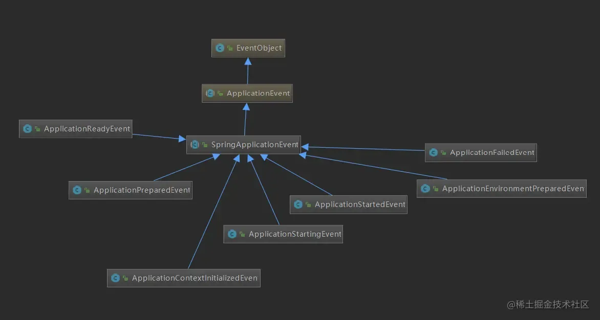
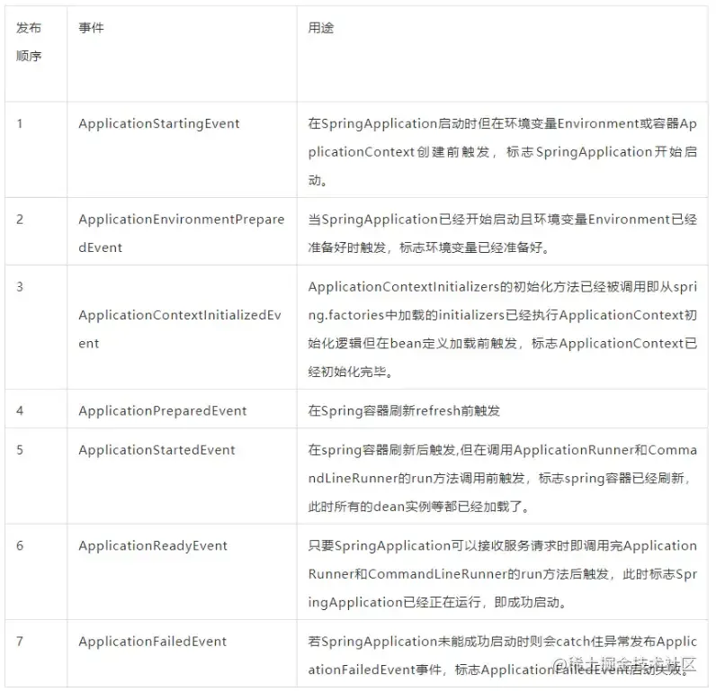

# 10 SpringBoot内置生命周期事件详解

## 1 温故而知新

温故而知新，我们来简单回顾一下上篇的内容，上一篇我们分析了**SpringBoot 启动时广播生命周期事件的原理**，现将关键步骤再浓缩总结下：

1. 为广播 SpringBoot 内置生命周期事件做前期准备：1）首先加载`ApplicationListener`监听器实现类；2）其次加载 SPI 扩展类
   `EventPublishingRunListener`。
2. SpringBoot 启动时利用`EventPublishingRunListener`广播生命周期事件，然后`ApplicationListener`
   监听器实现类监听相应的生命周期事件执行一些初始化逻辑的工作。

## 2 引言

上篇文章的侧重点是分析了 SpringBoot 启动时广播生命周期事件的原理，此篇文章我们再来详细分析 SpringBoot 内置的 7
种生命周期事件的源码。

## 3 SpringBoot 生命周期事件源码分析

分析 SpringBoot 的生命周期事件，我们先来看一张类结构图：



由上图可以看到事件类之间的关系：

1. 最顶级的父类是 JDK 的事件基类`EventObject`；
2. 然后 Spring 的事件基类`ApplicationEvent`继承了 JDK 的事件基类`EventObject`；
3. 其次 SpringBoot 的生命周期事件基类`SpringApplicationEvent`继承了 Spring 的事件基类`ApplicationEvent`；
4. 最后 SpringBoot 具体的 7 个生命周期事件类再继承了 SpringBoot 的生命周期事件基类`SpringApplicationEvent`。

### 3.1 JDK 的事件基类 EventObject

`EventObject`类是 JDK 的事件基类，可以说是所有 Java 事件类的基本，即所有的 Java 事件类都直接或间接继承于该类，源码如下：

```java
// EventObject.java

public class EventObject implements java.io.Serializable {

    private static final long serialVersionUID = 5516075349620653480L;

    /**
     * The object on which the Event initially occurred.
     */
    protected transient Object source;

    /**
     * Constructs a prototypical Event.
     *
     * @param    source    The object on which the Event initially occurred.
     * @exception IllegalArgumentException  if source is null.
     */
    public EventObject(Object source) {
        if (source == null)
            throw new IllegalArgumentException("null source");
        this.source = source;
    }

    /**
     * The object on which the Event initially occurred.
     *
     * @return The object on which the Event initially occurred.
     */
    public Object getSource() {
        return source;
    }

    /**
     * Returns a String representation of this EventObject.
     *
     * @return A a String representation of this EventObject.
     */
    public String toString() {
        return getClass().getName() + "[source=" + source + "]";
    }
}
```

可以看到`EventObject`类只有一个属性`source`，这个属性是用来记录最初事件是发生在哪个类，举个栗子，比如在 SpringBoot 启动过程中会发射
`ApplicationStartingEvent`事件，而这个事件最初是在`SpringApplication`类中发射的，因此`source`就是`SpringApplication`对象。

### 3.2 Spring 的事件基类 ApplicationEvent

`ApplicationEvent`继承了 DK 的事件基类`EventObject`类，是 Spring 的事件基类，被所有 Spring 的具体事件类继承，源码如下：

```java
// ApplicationEvent.java

/**
 * Class to be extended by all application events. Abstract as it
 * doesn't make sense for generic events to be published directly.
 *
 * @author Rod Johnson
 * @author Juergen Hoeller
 */
public abstract class ApplicationEvent extends EventObject {
    /** use serialVersionUID from Spring 1.2 for interoperability. */
    private static final long serialVersionUID = 7099057708183571937L;
    /** System time when the event happened. */
    private final long timestamp;

    /**
     * Create a new ApplicationEvent.
     * @param source the object on which the event initially occurred (never {@code null})
     */
    public ApplicationEvent(Object source) {
        super(source);
        this.timestamp = System.currentTimeMillis();
    }

    /**
     * Return the system time in milliseconds when the event happened.
     */
    public final long getTimestamp() {
        return this.timestamp;
    }
}
```

可以看到`ApplicationEvent`有且仅有一个属性`timestamp`，该属性是用来记录事件发生的时间。

### 3.3 SpringBoot 的事件基类 SpringApplicationEvent

`SpringApplicationEvent`类继承了 Spring 的事件基类`ApplicationEvent`，是所有 SpringBoot 内置生命周期事件的父类，源码如下：

```java
/**
 * Base class for {@link ApplicationEvent} related to a {@link SpringApplication}.
 *
 * @author Phillip Webb
 */
@SuppressWarnings("serial")
public abstract class SpringApplicationEvent extends ApplicationEvent {
    private final String[] args;

    public SpringApplicationEvent(SpringApplication application, String[] args) {
        super(application);
        this.args = args;
    }

    public SpringApplication getSpringApplication() {
        return (SpringApplication) getSource();
    }

    public final String[] getArgs() {
        return this.args;
    }
}
```

可以看到`SpringApplicationEvent`有且仅有一个属性`args`，该属性就是 SpringBoot 启动时的命令行参数即标注
`@SpringBootApplication`启动类中`main`函数的参数。

### 3.4 SpringBoot 具体的生命周期事件类

接下来我们再来看一下`SpringBoot`内置生命周期事件即`SpringApplicationEvent`的具体子类们。

#### 3.4.1 ApplicationStartingEvent

```java
// ApplicationStartingEvent.java

public class ApplicationStartingEvent extends SpringApplicationEvent {
    public ApplicationStartingEvent(SpringApplication application, String[] args) {
        super(application, args);
    }
}
```

SpringBoot 开始启动时便会发布`ApplicationStartingEvent`事件，其发布时机在环境变量 Environment 或容器 ApplicationContext
创建前但在注册`ApplicationListener`具体监听器之后，标志标志`SpringApplication`开始启动。

#### 3.4.2 ApplicationEnvironmentPreparedEvent

```java
// ApplicationEnvironmentPreparedEvent.java

public class ApplicationEnvironmentPreparedEvent extends SpringApplicationEvent {
    private final ConfigurableEnvironment environment;

    /**
     * Create a new {@link ApplicationEnvironmentPreparedEvent} instance.
     * @param application the current application
     * @param args the arguments the application is running with
     * @param environment the environment that was just created
     */
    public ApplicationEnvironmentPreparedEvent(SpringApplication application,
                                               String[] args, ConfigurableEnvironment environment) {
        super(application, args);
        this.environment = environment;
    }

    /**
     * Return the environment.
     * @return the environment
     */
    public ConfigurableEnvironment getEnvironment() {
        return this.environment;
    }
}
```

可以看到`ApplicationEnvironmentPreparedEvent`事件多了一个`environment`属性，我们不妨想一下，多了`environment`属性的作用是啥？
答案就是`ApplicationEnvironmentPreparedEvent`事件的`environment`属性作用是利用事件发布订阅机制，相应监听器们可以从
`ApplicationEnvironmentPreparedEvent`事件中取出`environment`变量，然后我们可以为`environment`属性增加属性值或读出
`environment`变量中的值。


> **举个栗子：** `ConfigFileApplicationListener`监听器就是监听了`ApplicationEnvironmentPreparedEvent`事件，然后取出
`ApplicationEnvironmentPreparedEvent`事件的`environment`属性，然后再为`environment`属性增加`application.properties`
> 配置文件中的环境变量值。
>


当 SpringApplication 已经开始启动且环境变量`Environment`已经创建后，并且为环境变量`Environment`配置了命令行和`Servlet`
等类型的环境变量后，此时会发布`ApplicationEnvironmentPreparedEvent`事件。

监听`ApplicationEnvironmentPreparedEvent`事件的第一个监听器是`ConfigFileApplicationListener`，因为是
`ConfigFileApplicationListener`监听器还要为环境变量`Environment`增加`application.properties`配置文件中的环境变量；此后还有一些也是监听
`ApplicationEnvironmentPreparedEvent`事件的其他监听器监听到此事件时，此时可以说环境变量`Environment`几乎已经完全准备好了。


> **思考：** 监听同一事件的监听器们执行监听逻辑时是有顺序的，我们可以想一下这个排序逻辑是什么时候排序的？还有为什么要这样排序呢？
>

#### 3.4.3 ApplicationContextInitializedEvent

```java
// ApplicationContextInitializedEvent.java

public class ApplicationContextInitializedEvent extends SpringApplicationEvent {
    private final ConfigurableApplicationContext context;

    /**
     * Create a new {@link ApplicationContextInitializedEvent} instance.
     * @param application the current application
     * @param args the arguments the application is running with
     * @param context the context that has been initialized
     */
    public ApplicationContextInitializedEvent(SpringApplication application,
                                              String[] args, ConfigurableApplicationContext context) {
        super(application, args);
        this.context = context;
    }

    /**
     * Return the application context.
     * @return the context
     */
    public ConfigurableApplicationContext getApplicationContext() {
        return this.context;
    }
}
```

可以看到`ApplicationContextInitializedEvent`事件多了个`ConfigurableApplicationContext`类型的`context`属性，`context`
属性的作用同样是为了相应监听器可以拿到这个`context`属性执行一些逻辑，具体作用将在`3.4.4`详述。

`ApplicationContextInitializedEvent`事件在`ApplicationContext`容器创建后，且为`ApplicationContext`容器设置了`environment`
变量和执行了`ApplicationContextInitializers`的初始化方法后但在 bean 定义加载前触发，标志 ApplicationContext 已经初始化完毕。


> **扩展：** 可以看到`ApplicationContextInitializedEvent`是在为`context`容器配置`environment`变量后触发，此时
`ApplicationContextInitializedEvent`等事件只要有`context`容器的话，那么其他需要`environment`环境变量的监听器只需要从
`context`中取出`environment`变量即可，从而`ApplicationContextInitializedEvent`等事件没必要再配置`environment`属性。
>

#### 3.4.4 ApplicationPreparedEvent

```java
// ApplicationPreparedEvent.java

public class ApplicationPreparedEvent extends SpringApplicationEvent {
    private final ConfigurableApplicationContext context;

    /**
     * Create a new {@link ApplicationPreparedEvent} instance.
     * @param application the current application
     * @param args the arguments the application is running with
     * @param context the ApplicationContext about to be refreshed
     */
    public ApplicationPreparedEvent(SpringApplication application, String[] args,
                                    ConfigurableApplicationContext context) {
        super(application, args);
        this.context = context;
    }

    /**
     * Return the application context.
     * @return the context
     */
    public ConfigurableApplicationContext getApplicationContext() {
        return this.context;
    }
}
```

同样可以看到`ApplicationPreparedEvent`事件多了个`ConfigurableApplicationContext`类型的`context`属性，多了`context`
属性的作用是能让监听该事件的监听器们能拿到`context`属性，监听器拿到`context`属性一般有如下作用：

1. 从事件中取出`context`属性，然后可以增加一些后置处理器，比如`ConfigFileApplicationListener`监听器监听到
   `ApplicationPreparedEvent`事件后，然后取出`context`变量，通过`context`变量增加了`PropertySourceOrderingPostProcessor`
   这个后置处理器；
2. 通过`context`属性取出`beanFactory`容器，然后注册一些`bean`，比如`LoggingApplicationListener`监听器通过
   `ApplicationPreparedEvent`事件的`context`属性取出`beanFactory`容器,然后注册了`springBootLoggingSystem`这个单例`bean`；
3. 通过`context`属性取出`Environment`环境变量，然后就可以操作环境变量，比如`PropertiesMigrationListener`。

`ApplicationPreparedEvent`事件在`ApplicationContext`容器已经完全准备好时但在容器刷新前触发，在这个阶段`bean`定义已经加载完毕还有
`environment`已经准备好可以用了。

#### 3.4.5 ApplicationStartedEvent

```java
// ApplicationStartedEvent.java

public class ApplicationStartedEvent extends SpringApplicationEvent {
    private final ConfigurableApplicationContext context;

    /**
     * Create a new {@link ApplicationStartedEvent} instance.
     * @param application the current application
     * @param args the arguments the application is running with
     * @param context the context that was being created
     */
    public ApplicationStartedEvent(SpringApplication application, String[] args,
                                   ConfigurableApplicationContext context) {
        super(application, args);
        this.context = context;
    }

    /**
     * Return the application context.
     * @return the context
     */
    public ConfigurableApplicationContext getApplicationContext() {
        return this.context;
    }
}
```

`ApplicationStartedEvent`事件将在容器刷新后但`ApplicationRunner`和`CommandLineRunner`的`run`方法执行前触发，标志`Spring`
容器已经刷新，此时容器已经准备完毕了。


> **扩展：** 这里提到了`ApplicationRunner`和`CommandLineRunner`接口有啥作用呢？我们一般会在`Spring`
> 容器刷新完毕后，此时可能有一些系统参数等静态数据需要加载，此时我们就可以实现了`ApplicationRunner`或`CommandLineRunner`
> 接口来实现静态数据的加载。
>

#### 3.4.6 ApplicationReadyEvent

```java
// ApplicationReadyEvent.java

public class ApplicationReadyEvent extends SpringApplicationEvent {
    private final ConfigurableApplicationContext context;

    /**
     * Create a new {@link ApplicationReadyEvent} instance.
     * @param application the current application
     * @param args the arguments the application is running with
     * @param context the context that was being created
     */
    public ApplicationReadyEvent(SpringApplication application, String[] args,
                                 ConfigurableApplicationContext context) {
        super(application, args);
        this.context = context;
    }

    /**
     * Return the application context.
     * @return the context
     */
    public ConfigurableApplicationContext getApplicationContext() {
        return this.context;
    }
}
```

`ApplicationReadyEvent`事件在调用完`ApplicationRunner`和`CommandLineRunner`的`run`方法后触发，此时标志`SpringApplication`
已经正在运行。

#### 3.4.7 ApplicationFailedEvent

```java
// ApplicationFailedEvent.java

public class ApplicationFailedEvent extends SpringApplicationEvent {
    private final ConfigurableApplicationContext context;
    private final Throwable exception;

    /**
     * Create a new {@link ApplicationFailedEvent} instance.
     * @param application the current application
     * @param args the arguments the application was running with
     * @param context the context that was being created (maybe null)
     * @param exception the exception that caused the error
     */
    public ApplicationFailedEvent(SpringApplication application, String[] args,
                                  ConfigurableApplicationContext context, Throwable exception) {
        super(application, args);
        this.context = context;
        this.exception = exception;
    }

    /**
     * Return the application context.
     * @return the context
     */
    public ConfigurableApplicationContext getApplicationContext() {
        return this.context;
    }

    /**
     * Return the exception that caused the failure.
     * @return the exception
     */
    public Throwable getException() {
        return this.exception;
    }
}
复制代码
```

可以看到`ApplicationFailedEvent`事件除了多了一个`context`属性外，还多了一个`Throwable`类型的`exception`属性用来记录
SpringBoot 启动失败时的异常。

`ApplicationFailedEvent`事件在 SpringBoot 启动失败时触发，标志 SpringBoot 启动失败。

## 4 小结

此篇文章相对简单，对 SpringBoot 内置的 7 种生命周期事件进行了详细分析。我们还是引用上篇文章的一张图来回顾一下这些生命周期事件及其用途：



## 5 写在最后

由于有一些小伙伴们建议之前有些源码分析文章太长，导致耐心不够，看不下去，因此，之后的源码分析文章如果太长的话，笔者将会考虑拆分为几篇文章，这样就比较短小了，比较容易看完，嘿嘿。

