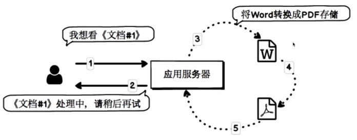

# 01 传统创建线程vs线程池

学习目的：灵活使用线程池，理解线程池的各个参数作用，了解线程池内部工作流程。

## 引子



## 模拟

```java

package com.imooc.zhangxiaoxi.threadpool;

import org.junit.Test;

import java.util.concurrent.ExecutorService;
import java.util.concurrent.Executors;

public class ThreadVs {

    /**
     * 老的处理方式
     */
    @Test
    public void oldHandle() throws InterruptedException {
        /**
         * 使用循环来模拟许多用户请求的场景
         */
        for (int request = 1; request <= 100; request++) {
            new Thread(() -> {
                System.out.println("文档处理开始！");

                try {
                    // 核心功能：将Word转换为PDF格式：简化为处理时长很长的耗时过程
                    Thread.sleep(1000L * 30);
                } catch (InterruptedException e) {
                    e.printStackTrace();
                }

                System.out.println("文档处理结束！");
            }).start();
        }


        // 为了便于观察，让主线程也睡一会儿
        Thread.sleep(1000L * 1000);
    }

    /**
     * 新的处理方式
     */
    @Test
    public void newHandle() throws InterruptedException {
        /**
         * 开启了一个线程池：线程个数是10个
         */
        ExecutorService threadPool =
                Executors.newFixedThreadPool(10);
        /**
         * 使用循环来模拟许多用户请求的场景
         */
        for (int request = 1; request <= 100; request++) {
            threadPool.execute(() -> {
                System.out.println("文档处理开始！");

                try {
                    // 将Word转换为PDF格式：处理时长很长的耗时过程
                    Thread.sleep(1000L * 30);
                } catch (InterruptedException e) {
                    e.printStackTrace();
                }

                System.out.println("文档处理结束！");
            });
        }

        Thread.sleep(1000L * 1000);
    }
}
```

debug模式下观察旧的方法，我们会观察到每次都启用新的线程处理请求，处理了100个请求，很明显，这种状态下，上线不久，系统就会崩溃。

再看下新版本的业务处理，现在只有是个线程在处理文档。有一万个请求进来，依然是是个线程在处理，不会增加新的请求，这是个线程，会轮询的执行这一万个任务。将会十个线程一组十个线程一组的去执行。

## 使用线程姿势对比

```java
// 风骚码农-使用线程
ExecutorService threadPool = Executors.newCachedThreadPool();
for(int j = 0; j< 10;j++){
        threadPool.execute(() ->{
            // 模拟执行业务逻辑
            System.out.println("do something!");
        });
}

// 普通码农-使用线程
for(int i = 0; i< 10; i++){
        new Thread(() ->{
            // 执行业务逻辑
            System.out.println("do something !");
        }).start();
}
```
