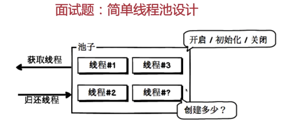
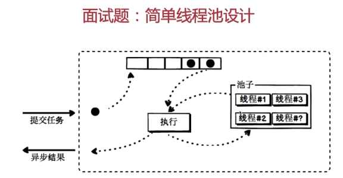

# 简单线程池的设计

## 面试题：简单线程池设计

> 面试官：同学你好，你能独立设计出一个简单线程池吗？
> 我：我想想，应该怎么设计哈！

### 简单线程池的设计，应该从哪几方面考虑，

首先你得有个池子，这个池子指的是线程的管理容器。

那这个池子需要具备哪几个功能呢？

开启/关闭/初始化

初始化了n多个线程。

那其次，这个池子需要对外界提供什么样的服务？

外界通过它来获取到一个线程，然后拿到线程的外界程序再做自己的运行——执行操作，当执行完程序之后，这个池子还要能提供一个操作，把线程还到池子里的一个功能。
这样的话，

这样的话，这个线程对外提供的两个服务就定义出来了。

### 那这个线程池需要考虑到哪些问题呢？

初始化线程池的时候，初始化多少？肯定不能初始化十万个，那系统上来就崩溃了。那初始化多少，这个指标怎么定呢？

池子里的线程都已经被其他程序拿空了，那我当再来程序需要线程的时候应该怎么处理？

以上就是一个最简单的线程池需要考虑的问题

但是这样一个线程池还是太简陋了，或者说让别人用的太不爽了。因为如果我是一个外界程序，我需要借助你的线程池实现一个功能，那我通过你的池子拿到一个线程，然后用这个线程执行我的逻辑，执行完之后，还要想着把我的线程还到这个池子里，那对我来说，感觉使用的很不爽，

作为系统设计者来说，这个功能模块设计者来说，我应该怎么改进呢？

首先还是这个池子，管理了一些线程，第二我想让使用者很爽，那我现在告诉使用者，你不用再找我拿线程了，你只需要把你想要拿到线程之后执行的任务告诉我，然后呢，我用线程帮你执行，执行完，我异步告诉你，异步返回给你。使用者只需要把任务告诉我就ok了，这不是很爽吗？

那线程池要接收外界提交的任务，那我总得有地方存吧，那我叫它任务队列也好，任务集合也好，任务数组也好。反正就是存放任务的一个东西。当你外界提交了一个任务，我就会将它提交到这个队列当中，然后线程池有个执行器，作用是从任务队列当中拿任务，从池子里拿线程，用线程执行这个任务，执行完这个任务之后，把这个线程还回到池子里，把执行结果异步返回给外界调度方。

那这个线程池我需要考虑哪些问题呢？第一还是初始化数量的问题，我要初始化多少线程，第二，整个队列或者数组要多长，第三，当任务队列满了的时候我应该怎么办？我是抛出异常？还是怎么办，这些就是这版本线程池需要考虑的问题。

咱们讲线程池的设计，并不是为了让大家记住这一版线程池的设计，只是想让大家了解一下，拿到一个任务设计的时候，需要从哪几个方面考虑，后边会真正考虑一个线程池设计，可以后期进行对比