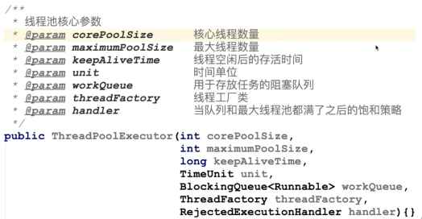
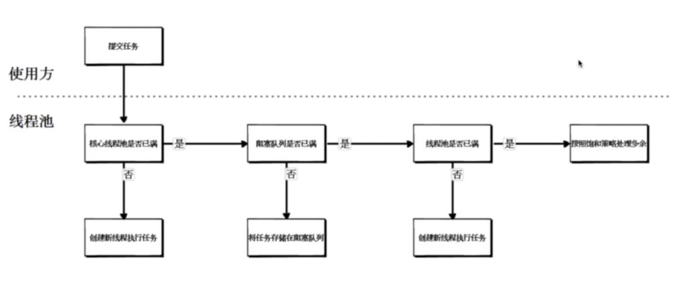

# 线程池参数与处理流程

## 线程池的核心参数

- 最大线程数量：防止线程无限大的时候，出现线程过多的情况。
- 用于存放任务的阻塞队列：这就是上一小节用于存放任务的一个队列/集合/数组。
- 线程工厂类：负责往线程池里生产线程，创建线程。
- 饱和策略：当任务队列满了，无法再接受新的任务之后，线程池的一个新的执行策略。

## 线程池的处理流程

当线程池接受到任务之后，会执行哪些操作？
注意：只有当阻塞队列满了之后才会触发新线程的创建。