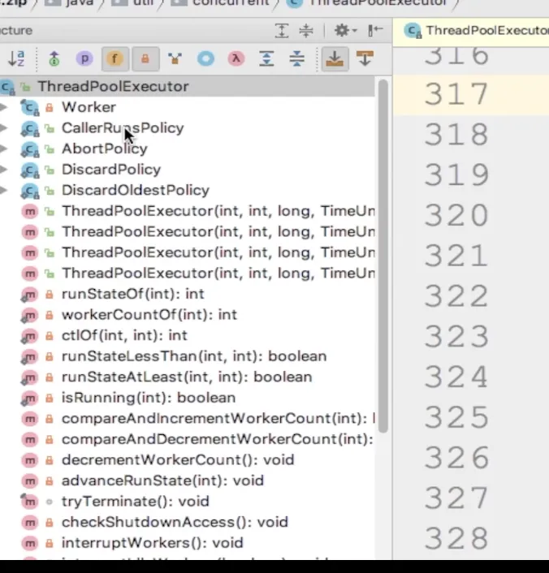
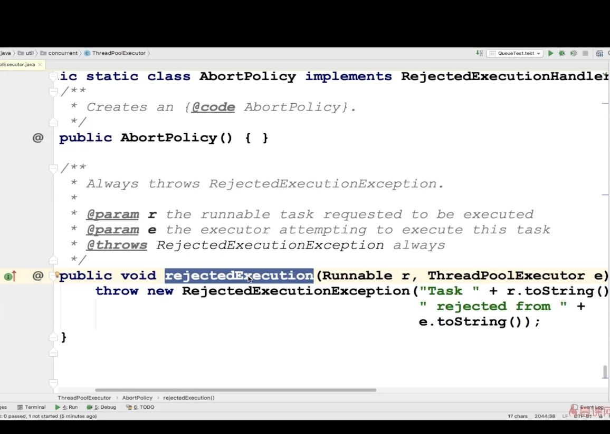
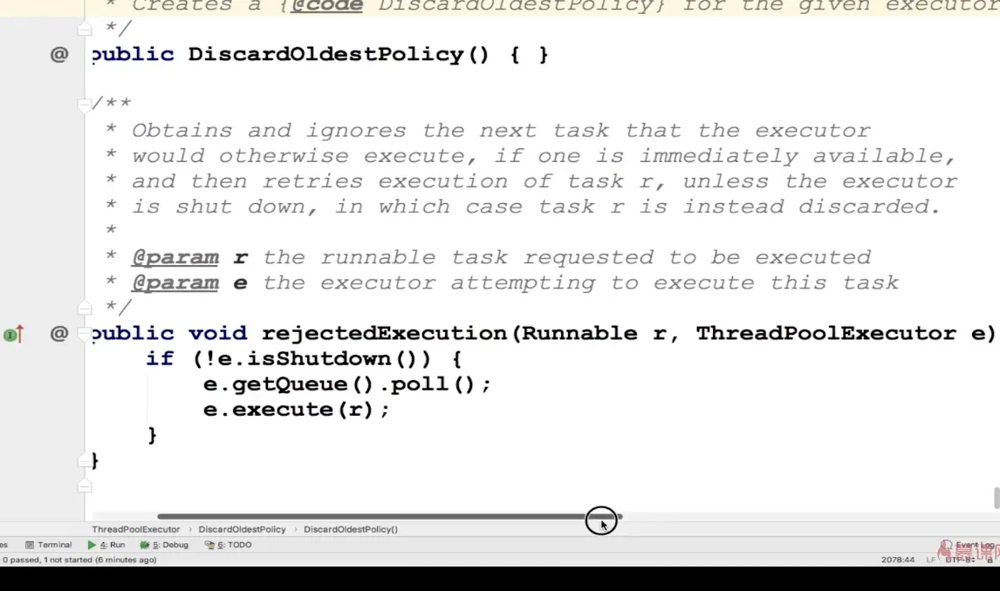
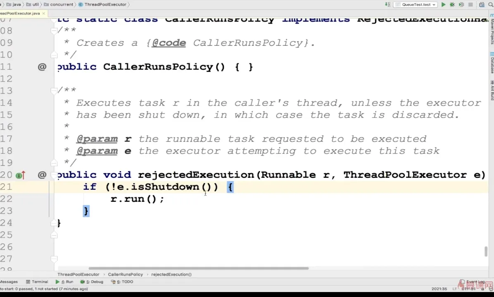

# 线程池可选择的饱和策略

接下来看线程池为我们提供了哪些可供选择的饱和策略，就是当阻塞队列和最大线程都已经满了的时候，再有任务提交，此时就会用到饱和策略。

- AbortPolicy终止策略（默认）
- DiscardPolicy抛弃策略
- DiscardOldestPolicy抛弃旧任务策略
- CallerRunsPolicy调用者运行策略
  
  打开源码我们可以看到，线程池内部定义了四个内部类，这四个内部类就是我们的饱和策略，
  
  默认保护策略，
-

第一个Runnable对象的参数是外界传进来的任务，

第二个参数ThreadPoolExecutor是当前线程池对象

丢弃策略

也是实现了RejectedExecutionHandler这个方法，但是什么都没做。

丢弃旧任务策略

首先判断线程池是否shutdown

调用方执行策略

判断完是否关闭，如果关闭了，当前的调用方直接执行run方法