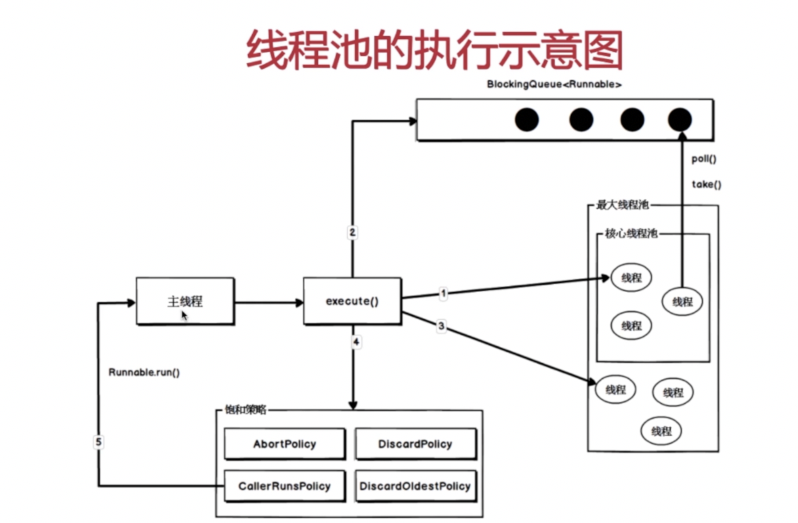

# 线程池的执行示意图

主线程调用execute()方法，执行第一步，如果核心线程池没有满，会立即创建一个线程来执行这个任务，如果核心线程池满了，直接进行方法二，将这个任务提交到阻塞队列当中，阻塞队列当中可以缓存一系列的任务，然后核心线程会不断的轮询阻塞队列，拿到新的任务来执行，第三步，如果调用execute()时，核心线程和阻塞队列都已经满了，它会执行第三步，创建新的线程，但是前提是线程池的线程数没有超过最大线程数，此时会创建新的线程来执行这个任务，当调用execute()时发现第三步也走不通，线程池中的线程数已经超过了最大线程数，就会执行第四步，执行饱和策略，根据构造线程池时构造的不通的饱和策略执行处理，如果传入的是调用方自行执行的保护策略，就会返回到主线程，通过主线程去运行任务的run()方法来执行任务