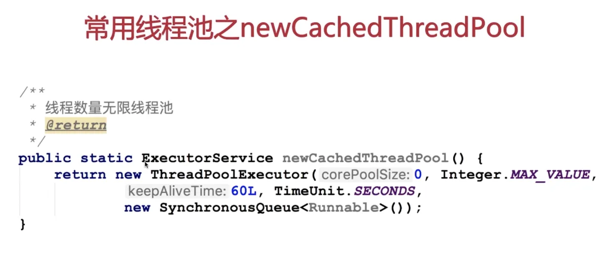
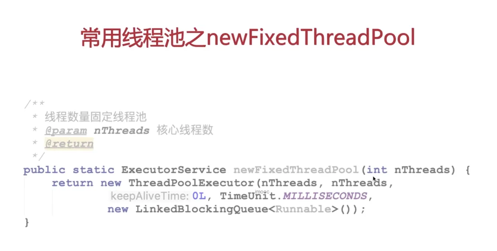
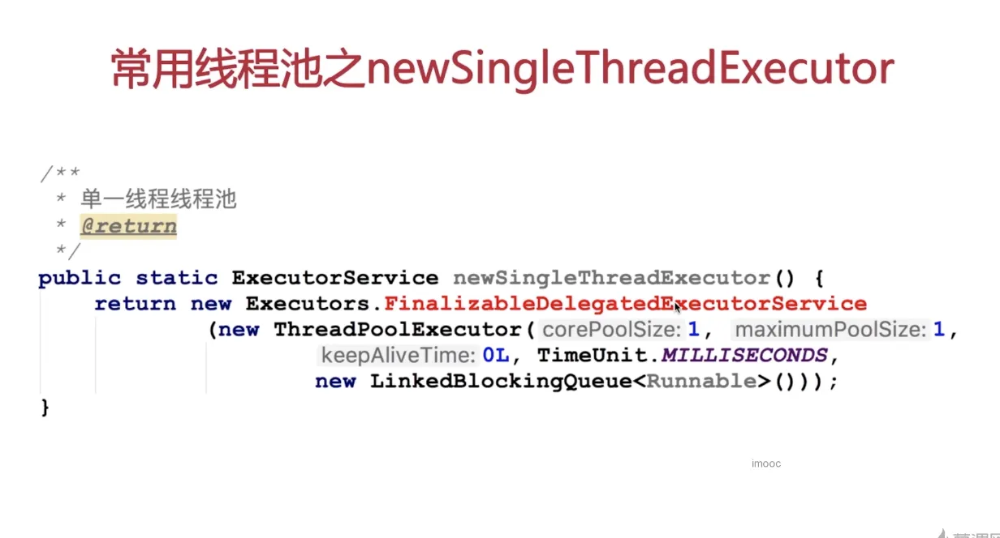

# 常用线程池

## 常用线程池之newCachedThreadPool

在学习完线程池构造函数的各个参数含义之后，咱们来看一看，为了简化线程池的使用，线程池工具类为我们提供了几种创建线程池的方法。

同步移交的饱和策略，有一个线程提交就要有一个线程去消费。

使用这个一定要注意，很有可能创建出来一个无限大的线程池从而导致系统崩溃。

## 常用线程池之newFixedThreadPool

这个线程池让你穿进去一个线程的个数，既是初始值也是最大值，线程个数已经固定。阻塞队列使用了一个没有参数的无界阻塞队列，说明线程个数一定，阻塞队列无限大，这是一个线程数量固定的线程池，依靠阻塞队列来缓存提交的任务，使用它的时候一定要注意，线程的个数虽然固定了，但是阻塞队列是没有限制的，如果你提交任务过多，系统队列，也会把系统内存撑爆，所以使用的时候也要注意。

## 常用线程池之newSingleThreadExecutor

飘红的FinalizableDelegatedExecutorService只是一个代理的方法，内部还是通过调用newThreadPoolExecutor来实现的，看它传入的参数，核心线程数是一个，最大线程数量是1个，使用的是无界的阻塞队列，由于核心线程和最大线程都是一个，其实就相当于是一个独立的线程，只不过任务会先被存方法到阻塞队列当中，由这一个线程顺序消费。 