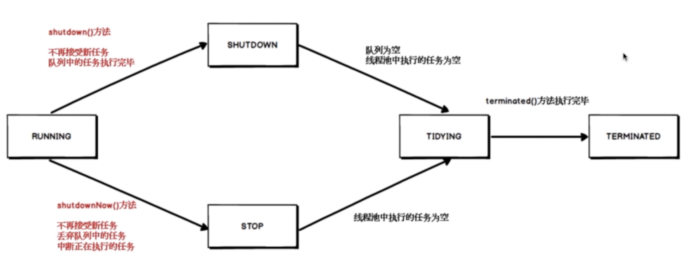

# 线程池的状态

前面学习了线程池的创建启动提交任务之后，这里来看一下线程池的状态，也就是当调用shutdown关闭线程池，线程会经历哪几种状态。

RUNNING：说明线程池处于正常的运行状态当中，能够接受新的任务，并且也能够将任务添加到处理队列当中，是一个正常的状态。

当调用shutdown方法之后，线程会进入shutdown状态，此时不再接收新任务，但是队列中的任务会执行完毕。

如果调用shutdownNow()方法，线程将不再接收新任务，并且会丢弃队列中的任务，中断正在执行的任务，相当于是立刻什么事情都不干了，线程池会进入到STOP状态。

当所有的SHUTDOWN和STOP状态的所有任务都关停之后，会进入到TIDYING状态，此时这个状态表明所有的任务都已经终止，线程池内部调用terminated方法执行完毕之后会进入到TERMINATED状态

需要注意的是showdown()和shutdownNow()，本质区别是是否丢弃任务队列当中的执行任务，所以有些线程池关闭不当的话，就会导致已经提交的任务丢失的情况，所以在使用线程池的时候，一定要额外注意这两个状态。