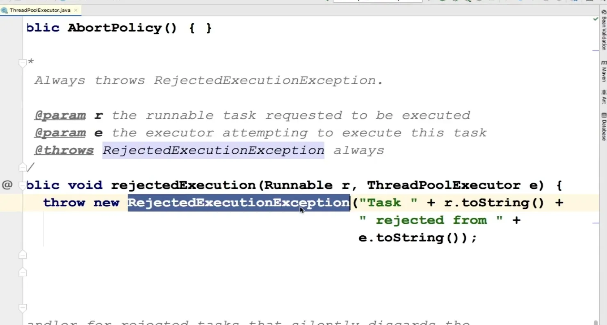

# 线程池饱和策略之终止策略

## 回顾线程池的饱和策略都有哪些

- AbortPolicy终止策略（默认）
- DiscardPolicy抛弃策略
- DiscardOldestPolicy抛弃旧任务策略
- CallerRunsPolicy调用者运行策略

```java

import org.junit.After;
import org.junit.Test;

import java.util.concurrent.LinkedBlockingQueue;
import java.util.concurrent.ThreadPoolExecutor;
import java.util.concurrent.TimeUnit;

/**
 * 类名称：PolicyTest
 * ********************************
 * <p>
 * 类描述：饱和策略
 *
 * @author zhangxiaoxi
 * @date 上午10:15
 */
public class PolicyTest {

    // 全局的线程池，后续用来做测试
    /**
     * 线程池
     */
    private static ThreadPoolExecutor executor =
            new ThreadPoolExecutor(
                    // 核心线程数和最大线程数
                    2, 3,

                    // 线程空闲后的存活时间
                    60L, TimeUnit.SECONDS,

                    // 有界阻塞队列
                    new LinkedBlockingQueue<Runnable>(5));

    /**
     * 任务
     */
    class Task implements Runnable {
        /**
         * 任务名称
         */
        private String taskName;

        public Task(String taskName) {
            this.taskName = taskName;
        }

        @Override
        public void run() {
            System.out.println("线程[ " + Thread.currentThread().getName()
                    + " ]正在执行[ " + this.taskName + " ]任务...");

            try {
                Thread.sleep(1000L * 5);
            } catch (InterruptedException e) {
                e.printStackTrace();
            }

            System.out.println("线程[ " + Thread.currentThread().getName()
                    + " ]已执行完[ " + this.taskName + " ]任务！！！");
        }
    }

    /**
     * 线程池的执行过程
     *
     * 已知
     * 2个核心线程
     * 5个任务的队列
     * 3个最大线程：1个线程可用
     *
     * 前2个任务，会占用2个核心线程
     * 第3个到第7个任务，会暂存到任务队列中
     * 第8个任务，会启动最大线程，去执行
     * 第9个任务，没有线程可以去执行~~~
     */

    /**
     * 终止策略
     * TODO 抛出异常，拒绝任务提交
     */
    @Test
    public void abortPolicyTest() {
        // 设置饱和策略为 终止策略
        executor.setRejectedExecutionHandler(
                new ThreadPoolExecutor.AbortPolicy());

        for (int i = 1; i <= 10; i++) {
            try {
                // 提交10个线程任务
                executor.execute(new Task("线程任务" + i));
            } catch (Exception e) {
                System.err.println(e);
            }
        }

        // 关闭线程池
        executor.shutdown();
    }

    /**
     目的：让主线程等待一会二，防止主线程在执行完之后立马退出，我们看不到线程运行的最后结果
     * 单元测试执行完，主线程等待100秒。防止主线程退出，看不到线程的执行结果
     * @throws InterruptedException
     */
    @After
    public void after() throws InterruptedException {
        Thread.sleep(1000L * 100);
    }

}

```

