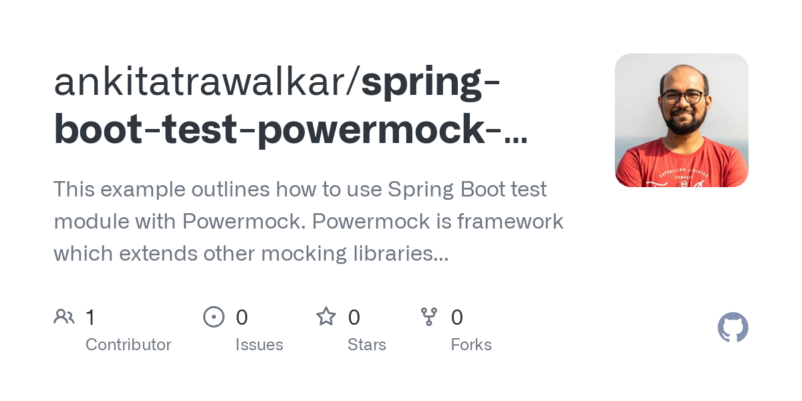

> 原文链接：https://blog.csdn.net/weixin_35755823/article/details/143664833

# PowerMock测试用例集锦：Java单元测试框架深入剖析

## 简介

PowerMock是一个Java单元测试框架，扩展了EasyMock等工具，实现了对静态方法、最终类和私有方法等难以测试的部分的模拟。本文将通过一系列测试样例集合，详细介绍如何使用PowerMock进行高效的单元测试。从模拟静态方法、最终类和方法，到局部和成员变量的控制，再到自定义响应和参数匹配器，每个环节都配有实际的代码示例。这些样例集锦能够帮助开发者全面了解PowerMock的使用方法，并在复杂的测试场景中应用这个强大的工具，提高测试效率和质量。



## 1. PowerMock基础功能介绍

PowerMock是一个Java开发测试库，它扩展了流行的测试框架（如Mockito和EasyMock），使其能够模拟静态方法、最终类、私有方法以及构造函数等难以测试的元素。它的出现大大增加了单元测试的灵活性和测试场景的覆盖度，尤其对复杂的遗留系统和第三方库的测试提供了有力的支持。

### 1.1 PowerMock的优势

PowerMock的优势在于能够绕过Java语言的一些固有限制，为开发者提供更丰富的测试手段。比如，通过PowerMock可以模拟那些没有提供接口的类，或者那些调用了静态方法和私有方法的系统行为。

### 1.2 如何开始使用PowerMock

要开始使用PowerMock，首先需要在项目中引入PowerMock的依赖库。然后，配置测试运行器以支持PowerMock功能。通常，我们会使用
@RunWith(PowerMockRunner.class) 注解来指定测试运行器。接下来，使用 @PrepareForTest 注解来准备需要模拟的类。

示例代码如下：

```java

@RunWith(PowerMockRunner.class)
@PrepareForTest({MyClass.class})
public class MyTest {

    @Test
    public void testStaticMethod() {
        // 使用PowerMock模拟静态方法的调用
        PowerMock.mockStatic(MyClass.class);
        when(MyClass.staticMethod()).thenReturn("mocked");
        // 执行测试逻辑并验证结果
        assertEquals("mocked", MyClass.staticMethod());
        // ... 其他测试逻辑
    }
}
```

在上述代码中， MyClass 包含一个静态方法 staticMethod ，我们使用PowerMock来模拟这个静态方法，并验证它是否返回了我们设置的模拟值。

通过这样的引入和使用，PowerMock为测试者提供了一个强大的工具集，使得单元测试能够覆盖更加全面和深入的场景，从而提高代码质量和项目维护性。在后续章节中，我们将深入探讨PowerMock的其他高级功能和应用实例。

## 2. 静态方法的模拟与测试

### 2.1 静态方法模拟的原理

#### 2.1.1 静态方法在测试中的挑战

在传统的单元测试中，静态方法是一种难以测试的代码结构。由于静态方法不依赖于对象实例，而是直接依赖于类本身，这使得它不像实例方法那样可以通过模拟对象依赖关系来进行测试。在测试静态方法时，常见的挑战包括但不限于：

- 难以模拟静态方法的依赖项，因为静态方法通常直接访问静态变量或调用其他静态方法。
- 静态方法的全局作用域意味着在测试中的任何变化都会影响到整个应用程序，导致测试用例之间的干扰。
- 无法通过继承和多态来改变静态方法的行为，这限制了测试时使用Mock框架的能力。

#### 2.1.2 PowerMock模拟静态方法的机制

幸运的是，PowerMock库提供了一种机制来模拟静态方法的行为。PowerMock通过Java的动态代理和字节码操作技术，可以在运行时修改静态方法的实现，允许我们模拟返回值、抛出异常或记录方法调用等。下面是PowerMock模拟静态方法的基本机制：

- 使用 @PrepareForTest 注解来指定需要模拟的类。
- 使用 PowerMock.mockStatic 方法来激活静态方法的模拟。
- 使用 when 语句来指定当调用某个静态方法时返回的模拟值或抛出的模拟异常。

```java

@PrepareForTest({SomeClass.class})
public class SomeTest {
    @Before
    public void setUp() {
        PowerMock.mockStatic(SomeClass.class);
    }

    @Test
    public void testStaticMethod() {
        when(SomeClass.staticMethod()).thenReturn("Mocked Value");
        String result = SomeClass.staticMethod();
        verifyStatic(SomeClass.class, times(1));
        SomeClass.staticMethod();
        assertEquals("Mocked Value", result);
    }
}
```

在上述代码中， SomeClass 类的 staticMethod 方法在测试中被模拟，当调用此方法时，它会返回我们指定的"Mocked Value"。

### 2.2 静态方法测试案例实践

#### 2.2.1 创建静态方法测试案例

为了更好地理解静态方法的模拟和测试，我们可以从一个简单的例子开始。假设我们有一个 Helper 类，它包含一个用于获取系统时间的静态方法
getCurrentTime ，我们需要测试这个方法。

```java
public class Helper {
    public static String getCurrentTime() {
        return new SimpleDateFormat("HH:mm:ss").format(new Date());
    }
}
```

我们想在不同的测试场景下模拟这个方法的行为，以检查依赖于时间的业务逻辑。

#### 2.2.2 测试案例执行与结果分析

首先，我们需要对 Helper 类进行模拟，因为我们的测试目标是模拟 getCurrentTime 方法的行为。然后，我们编写几个测试用例来验证这个方法在不同条件下的行为。

```java

@RunWith(PowerMockRunner.class)
@PrepareForTest(Helper.class)
public class StaticMethodTest {
    @Before
    public void setUp() {
        PowerMock.mockStatic(Helper.class);
    }

    @After
    public void tearDown() {
        PowerMock.verifyAll();
    }

    @Test
    public void testGetCurrentTime_ReturnsMorningTime() {
        String morningTime = "08:00:00";
        when(Helper.getCurrentTime()).thenReturn(morningTime);
        String currentTime = Helper.getCurrentTime();
        assertEquals(morningTime, currentTime);
    }
}
```

在上述测试用例中，我们通过 when 语句设置了 getCurrentTime 方法的预期返回值。然后，我们调用该方法，并使用 assertEquals
来验证返回值是否如预期。 tearDown 方法确保在每个测试用例结束后，所有的模拟都被清除，并且验证了所有预期的模拟方法调用。

通过这种方式，我们可以确保在进行单元测试时，能够控制那些静态方法，从而能够全面地测试涉及它们的业务逻辑。这个实践展示了PowerMock如何帮助我们克服测试静态方法时常见的挑战，使得测试更加全面和可靠。

## 3. 最终类和方法的模拟与测试

在Java中， final 关键字可以用来修饰类、方法和变量，它给对象、方法和变量的设计带来了一些限制。对于测试而言，这些限制增加了测试难度，特别是当我们需要测试那些依赖于
final 方法或类的组件时。幸运的是，PowerMock提供了突破这些限制的途径，使得测试可以更自由地控制这些 final
成员。让我们深入了解如何使用PowerMock来模拟最终类和方法，以及如何进行测试实践。

### 3.1 最终类和方法模拟的原理

#### 3.1.1 Java中final关键字的作用及其测试挑战

在Java编程中，使用 final 关键字具有特定的含义和用途：

- final类 ：不能被继承，意味着无法创建其子类。
- final方法 ：不能被重写，任何尝试继承并重写该方法的操作都会失败。
- final变量 ：如果变量是基本类型的，那么它的值不可更改；如果变量是引用类型的，那么该引用不可被重新指向另一个对象，但指向的对象的内容可以修改。

由于 final
类和方法不能被继承或重写，测试时要覆盖它们就会遇到问题，因为常规的mocking技术依赖于继承来模拟行为。例如，如果我们想要测试一个使用了第三方库的final类的行为，就无法通过创建子类的方式改变其方法的行为，因此难以进行单元测试。

#### 3.1.2 PowerMock突破final限制的方法

PowerMock库通过字节码操作技术提供了解决方案，可以绕过Java语言规范的这些限制：

- 利用PowerMock框架，可以创建final类的mock对象，并且重写其方法。
- 也可以模拟final方法的行为，使其返回预设的结果。

PowerMock通过类加载器和字节码修改的黑魔法，能够重新定义这些 final 成员的行为，使其在测试环境中表现为非 final
，这样就可以用mock对象来代替原始对象。

###3.2 最终类和方法测试案例实践
####3.2.1 设计最终类和方法的测试案例

现在我们通过一个简单的例子来演示如何使用PowerMock模拟一个final类和其方法。假设我们有如下final类和方法：

```java
public final class FinalClass {
    public final String finalMethod() {
        return "Original result";
    }
}
```

我们想测试一个使用 FinalClass 的类 ConsumerClass ：

```java
public class ConsumerClass {
    public void useFinalClass() {
        FinalClass fc = new FinalClass();
        String result = fc.finalMethod();
        // Do something with the result
    }
}
```

为了测试 ConsumerClass 的行为，我们需要mock FinalClass 的 finalMethod 方法，使其返回一个预定义的结果。

#### 3.2.2 案例的执行与测试结果验证

接下来，我们需要编写一个测试类，并使用PowerMock来模拟 FinalClass 的 finalMethod 方法。

```java

@RunWith(PowerMockRunner.class)
@PrepareForTest({FinalClass.class})
public class FinalClassTest {

    @Test
    public void testFinalMethod() throws Exception {
        // 创建模拟对象
        FinalClass mockFinalClass = PowerMock.createMock(FinalClass.class);
        // 指定返回值
        String expected = "Mocked result";
        expect(mockFinalClass.finalMethod()).andReturn(expected).anyTimes();
        // 重新定义行为
        PowerMock.redefineMethods(FinalClass.class);
        PowerMock.expectNew(FinalClass.class).andReturn(mockFinalClass).anyTimes();
        // 重置类加载器
        PowerMock.replayAll();
        // 创建被测试对象并执行测试逻辑
        ConsumerClass consumer = new ConsumerClass();
        consumer.useFinalClass();
        // 验证期望的行为
        PowerMock.verifyAll();
    }
}
```

上面的测试代码中，我们使用了 @RunWith(PowerMockRunner.class) 注解来指定测试运行器。使用 @PrepareForTest
注解来指定哪些类需要在测试中被准备（即哪些类包含final成员）。通过 PowerMock.createMock 方法创建了 FinalClass 的mock对象，并使用
expect 方法来定义 finalMethod 的期望行为。 PowerMock.redefineMethods 允许我们重定义 FinalClass 的方法，使其不再final，
PowerMock.expectNew 来控制 FinalClass 的构造行为。最后，通过调用 PowerMock.replayAll 和 PowerMock.verifyAll
方法来记录和验证期望行为是否发生。

通过上述步骤，我们成功模拟了 FinalClass 的 finalMethod 方法，并验证了 ConsumerClass
使用该方法时的行为，这展示了PowerMock在测试最终类和方法时的强大能力。

## 4. 局部变量和成员变量的控制

### 4.1 变量控制的原理

#### 4.1.1 局部变量和成员变量在测试中的作用

在编写单元测试时，常常需要控制变量的值以便于验证某些特定的代码路径或行为。局部变量和成员变量在测试中扮演着至关重要的角色，因为它们的值往往会影响方法的输出或程序的流程。

局部变量控制允许我们修改函数内部的局部变量值，这对于测试函数的边界条件或异常情况特别有用。通过控制局部变量，我们可以确保测试覆盖了代码的所有逻辑分支。

成员变量控制则允许我们控制对象的私有或受保护字段，这在测试面向对象代码时尤为重要。对成员变量的控制可以帮助我们测试私有方法的行为，或者在测试过程中创建特定的对象状态。

#### 4.1.2 PowerMock对变量进行控制的技术细节

PowerMock提供了一种机制，允许测试者在测试期间对私有和受保护的变量进行读写操作。这通过Java代理和类加载技术实现，使得测试代码能够覆盖和修改原有类的内部状态。

当使用PowerMock控制变量时，测试框架会在运行时动态地修改或增强原始类，从而允许测试代码访问和修改私有或受保护的变量。此过程不需要修改原有的生产代码，保持了代码的整洁和封装性。

### 4.2 变量控制测试案例实践

#### 4.2.1 设计变量控制的测试案例

我们将设计一个测试案例，演示如何使用PowerMock来控制一个类中的成员变量。这个例子中，我们将有一个简单的 Counter
类，该类包含一个私有成员变量 count ，以及增加该变量值的方法 increment 。

```java
public class Counter {
    private int count = 0;

    public void increment() {
        count++;
    }

    public int getCount() {
        return count;
    }
}
```

我们希望在测试中控制 count 变量的值，以便验证 increment 方法是否正确地更新了计数器。

#### 4.2.2 测试执行过程及结果分析

首先，需要在测试项目中添加PowerMock的依赖库，然后编写测试代码。我们将使用PowerMockito API来模拟 Counter 类的实例，并通过
@PrepareForTest 注解来通知PowerMock需要准备测试的类。

```java
import org.junit.Test;
import org.junit.runner.RunWith;
import org.mockito.MockitoAnnotations;
import org.powermock.api.mockito.PowerMockito;
import org.powermock.core.classloader.annotations.PrepareForTest;
import org.powermock.modules.junit4.PowerMockRunner;

import static org.junit.Assert.assertEquals;
import static org.mockito.Mockito.*;

@RunWith(PowerMockRunner.class)
@PrepareForTest(Counter.class)
public class VariableControlTest {

    @Test
    public void testIncrementMethod() throws Exception {
        Counter counter = PowerMockito.mock(Counter.class);
        PowerMockito.whenNew(Counter.class).withNoArguments().thenReturn(counter);

        // 使用PowerMockito控制私有变量
        PowerMockito.field(Counter.class, "count").set(counter, 10);

        counter.increment();
        // 验证私有变量的值是否按照预期被修改
        PowerMockito.verifyPrivate(counter).invoke("getCount");
        assertEquals(11, PowerMockito.getField(Counter.class, "count").getInt(counter));
    }
}
```

在上述代码中，我们使用 PowerMockito.field 方法来修改 Counter 类实例的 count 变量。我们还使用 PowerMockito.invoke 和
PowerMockito.getField 方法来调用 getCount 方法和获取 count 变量的值。测试将验证 increment 方法是否正确地将计数器的值增加了1。

最终，测试结果将显示 count 变量的值已经从10变为了11，这验证了 increment
方法能够正确地处理成员变量。通过这种方式，我们可以确保我们的测试覆盖了私有成员变量的所有相关使用场景。

通过这个案例，我们可以看到如何使用PowerMock来控制对象内部的私有变量，并确保我们的单元测试能够完整地验证私有实现的正确性。

## 5. 自定义模拟方法与参数匹配

### 5.1 使用Answer接口自定义模拟响应

#### 5.1.1 Answer接口的工作原理

在单元测试中，有时候需要对被测试的方法返回值做更细致的控制。PowerMock 提供的 Answer
接口可以让我们自定义方法调用的返回值。当你想要覆盖被测试方法的默认行为，并且为其提供一个特定的返回值时， Answer 接口会非常有用。

使用 Answer 接口时，你需要实现 Answer<T> 接口，并在其中定义一个 answer(InvocationOnMock invocation)
方法。在这个方法中，你可以访问调用参数，执行自定义的逻辑，并返回一个模拟的结果。然后，在创建模拟对象时，使用 when(
mockedObject.someMethod(arg1, arg2)).thenAnswer(answer); 将这个 Answer 实例与期望调用相关联。

#### 5.1.2 如何利用Answer接口实现自定义模拟响应

假设你有一个复杂对象的生成逻辑，它依赖于多个输入参数，你需要模拟这个对象的创建过程。下面是一个简单的例子：

```bash
when(mockedObject.createComplexObject(anyString(), anyInt()))
    .thenAnswer(new Answer<ComplexObject>() {
        @Override
        public ComplexObject answer(InvocationOnMock invocation) throws Throwable {
            // 获取调用的参数
            String name = invocation.getArgument(0);
            int age = invocation.getArgument(1);
            // 构建一个复杂的返回对象
            ComplexObject object = new ComplexObject(name, age);
            // 在这里可以执行一些自定义逻辑
            // ...
            return object;
        }
    });
```

在上面的代码中，我们创建了一个匿名类，重写了 answer 方法。在这个方法中，我们可以根据实际的测试需求来编写逻辑，并返回一个自定义的
ComplexObject 对象。这种方式提供了极高的灵活性，可以根据不同的测试用例和输入参数返回不同的模拟结果。

### 5.2 使用ArgumentMatcher进行精细化参数匹配

#### 5.2.1 ArgumentMatcher的原理与应用

在测试中，我们经常需要对方法的参数进行匹配，以确保它们满足特定的条件。PowerMock 提供了 ArgumentMatcher
类，它允许我们定义参数匹配的规则，而不是仅仅进行值的比较。这在处理复杂对象或特定类型参数时非常有用。

通过使用 ArgumentMatcher ，我们可以创建出如 eq , isA , contains 等匹配器，这些匹配器可以用于参数匹配中。当你使用 Mockito
的验证或模拟方法时，这些匹配器可以帮助你实现更为灵活的测试场景。

#### 5.2.2 实现复杂参数匹配的示例与分析

假设我们有一个方法 saveData(Data data) ，它接受一个 Data 类型的对象作为参数，并将其保存到数据库中。我们需要模拟这个方法的行为，并且只在特定的数据对象被传递时才触发。

```bash
when(mockedObject.saveData(argThat(new ArgumentMatcher<Data>() {
    @Override
    public boolean matches(Object o) {
        Data data = (Data) o;
        return data.getName().startsWith("Test");
    }
}))).thenReturn(true);
 
// 测试代码
boolean result = mockedObject.saveData(new Data("TestData", 1));
```

在这个例子中， argThat 方法接受一个 ArgumentMatcher 实例。我们通过实现 matches 方法定义了参数的匹配规则。在这个例子中，我们要求传入的
Data 对象的 name 属性必须以 "Test" 开头。如果这个条件满足，那么模拟对象的 saveData 方法将会返回 true 。

通过这种方式，你可以模拟那些具有复杂参数验证逻辑的方法，为你的测试带来更大的灵活性和控制力。

