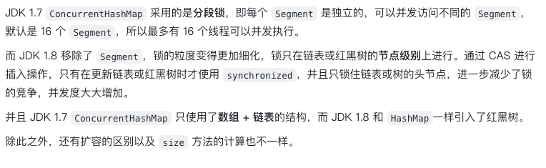
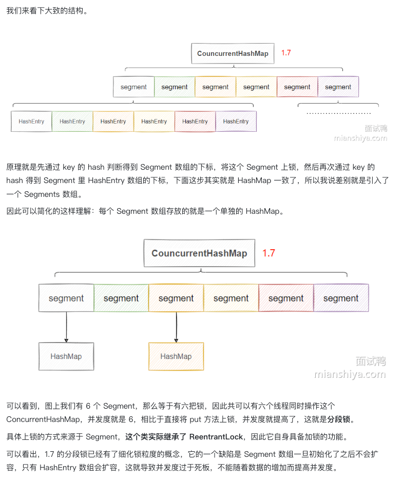
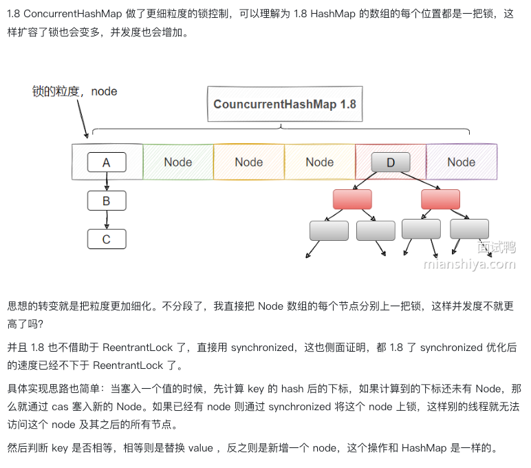
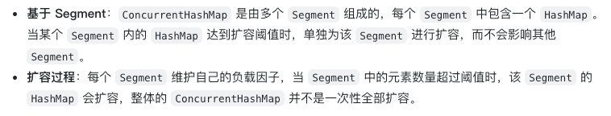
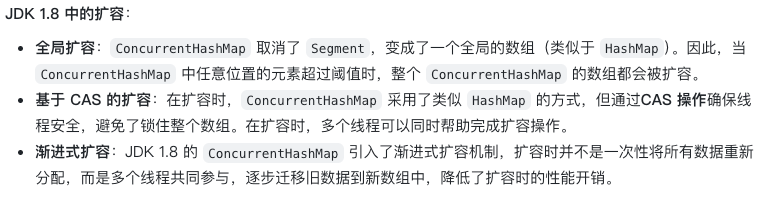
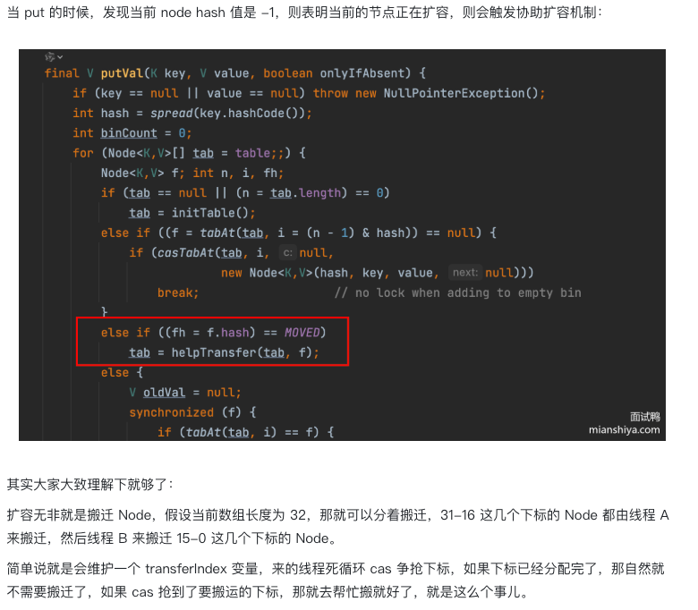
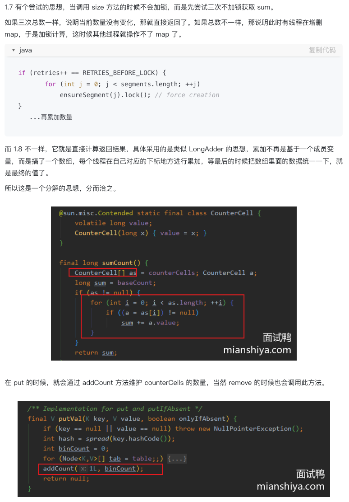
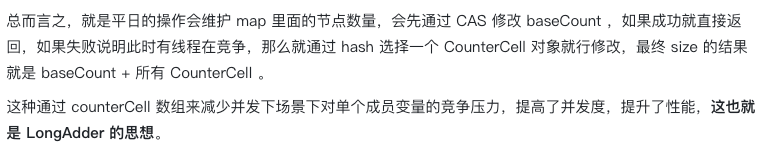

# 0461.Java中ConcurrentHashMap1.7和1.8之间有哪些区别？

## 回答重点

## 扩展知识

### ConcurrentHashMap1.7简单图解

### ConcurrentHashMap1.8简单图解

## 扩容的区别

### JDK1.7中的扩容

### JDK1.8中的扩容

### 渐进式扩容分析

## size逻辑的区别

## CAS

